# Nakshathra Jewellers — Admin Panel API & UI Flow Guide

Hand this document to the frontend developer building the **owner/admin web panel**. It covers authentication, screen structure, business flows, and every admin API endpoint.

**Base URL:** `https://{host}/api/v1`  
**Live API example:** `https://nakshatra-bnglr-hassan.retailkerala.com/api/v1`  
**OpenAPI (runtime):** `GET /api/v1/openapi.json`  
**Health:** `GET /health` · `GET /ready`

**Live product:** CASH schemes only — see [§8 Nakshathra CASH contribution contract](#nakshathra-cash-contribution-contract-live-rules) (11 contribution months, pay on the 5th, flexible months 1–6, capped months 7–11). GOLD_WEIGHT routes exist but are dormant unless explicitly enabled on the server.

**Example payloads:** sample request/response JSON in [Appendix A](#appendix-a--example-request--response-payloads). See [Appendix completeness audit](#appendix-completeness-audit-code-vs-doc-2026-09-11) for full code-vs-doc status. **Planned contribution-rule APIs (Mark as paid caps):** [§26](#26-planned-api-updates--contribution-rules--mark-as-paid) — not implemented yet.

**UI wireframes:** screen layouts, walk-in “Mark as paid” flow, and per-page field checklists → [ADMIN_PANEL_WIREFRAMES.md](./ADMIN_PANEL_WIREFRAMES.md).

---


## 1. Conventions


### Response envelope

Success:

```json
{ "success": true, "data": {}, "meta": {} }
```

Paginated lists include `meta`. Errors:

```json
{
  "success": false,
  "error": {
    "code": "VALIDATION_ERROR",
    "message": "The request is invalid",
    "retryable": false,
    "details": [{ "path": "phone", "message": "..." }]
  },
  "requestId": "..."
}
```


### Money

All amounts are **integer paise** (₹1,000 = `100000`). Never send rupees as floats.

### Timezone

Business dates use **Asia/Kolkata**. Report `from` / `to` query params accept ISO dates or `YYYY-MM-DD`.

### Phone numbers

Send `9876543210` or `+919876543210`. Server stores E.164 `+91XXXXXXXXXX`.

### Idempotency

These bodies require `idempotencyKey` (8–120 chars):

- Manual payment
- Payout / premature close
- Refund initiation / retry

Generate a new UUID per user action. Reuse the same key only when retrying the **same** action after a network failure.

### Pagination

Default: **cursor**. Max `limit` 100, default 50.


| Mode             | Query                                            | Meta                                   |
| ---------------- | ------------------------------------------------ | -------------------------------------- |
| Cursor (default) | `?limit=50` then `?cursor={nextCursor}&limit=50` | `{ mode, limit, nextCursor, hasMore }` |
| Offset (legacy)  | `?page=1&limit=50`                               | `{ mode, page, limit, total }`         |


List endpoints also support `search` where noted.

---


## 2. Authentication (web admin)

The API is **cookie-only**. There is no Bearer token header.


| Cookie          | Purpose                                            |
| --------------- | -------------------------------------------------- |
| `access_token`  | JWT for all admin routes (default TTL 480 min)     |
| `refresh_token` | Session rotation via `POST /auth/refresh` (7 days) |


**Web client setup (fetch / axios):**

```javascript
// fetch
fetch(`${baseUrl}/api/v1/admin/dashboard`, { credentials: 'include' });

// axios
axios.defaults.withCredentials = true;
axios.defaults.baseURL = `${baseUrl}/api/v1`;
```

The admin web origin must be listed in server `WEB_ORIGINS`.

### Auth endpoints


| Method | Path            | Notes                                           |
| ------ | --------------- | ----------------------------------------------- |
| POST   | `/auth/login`   | Sets cookies. Admin must have `role: "ADMIN"`.  |
| POST   | `/auth/refresh` | Rotates cookies                                 |
| POST   | `/auth/logout`  | Clears session                                  |
| GET    | `/auth/me`      | `{ userId, role, permissions, sessionVersion }` |


**Login body:**

```json
{ "phone": "9999999901", "password": "Nakshathra@123" }
```

**Login response:**

```json
{
  "success": true,
  "data": {
    "user": {
      "id": "...",
      "name": "Demo Admin",
      "phone": "+919999999901",
      "role": "ADMIN",
      "permissions": []
    },
    "redirectTo": "/admin"
  }
}
```


### Admin route guard

Every `/admin/*` route requires:

1. Valid `access_token` cookie
2. `role === "ADMIN"`

Non-admin roles get `403 PERMISSION_DENIED`.

### Session lifecycle

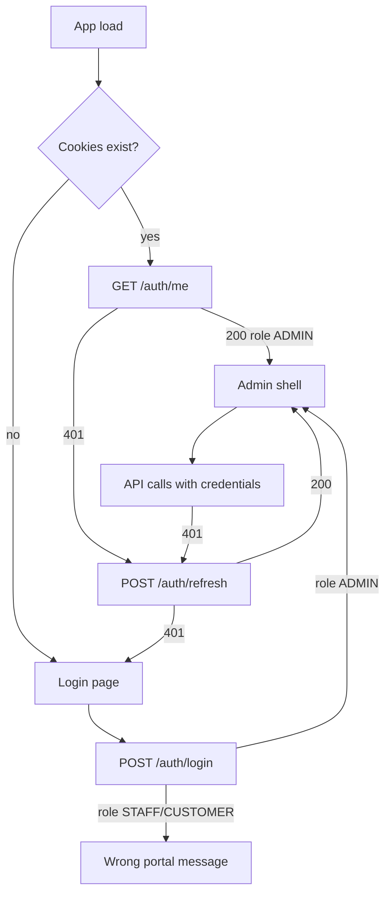


---


## 3. Suggested admin UI structure

Build the panel around these primary modules:

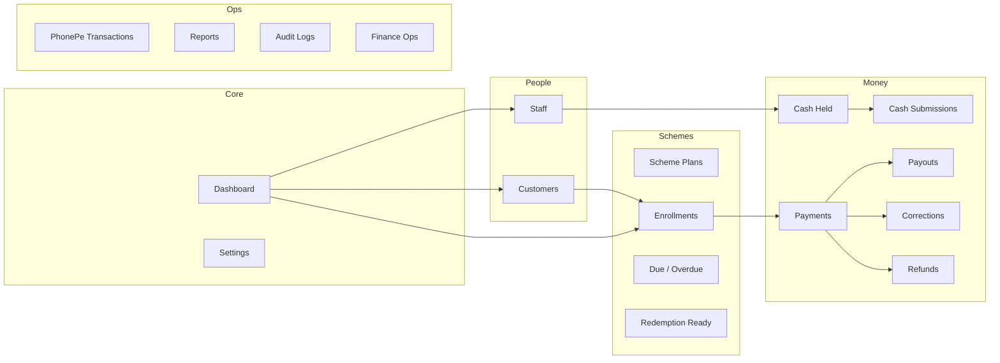


| Sidebar section | Screens                                     | Primary APIs                                  |
| --------------- | ------------------------------------------- | --------------------------------------------- |
| Dashboard       | KPI cards, recent activity                  | `GET /admin/dashboard`                        |
| Staff           | List, create, detail, permissions           | `/admin/staff`, `/admin/users/:id/*`          |
| Customers       | Search, create, detail, KYC                 | `/admin/customers`, KYC verify/reject         |
| Scheme plans    | Plan catalog, create/edit                   | `/admin/scheme-plans`                         |
| Enrollments     | All, due, overdue, redemption-ready         | `/admin/enrollments*`                         |
| Payments        | List, detail, manual collect, reverse       | `/admin/payments*`                            |
| Payouts         | Maturity / premature closure                | `/admin/payouts`, premature-close             |
| Cash            | Staff balances, record handover             | `/admin/cash-held`, `/admin/cash-submissions` |
| Corrections     | Staff requests, approve/reject              | `/admin/corrections`                          |
| Refunds         | PhonePe refund queue                        | `/admin/refunds*`                             |
| PhonePe         | Gateway transaction explorer                | `/admin/phonepe-transactions`                 |
| Reports         | Collection, staff, ledgers                  | `/admin/reports/*`                            |
| Finance ops     | Exceptions, suspense, disputes, settlements | `/admin/finance/*`                            |
| Settings        | Business info, PhonePe toggle               | `/admin/settings`                             |
| Audit           | Change history                              | `/admin/audit-logs`                           |


---


## 4. Dashboard

`GET /admin/dashboard`

No query params. Returns financial KPIs for the owner home screen.

**Key fields in** `data`**:**


| Field                                              | UI use                                      |
| -------------------------------------------------- | ------------------------------------------- |
| `totalCollectionPaise`                             | All-time successful collections             |
| `todayCollectionPaise` / `todayPaymentCount`       | Today's totals                              |
| `monthCollectionPaise` / `monthPaymentCount`       | Current calendar month (IST)                |
| `cashWithStaffPaise`                               | Cash still with staff (not yet handed over) |
| `cashSubmittedPaise`                               | Total cash handed to owner                  |
| `cashInVaultPaise`                                 | Computed cash position                      |
| `cashPayoutPaise`                                  | Total paid out to customers (cash basis)    |
| `activeSchemes` / `maturedSchemes`                 | Enrollment counts                           |
| `redemptionReadySchemes`                           | Ready for payout count                      |
| `dueInstallmentCount` / `overdueInstallmentCount`  | Collection queue badges                     |
| `upcomingInstallments`                             | Next due/overdue rows (max 12)              |
| `upcomingMaturities`                               | Schemes maturing in 30 days                 |
| `recentPayments`                                   | Last 8 payments                             |
| `recentCustomers`                                  | Last 8 new customers                        |
| `monthlyCollections`                               | 6-month chart data                          |
| `phonepeCollectionPaise`, `cashCollectionPaise`, … | Method breakdown                            |


**Dashboard flow:**

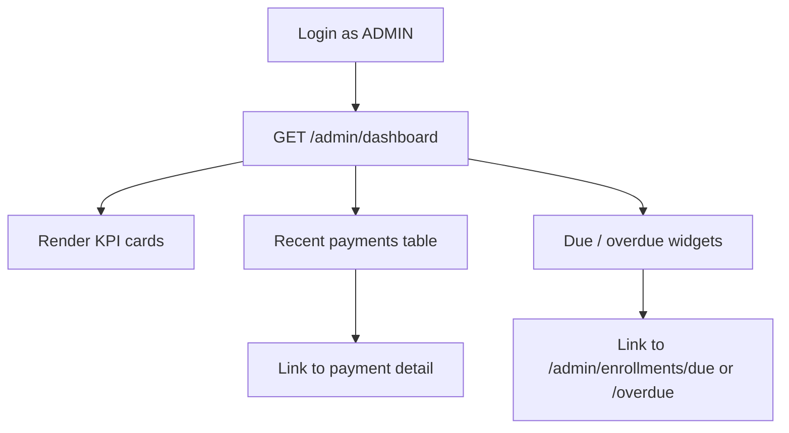


---


## 5. Staff management


### Flow

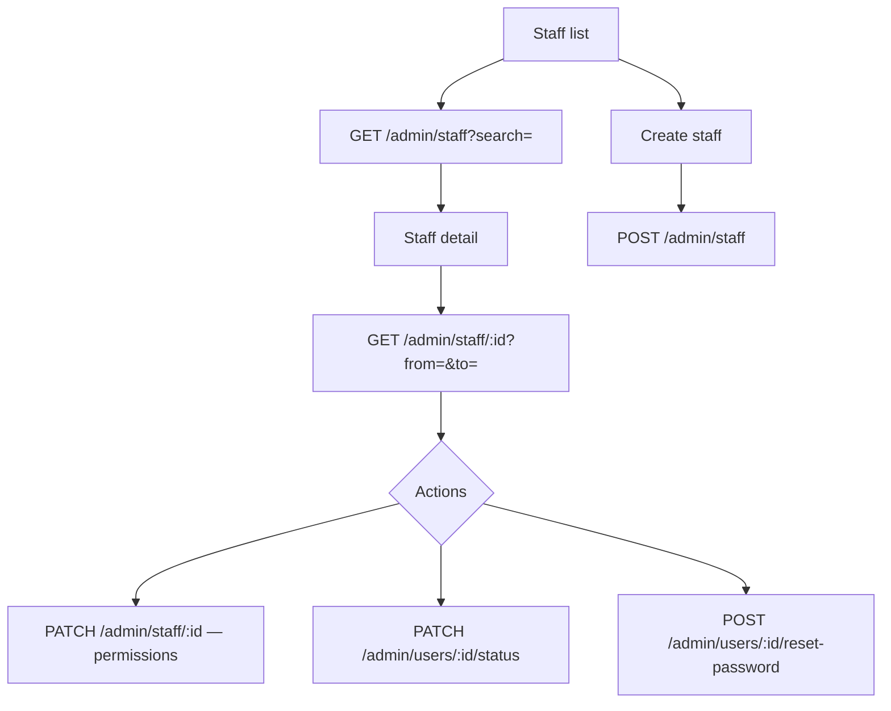


### Endpoints


| Method | Path                              | Purpose                                                                |
| ------ | --------------------------------- | ---------------------------------------------------------------------- |
| GET    | `/admin/staff`                    | Paginated list. Query: `search`, `cursor`, `limit`                     |
| POST   | `/admin/staff`                    | Create staff                                                           |
| GET    | `/admin/staff/:id`                | Detail + collection summary. Query: `from`, `to` (optional date range) |
| PATCH  | `/admin/staff/:id`                | Update profile / permissions                                           |
| PATCH  | `/admin/users/:id/status`         | Enable/disable staff or customer user                                  |
| POST   | `/admin/users/:id/reset-password` | Reset password (staff or customer user id)                             |


### Create staff — `POST /admin/staff`

```json
{
  "name": "Counter Staff",
  "phone": "9876543210",
  "password": "TempPass12!",
  "employeeCode": "STF-001",
  "permissions": [
    "canViewCustomers",
    "canCreateCustomer",
    "canEnrollScheme",
    "canCollectPayment",
    "canSubmitCorrectionRequest"
  ],
  "notes": "Optional"
}
```

**Permissions (checkboxes in UI):**


| Permission                   | Allows                                 |
| ---------------------------- | -------------------------------------- |
| `canViewCustomers`           | Search / view customers                |
| `canCreateCustomer`          | Create customer + Aadhaar upload       |
| `canEnrollScheme`            | Enroll on scheme plan                  |
| `canCollectPayment`          | Manual + PhonePe collection            |
| `canSubmitCorrectionRequest` | Request corrections on own collections |


### Reset password — `POST /admin/users/:id/reset-password`

```json
{ "newPassword": "NewSecurePass1!" }
```

Password min **10** characters for create/reset.

---


## 6. Customer management & KYC


### Flow

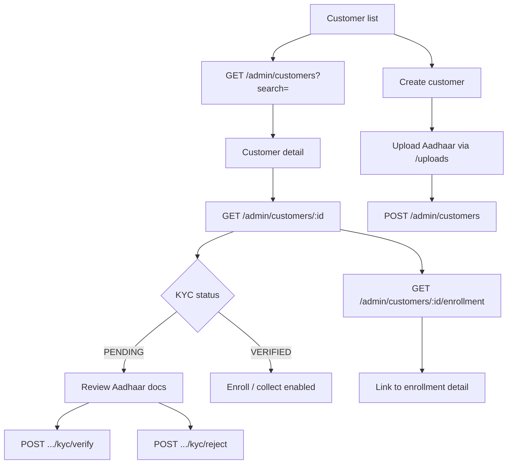


### Endpoints


| Method | Path                                  | Purpose                                        |
| ------ | ------------------------------------- | ---------------------------------------------- |
| GET    | `/admin/customers`                    | List/search. Query: `search`, pagination       |
| POST   | `/admin/customers`                    | Create customer (optional enrollment)          |
| GET    | `/admin/customers/:id`                | Full profile, schemes, payments summary        |
| PATCH  | `/admin/customers/:id`                | Update profile, address, nominee, Aadhaar keys |
| GET    | `/admin/customers/:id/enrollment`     | Active enrollment or 404                       |
| POST   | `/admin/customers/:id/reset-password` | Reset customer login password                  |
| POST   | `/admin/customers/:id/kyc/verify`     | Approve KYC (no body)                          |
| POST   | `/admin/customers/:id/kyc/reject`     | Reject KYC                                     |


### Create customer — `POST /admin/customers`

```json
{
  "name": "Anita Sharma",
  "phone": "9876512345",
  "password": "TempPass12!",
  "address": {
    "line1": "12 MG Road",
    "city": "Hassan",
    "state": "Karnataka",
    "postalCode": "573201"
  },
  "aadhaar": {
    "frontKey": "nakshathra-jewellery/aadhaar/.../front.jpg",
    "backKey": "nakshathra-jewellery/aadhaar/.../back.jpg"
  },
  "nominee": {
    "name": "Raj Sharma",
    "relationship": "Spouse",
    "phone": "9876512346"
  },
  "enrollment": {
    "schemePlanId": "...",
    "startDate": "2026-08-01T00:00:00.000Z",
    "monthlyInstallmentPaise": 100000
  }
}
```

`address`, `aadhaar`, `nominee`, `enrollment` are optional.

### Reject KYC — `POST /admin/customers/:id/kyc/reject`

```json
{ "reason": "Aadhaar image unreadable" }
```


### KYC states (UI badges)


| Status          | Admin action                           |
| --------------- | -------------------------------------- |
| `NOT_SUBMITTED` | Wait for staff upload                  |
| `PENDING`       | Show Verify / Reject buttons           |
| `VERIFIED`      | Green badge — pay/enroll allowed       |
| `REJECTED`      | Show reason; allow re-upload via PATCH |


---


## 7. File uploads (Aadhaar)

Prefix: `/api/v1/uploads` (not under `/admin`, but admin uses these).


| Method | Path                          | Purpose                  |
| ------ | ----------------------------- | ------------------------ |
| POST   | `/uploads/presign`            | Get S3 presigned PUT URL |
| POST   | `/uploads?kind=aadhaar-front` | Direct binary upload     |


**Presign body:**

```json
{
  "kind": "aadhaar-front",
  "contentType": "image/jpeg",
  "fileName": "front.jpg"
}
```

`kind`: `aadhaar-front` | `aadhaar-back`  
Allowed types: `image/jpeg`, `image/png`, `image/webp`, `application/pdf`

Use returned `key` in customer `aadhaar.frontKey` / `aadhaar.backKey`.

---


## 8. Scheme plans


### Flow

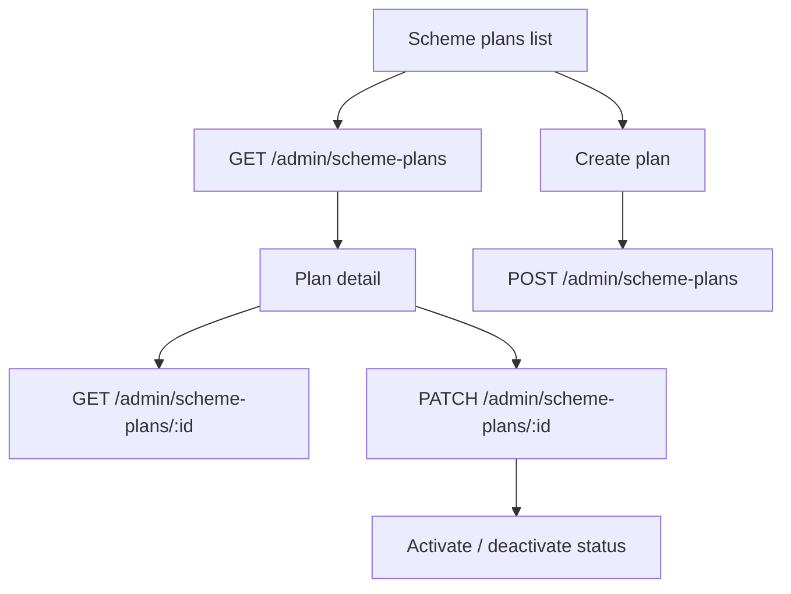


### Endpoints


| Method | Path                      | Purpose                               |
| ------ | ------------------------- | ------------------------------------- |
| GET    | `/admin/scheme-plans`     | All plans                             |
| POST   | `/admin/scheme-plans`     | Create CASH plan                      |
| GET    | `/admin/scheme-plans/:id` | Plan detail                           |
| PATCH  | `/admin/scheme-plans/:id` | Update plan or set `status: INACTIVE` |


Live plans are **CASH only**, **11 months** duration. Key create fields:

```json
{
  "name": "Nakshathra Cash 11",
  "minimumPaymentPaise": 100000,
  "termsText": "Contribute for 11 months...",
  "benefitText": "Optional marketing copy",
  "paymentWindowType": "FIXED_DAY",
  "fixedPaymentDay": 5,
  "prematureClosureEnabled": true,
  "prematureClosureMinElapsedMonths": 6,
  "maturitySettlementAssets": ["CASH", "JEWELLERY"],
  "prematureClosureSettlementAssets": ["CASH"]
}
```

### Nakshathra CASH contribution contract (live rules)

Every live CASH enrollment follows the **6 + 5 + redemption** contract enforced by the server. Do not hard-code payment limits in the admin UI — read them from enrollment detail, payment preview, or error payloads.

#### Timeline


| Calendar scheme month | Phase        | What the customer can pay                                      |
| --------------------- | ------------ | ---------------------------------------------------------------- |
| **1–6**               | **Flexible** | Any amount **≥ plan minimum** (`monthlyInstallmentPaise`). **No monthly upper cap.** Multiple payments in the same scheme month are allowed. |
| **7–11**              | **Capped**   | Up to the **monthly cap** for that month (see formula below). Multiple partial payments are allowed until the cap is reached. |
| **12**                | **Redemption** | No new contributions. Owner records maturity payout via `POST /admin/payouts`. |

Contribution duration is **11 months**. Month **12** is the redemption / payout month only.

#### Payment due date — 5th of each month

Live plans use `paymentWindowType: "FIXED_DAY"` and `fixedPaymentDay: 5`:

- Each scheme month’s installment is due on the **5th** of that calendar month (Asia/Kolkata).
- Due / overdue queues (`GET /admin/enrollments/due`, `.../overdue`) and enrollment `installmentSchedule` expose `dueDate`, `paymentWindowStartDate`, and `paymentWindowEndDate` from this window.
- When recording a manual payment, send `paymentDate` — the server assigns `schemeMonth` in IST. **Do not treat a client-supplied month as authoritative.**

#### How the month 7–11 cap is calculated

After month 6 completes, the server computes one cap for months 7–11:

```
monthlyCapPaise = floor(
  sum of all SUCCESS payments in scheme months 1–6
  ÷ count of those SUCCESS payments
)
```

Important details:

- Uses **successful payment count**, not “divide by 6”. If a customer made 8 payments across months 1–6, the cap is `total ÷ 8`.
- Reversed or fully refunded payments are excluded from the calculation.
- If there were **zero** successful payments in months 1–6, month 7+ payments are blocked with `FIRST_PERIOD_EMPTY` until at least one month 1–6 payment exists.
- Each capped month (7–11) tracks `paidThisMonthPaise` vs `monthlyCapPaise`. Further payments in that month are allowed until `remainingCapPaise` reaches 0.

**Example:** Customer pays ₹1,000 in month 1, ₹2,000 in month 2, and ₹3,000 once each in months 3–6 (6 successful payments, ₹12,000 total).  
Cap from month 7 = ₹12,000 ÷ 6 = **₹2,000 per month** for months 7–11.

#### Plan fields that define this contract

Live CASH plans are created with these defaults (see create payload above):


| Field | Live value | Meaning |
| ----- | ---------- | ------- |
| `durationMonths` | `11` | Contribution months |
| `flexibleMonths` | `6` | Flexible phase length |
| `capMonths` | `5` | Capped phase length (months 7–11) |
| `capStrategy` | `AVERAGE_SUCCESSFUL_PAYMENT_FIRST_6` | Cap formula (see above) |
| `paymentWindowType` | `FIXED_DAY` | Single due day per month |
| `fixedPaymentDay` | `5` | Due on the **5th** |
| `prematureClosureMinElapsedMonths` | `6` | **Separate rule:** earliest premature closure after 6 elapsed scheme months (not the payment cap) |

`termsText` on the plan should summarise this for customers, e.g. `"Contribute for 11 months. Months 1–6 flexible; months 7–11 capped at your average payment."`

#### What to show on admin payment / enrollment screens

From `GET /admin/enrollments/:id`, payment list rows, or manual-payment validation errors, surface when available. **When [§26](#26-planned-api-updates--contribution-rules--mark-as-paid) is implemented**, use the **`contribution`** object and **`GET .../payment-preview`** — do not derive caps client-side.

- Current `schemeMonth` and phase label (`Flexible` / `Capped` / `Redemption`)
- `minimumPaymentPaise` — floor for the current month
- `monthlyCapPaise` and `remainingCapPaise` — only in capped months 7–11
- `paidInCurrentMonthPaise` — running total for the active scheme month
- Server `reasonMessage` or error `message` when a payment is blocked

#### Payment blocking errors (admin should display these)


| Code | When |
| ---- | ---- |
| `PAYMENT_BELOW_MINIMUM` | Amount below plan minimum |
| `PAYMENT_LIMIT_EXCEEDED` | Capped month: payment would exceed `remainingCapPaise` |
| `INSTALLMENT_ALREADY_PAID` | Capped month: cap already fully paid for this scheme month |
| `FIRST_PERIOD_EMPTY` | Month 7+ but no successful payments in months 1–6 to compute cap |
| `SCHEME_MATURED` | Payment date falls after month 11 contribution window |

---


## 9. Enrollments


### Flow

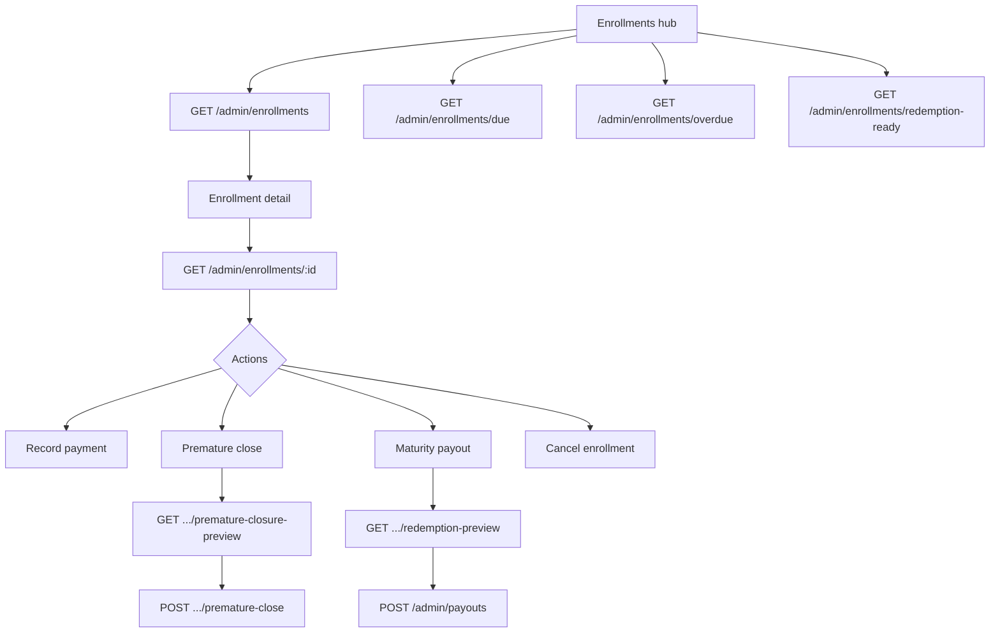


### Endpoints


| Method | Path                                               | Purpose                            |
| ------ | -------------------------------------------------- | ---------------------------------- |
| POST   | `/admin/enrollments`                               | Enroll verified customer           |
| GET    | `/admin/enrollments`                               | Filtered list                      |
| GET    | `/admin/enrollments/due`                           | Due installments queue             |
| GET    | `/admin/enrollments/overdue`                       | Overdue queue                      |
| GET    | `/admin/enrollments/redemption-ready`              | Ready for maturity payout          |
| GET    | `/admin/maturity-calendar`                         | Maturity calendar by date range    |
| GET    | `/admin/enrollments/:id`                           | Full detail + schedule + payments  |
| PATCH  | `/admin/enrollments/:id/status`                    | Manual status change (with reason) |
| POST   | `/admin/enrollments/:id/cancel`                    | Cancel enrollment                  |
| GET    | `/admin/enrollments/:id/premature-closure-preview` | Preview early closure amount       |
| POST   | `/admin/enrollments/:id/premature-close`           | Execute premature closure payout   |
| GET    | `/admin/enrollments/:id/redemption-preview`        | Preview maturity settlement        |


### Enrollment list filters (query params)


| Param                           | Values                               |
| ------------------------------- | ------------------------------------ |
| `status`                        | `ACTIVE`, `MATURED`, `CLOSED`, etc.  |
| `schemePlanId`                  | Plan id                              |
| `customerId`                    | Customer id                          |
| `schemeType`                    | `CASH`                               |
| `search`                        | Name, phone, enrollment number       |
| `installmentStatus`             | `PAID`, `DUE`, `OVERDUE`, `UPCOMING` |
| `redemptionReady`               | `true` / `false`                     |
| `prematureClosureEligible`      | `true` / `false`                     |
| `startDateFrom` / `startDateTo` | ISO dates                            |
| `maturityFrom` / `maturityTo`   | ISO dates                            |


Overdue list also supports: `sort` (`oldest` | `newest` | `highestAmount`), `minDaysOverdue`, `maxDaysOverdue`.

### Maturity calendar — `GET /admin/maturity-calendar`

Dedicated calendar feed for the admin panel (prefer this over `GET /admin/reports/maturity` for UI).

**Query params**

| Param | Required | Description |
| --- | --- | --- |
| `from` | no | Start date (`YYYY-MM-DD` IST or ISO). Default: now |
| `to` | no | End date (`YYYY-MM-DD` IST end-of-day or ISO). Default: `from` + 366 days |
| `status` | no | Single status filter: `ACTIVE`, `MATURED`, `REDEEMED`, `CLOSED`. Default: `ACTIVE` + `MATURED` |
| `schemeType` | no | `CASH` or `GOLD_WEIGHT` |

**Response** `200`:

```json
{
  "success": true,
  "data": [
    {
      "enrollmentId": "67a1b2c3d4e5f6789012345e",
      "enrollmentNumber": "NKS-2026-000042",
      "customer": { "id": "67a1…", "name": "Meera Nair", "phone": "+919876543210" },
      "schemePlan": { "id": "67a1…", "name": "Nakshathra Cash 11M", "type": "CASH" },
      "schemeType": "CASH",
      "status": "ACTIVE",
      "startDate": "2026-01-01T00:00:00.000Z",
      "maturityDate": "2026-12-01T00:00:00.000Z",
      "redemptionStartDate": "2026-12-01T00:00:00.000Z",
      "redemptionEndDate": "2027-01-31T00:00:00.000Z",
      "totalPaidPaise": 1100000,
      "monthlyInstallmentPaise": 100000,
      "durationMonths": 11
    }
  ],
  "meta": {
    "from": "2026-12-01T00:00:00.000+05:30",
    "to": "2026-12-31T23:59:59.999+05:30",
    "total": 1
  }
}
```

**Related:** `GET /admin/enrollments/redemption-ready` for the payout queue; `GET /admin/dashboard` → `upcomingMaturities` for next 30 days (max 8).

### Create enrollment — `POST /admin/enrollments`

```json
{
  "customerId": "...",
  "schemePlanId": "...",
  "startDate": "2026-08-01T00:00:00.000Z",
  "monthlyInstallmentPaise": 100000
}
```

One **ACTIVE** enrollment per customer. Duplicate → `409 CUSTOMER_ALREADY_ENROLLED`.

### Premature close — `POST /admin/enrollments/:id/premature-close`

Always call preview first.

```json
{
  "settlementAsset": "CASH",
  "payoutDate": "2026-08-17T10:00:00.000Z",
  "reason": "Customer requested early closure",
  "method": "CASH",
  "referenceNumber": "optional",
  "notes": "optional",
  "idempotencyKey": "prem-close-uuid-001"
}
```

`settlementAsset`: `CASH` | `JEWELLERY` (per plan policy).

### Cancel enrollment — `POST /admin/enrollments/:id/cancel`

```json
{
  "reason": "Customer requested cancellation before first payment"
}
```

`reason`: 3–500 characters.

### Update enrollment status — `PATCH /admin/enrollments/:id/status`

```json
{
  "status": "CLOSED",
  "reason": "Manual closure after customer visit"
}
```

Allowed `status`: `ACTIVE`, `MATURED`, `REDEEMED`, `CLOSED`, `WITHDRAWN`, `CANCELLED`.

---


## 10. Payments & collections

Payment limits follow the [Nakshathra CASH contribution contract](#nakshathra-cash-contribution-contract-live-rules): flexible months 1–6 (no cap), capped months 7–11 (average of month 1–6 payments), due on the **5th** of each month.

**Planned:** rule-aware Mark as paid (preview + `remainingCapPaise`) — see [§26](#26-planned-api-updates--contribution-rules--mark-as-paid).


### Flow

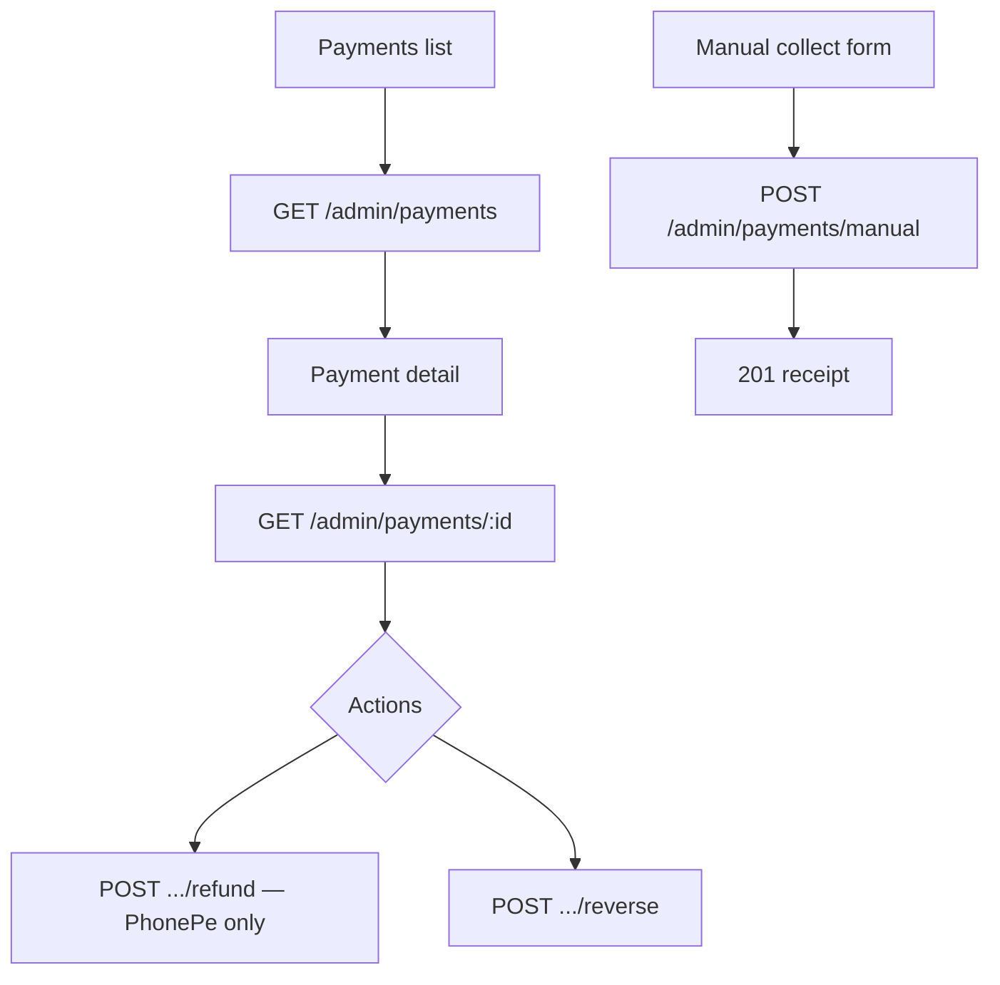


### Endpoints


| Method | Path                          | Purpose                 |
| ------ | ----------------------------- | ----------------------- |
| GET    | `/admin/payments`             | Paginated payment list  |
| GET    | `/admin/payments/:id`         | Payment detail          |
| POST   | `/admin/payments/manual`      | Owner manual collection |
| POST   | `/admin/payments/:id/refund`  | Initiate PhonePe refund |
| POST   | `/admin/payments/:id/reverse` | Reverse a payment       |


### Manual payment — `POST /admin/payments/manual`

```json
{
  "customerId": "...",
  "schemeId": "...",
  "amountPaise": 100000,
  "schemeMonth": 3,
  "method": "CASH",
  "paymentDate": "2026-08-17T10:00:00.000Z",
  "referenceNumber": "optional",
  "notes": "optional",
  "idempotencyKey": "admin-pay-uuid-001"
}
```

Methods: `CASH` | `UPI` | `BANK` | `CARD` (not `PHONEPE` — use gateway flow for that).

**Important:** `schemeMonth` is derived server-side in Asia/Kolkata when omitted. Do not treat client input as authoritative for staff/admin manual collect in production UI — show server-assigned month in the response.

### Reverse payment — `POST /admin/payments/:id/reverse`

```json
{ "reason": "Duplicate entry recorded in error" }
```


### Refund — `POST /admin/payments/:id/refund`

PhonePe/gateway payments only.

```json
{
  "reason": "Customer requested refund",
  "idempotencyKey": "refund-uuid-001",
  "amountPaise": 100000
}
```

Full refund only — `amountPaise` must match payment amount if provided.

---


## 11. Payouts (maturity & redemption)

`POST /admin/payouts` — create maturity payout or gold redeem (dormant).

```json
{
  "customerId": "...",
  "schemeId": "...",
  "payoutType": "PAYOUT",
  "settlementAsset": "CASH",
  "method": "CASH",
  "payoutDate": "2027-08-15T10:00:00.000Z",
  "referenceNumber": "MAT-2027-001",
  "notes": "Maturity settlement",
  "idempotencyKey": "payout-uuid-001"
}
```

For jewellery settlement (`settlementAsset: "JEWELLERY"`), also require `billNumber` and `billAmountPaise`.


| Method | Path             | Purpose                  |
| ------ | ---------------- | ------------------------ |
| GET    | `/admin/payouts` | Paginated payout history |
| POST   | `/admin/payouts` | Create payout            |


**Maturity UI flow:**

1. `GET /admin/enrollments/redemption-ready`
2. Open enrollment → `GET /admin/enrollments/:id/redemption-preview`
3. Confirm → `POST /admin/payouts`

---


## 12. Cash management


### Flow

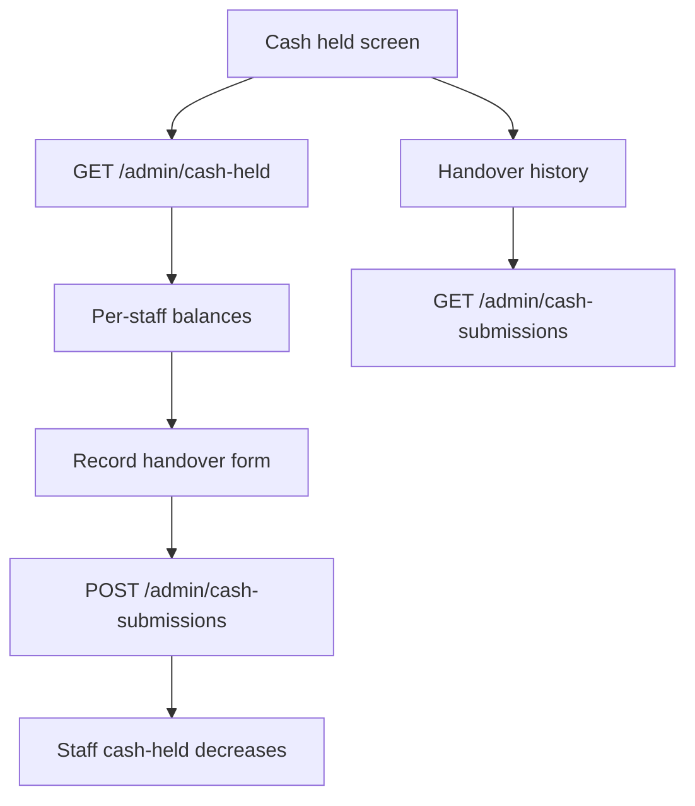


### Endpoints


| Method | Path                      | Purpose                       |
| ------ | ------------------------- | ----------------------------- |
| GET    | `/admin/cash-held`        | All staff cash balances       |
| POST   | `/admin/cash-submissions` | Record staff → owner handover |
| GET    | `/admin/cash-submissions` | Handover history              |


### Record handover — `POST /admin/cash-submissions`

```json
{
  "staffId": "...",
  "amountPaise": 150000,
  "submissionDate": "2026-08-16T18:00:00.000Z",
  "notes": "Counter closing handover"
}
```

| Field | Notes |
| --- | --- |
| `staffId` | Staff **User** id (`GET /admin/cash-held` → `staffId`) **or** **StaffProfile** id (`GET /admin/staff` → `_id`). Do not use customer/admin ids. |
| `submissionDate` | ISO datetime (offset `+05:30` is fine) |

Cannot submit more than staff's current cash held → `409 INSUFFICIENT_STAFF_CASH` (legacy docs may say `INSUFFICIENT_CASH_HELD`).  
No matching staff profile → `404 STAFF_NOT_FOUND`.

---


## 13. Correction requests

Staff submit corrections from the staff app. Admin approves here.

### Flow

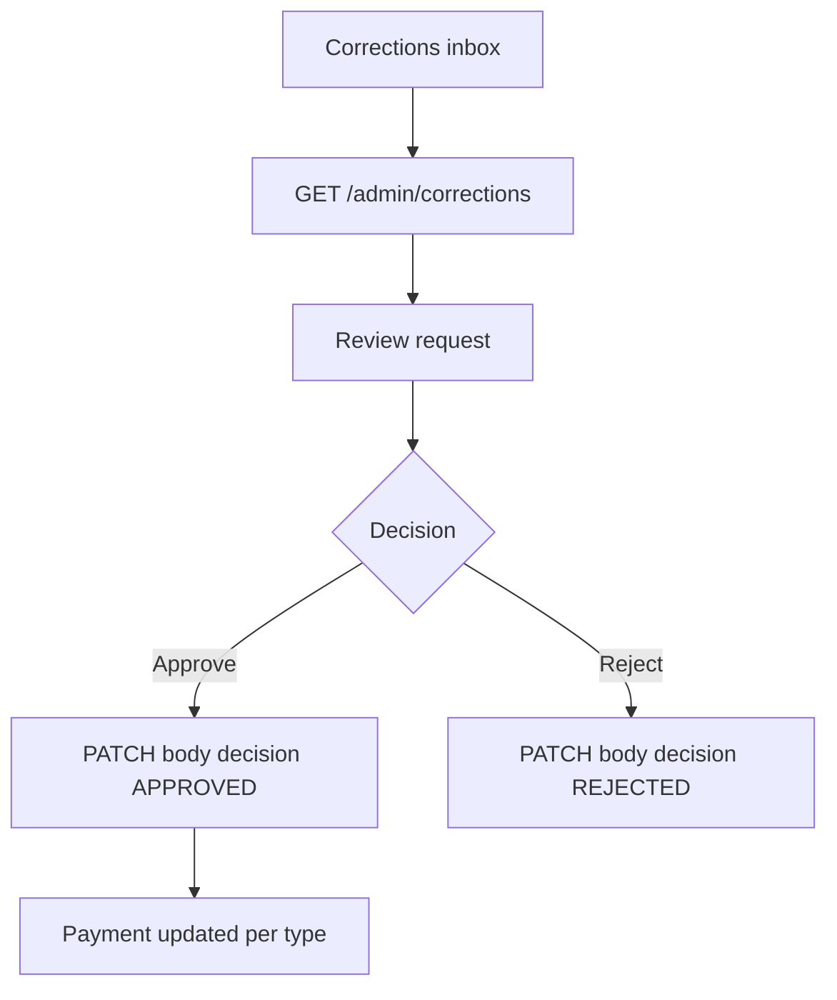


### Endpoints


| Method | Path                     | Purpose                  |
| ------ | ------------------------ | ------------------------ |
| GET    | `/admin/corrections`     | List correction requests |
| PATCH  | `/admin/corrections/:id` | Approve or reject        |


### Review — `PATCH /admin/corrections/:id`

```json
{
  "decision": "APPROVED",
  "reviewNotes": "Verified with customer at counter"
}
```

`decision`: `APPROVED` | `REJECTED`. `reviewNotes` min 3 chars.

Staff correction types: `CHANGE_AMOUNT`, `CHANGE_METHOD`, `CHANGE_REFERENCE`, `CHANGE_NOTES`, `REVERSE_PAYMENT`. Staff cannot request `CHANGE_DATE`.

---


## 14. Refunds


| Method | Path                              | Purpose                     |
| ------ | --------------------------------- | --------------------------- |
| GET    | `/admin/refunds`                  | Refund queue / history      |
| GET    | `/admin/refunds/:id`              | Refund detail               |
| POST   | `/admin/refunds/:id/check-status` | Poll PhonePe refund status  |
| POST   | `/admin/refunds/:id/retry`        | Retry failed refund attempt |


### Retry — `POST /admin/refunds/:id/retry`

```json
{
  "idempotencyKey": "refund-retry-uuid-001",
  "reason": "Retry after gateway timeout"
}
```

Refund statuses: `PENDING`, `SUCCESS`, `FAILED`.

---


## 15. PhonePe transactions


| Method | Path                              | Purpose                             |
| ------ | --------------------------------- | ----------------------------------- |
| GET    | `/admin/phonepe-transactions`     | Paginated gateway payment intents   |
| GET    | `/admin/phonepe-transactions/:id` | Intent detail + reconciliation info |


Use for ops/debugging when customer or staff PhonePe payments need investigation.

**PhonePe config (for reference — used by mobile apps):**

`GET /api/v1/payments/phonepe/config` (authenticated CUSTOMER/STAFF/ADMIN)

Admin settings toggle: `customerPhonePeEnabled` in `PATCH /admin/settings`.

---


## 16. Reports


### Standard reports — `GET /admin/reports/:report`

Query: `from`, `to` (ISO dates). Some reports need `id` query param.


| Report slug          | Purpose                               |
| -------------------- | ------------------------------------- |
| `collection`         | All collections by method             |
| `phonepe`            | PhonePe/UPI collections               |
| `cash`               | Cash collections                      |
| `daily-collection`   | Daily totals (IST)                    |
| `monthly-collection` | Monthly totals (IST)                  |
| `scheme-collection`  | Per plan totals                       |
| `attribution`        | Customer self-pay vs staff-collected  |
| `staff-performance`  | Per-staff collection + cash held      |
| `corrections`        | Correction request status             |
| `payout-totals`      | Payout and closure totals             |
| `payouts`            | Same as payout-totals                 |
| `maturity`           | Maturity calendar                     |
| `cash-position`      | Same data as dashboard cash position  |
| `all-schemes`        | All enrollments summary               |
| `gold-liability`     | Gold liability (dormant if CASH-only) |
| `scheme-ledger`      | Requires `?id={enrollmentId}`         |
| `customer-ledger`    | Requires `?id={customerId}`           |


### Operational reports (dedicated routes)


| Method | Path                                          | Query                  |
| ------ | --------------------------------------------- | ---------------------- |
| GET    | `/admin/reports/financial-periods/:periodKey` | —                      |
| GET    | `/admin/reports/bank-settlement-ledger`       | `from`, `to`, `status` |
| GET    | `/admin/reports/gateway-expenses`             | `from`, `to`           |
| GET    | `/admin/reports/refunds`                      | —                      |
| GET    | `/admin/reports/suspense-ledger`              | —                      |
| GET    | `/admin/reports/gold-control`                 | `from`, `to`           |
| GET    | `/admin/reports/financial-exceptions-aging`   | —                      |


### Operation record drill-down

`GET /admin/operation-records/:module/:id`

Deep-link from report rows to full entity detail. `module` values depend on report context (payment, refund, payout, etc.).

---


## 17. Finance operations (advanced)

For mature ops teams. Build these as an "Finance" or "Operations" sub-section.

### 17.1 Financial exceptions


| Method | Path                                        | Purpose                                                   |
| ------ | ------------------------------------------- | --------------------------------------------------------- |
| GET    | `/admin/finance/exceptions`                 | List. Filter: `status`, `severity`, `type`, `agingBucket` |
| GET    | `/admin/finance/exceptions/:id`             | Detail                                                    |
| POST   | `/admin/finance/exceptions/:id/acknowledge` | Acknowledge                                               |
| POST   | `/admin/finance/exceptions/:id/resolve`     | Resolve or ignore                                         |


Resolve body:

```json
{
  "resolutionNotes": "Matched to payment NKS-2026-0000012",
  "status": "RESOLVED"
}
```

Acknowledge body (`POST .../acknowledge`):

```json
{
  "notes": "Reviewing with bank statement"
}
```

`status` on resolve: `RESOLVED` | `IGNORED`.


### 17.2 Suspense entries


| Method | Path                                  | Purpose               |
| ------ | ------------------------------------- | --------------------- |
| POST   | `/admin/finance/suspense`             | Create suspense entry |
| GET    | `/admin/finance/suspense`             | List                  |
| POST   | `/admin/finance/suspense/:id/resolve` | Resolve / write off   |


Create body:

```json
{
  "entryType": "UNIDENTIFIED_CREDIT",
  "amountPaise": 100000,
  "provider": "PHONEPE",
  "providerReference": "PP-TXN-123",
  "bankReference": "UTR987654",
  "transactionDate": "2026-08-15T00:00:00.000Z",
  "description": "Unmatched bank credit",
  "source": "MANUAL"
}
```

Resolve body:

```json
{
  "resolutionNotes": "Matched to settlement batch PP-SETTLE-001",
  "status": "RESOLVED",
  "resolvedPaymentId": "67a1b2c3d4e5f6789012345aa"
}
```

`status` on resolve: `RESOLVED` | `WRITTEN_OFF`.


### 17.3 Disputes / chargebacks


| Method | Path                          | Purpose                  |
| ------ | ----------------------------- | ------------------------ |
| POST   | `/admin/finance/disputes`     | Open dispute             |
| GET    | `/admin/finance/disputes`     | List                     |
| GET    | `/admin/finance/disputes/:id` | Detail                   |
| PATCH  | `/admin/finance/disputes/:id` | Update status / evidence |


Create body:

```json
{
  "paymentId": "67a1b2c3d4e5f6789012345aa",
  "providerCaseId": "PP-CB-2026-001",
  "amountPaise": 100000,
  "reasonCode": "CUSTOMER_DISPUTE",
  "reason": "Customer reported unauthorized charge",
  "detectedVia": "PHONEPE_ALERT",
  "notifiedAt": "2026-08-10T00:00:00.000Z",
  "responseDueAt": "2026-08-20T00:00:00.000Z",
  "evidenceNotes": "Receipt attached"
}
```

Update body (at least one field):

```json
{
  "status": "UNDER_REVIEW",
  "evidenceNotes": "Submitted counter receipt scan"
}
```


### 17.4 Gateway settlements (PhonePe bank credits)


| Method | Path                                                         | Purpose                 |
| ------ | ------------------------------------------------------------ | ----------------------- |
| POST   | `/admin/finance/gateway-settlements`                         | Record settlement batch |
| GET    | `/admin/finance/gateway-settlements`                         | List                    |
| GET    | `/admin/finance/gateway-settlements/summary`                 | Summary totals          |
| GET    | `/admin/finance/gateway-settlements/:id`                     | Detail                  |
| POST   | `/admin/finance/gateway-settlements/:id/confirm-bank-credit` | Confirm UTR received    |
| POST   | `/admin/finance/gateway-settlements/:id/close`               | Close settlement        |


Confirm bank credit body:

```json
{
  "providerUtr": "UTR123456789",
  "bankCreditedAt": "2026-08-09T12:00:00.000Z",
  "notes": "Matched in HDFC statement"
}
```

At least one of `providerUtr` or `bankReferenceId` is required.

Close body:

```json
{
  "notes": "All line items reconciled"
}
```


### 17.5 Accounting periods


| Method | Path                                                  | Purpose       |
| ------ | ----------------------------------------------------- | ------------- |
| GET    | `/admin/finance/accounting-periods`                   | List periods  |
| GET    | `/admin/finance/accounting-periods/:periodKey`        | Period detail |
| POST   | `/admin/finance/accounting-periods/:periodKey/close`  | Close period  |
| POST   | `/admin/finance/accounting-periods/:periodKey/reopen` | Reopen period |


Close body:

```json
{
  "closeNotes": "Month-end close completed",
  "overrideReason": "Optional — required if closing with open exceptions"
}
```

Reopen body:

```json
{
  "reason": "Correction needed for settlement entry on 2026-08-05"
}
```


### 17.6 Gold control (dormant for CASH-only)


| Method | Path                                              | Purpose                   |
| ------ | ------------------------------------------------- | ------------------------- |
| POST   | `/admin/finance/gold-inventory/movements`         | Record inventory movement |
| GET    | `/admin/finance/gold-inventory/movements`         | List movements            |
| GET    | `/admin/finance/gold-control/summary`             | Gold control summary      |
| GET    | `/admin/finance/gold-control/liability-movements` | Liability movements       |


Create inventory movement body:

```json
{
  "movementType": "PURCHASE",
  "goldWeightMg": 5000,
  "movementDate": "2026-08-01T00:00:00.000Z",
  "purity": "916",
  "referenceNumber": "INV-2026-001",
  "reason": "Gold purchase from supplier"
}
```

`movementType`: `OPENING_STOCK` | `PURCHASE` | `RETURN_FROM_CUSTOMER` | `POSITIVE_ADJUSTMENT` | `NEGATIVE_ADJUSTMENT`.

### Gold rates — request bodies

**Create — `POST /admin/gold-rates`**

```json
{
  "ratePerGramPaise": 650000,
  "purity": "916",
  "effectiveFrom": "2026-08-01T00:00:00.000Z",
  "notes": "Daily rate update"
}
```

**Update — `PATCH /admin/gold-rates/:id`**

Any subset of create fields plus optional `status`: `ACTIVE` | `INACTIVE`.

---


## 18. Settings


| Method | Path              | Purpose              |
| ------ | ----------------- | -------------------- |
| GET    | `/admin/settings` | Read system settings |
| PATCH  | `/admin/settings` | Update settings      |


### Update — `PATCH /admin/settings`

All fields required on PATCH:

```json
{
  "businessName": "Nakshathra Jewellers",
  "supportPhone": "+919876543210",
  "supportEmail": "support@example.com",
  "businessAddress": "Hassan, Karnataka",
  "receiptFooter": "Thank you for saving with Nakshathra Jewellers.",
  "customerPhonePeEnabled": true
}
```

`customerPhonePeEnabled: false` disables customer self-service PhonePe (staff PhonePe unaffected).

---


## 19. Audit logs

`GET /admin/audit-logs`

Paginated immutable audit trail. Use for compliance / "who changed what" screens.

Query: standard pagination + optional filters from service (actor, entity type, date range — pass through query params supported by the list handler).

---


## 20. Complete endpoint index

All paths prefixed with `/api/v1/admin` unless noted. All require **ADMIN** role.

### Auth (prefix `/api/v1/auth`)

| POST | `/login` |
| POST | `/refresh` |
| POST | `/logout` |
| GET | `/me` |

### Dashboard

| GET | `/dashboard` |

### Staff

| GET/POST | `/staff` |
| GET/PATCH | `/staff/:id` |
| PATCH | `/users/:id/status` |
| POST | `/users/:id/reset-password` |

### Customers

| GET/POST | `/customers` |
| GET/PATCH | `/customers/:id` |
| GET | `/customers/:id/enrollment` |
| POST | `/customers/:id/reset-password` |
| POST | `/customers/:id/kyc/verify` |
| POST | `/customers/:id/kyc/reject` |

### Scheme plans

| GET/POST | `/scheme-plans` |
| GET/PATCH | `/scheme-plans/:id` |

### Enrollments

| POST | `/enrollments` |
| GET | `/enrollments` |
| GET | `/enrollments/due` |
| GET | `/enrollments/overdue` |
| GET | `/enrollments/redemption-ready` |
| GET | `/enrollments/:id` |
| PATCH | `/enrollments/:id/status` |
| POST | `/enrollments/:id/cancel` |
| GET | `/enrollments/:id/premature-closure-preview` |
| POST | `/enrollments/:id/premature-close` |
| GET | `/enrollments/:id/redemption-preview` |

### Gold rates

| GET/POST | `/gold-rates` |
| GET/PATCH | `/gold-rates/:id` |

### Payments & finance

| POST | `/payments/manual` |
| GET | `/payments`, `/payments/:id` |
| POST | `/payments/:id/refund`, `/payments/:id/reverse` |
| GET | `/refunds`, `/refunds/:id` |
| POST | `/refunds/:id/check-status`, `/refunds/:id/retry` |
| GET/POST | `/payouts` |
| GET | `/cash-held` |
| GET/POST | `/cash-submissions` |
| GET | `/corrections` |
| PATCH | `/corrections/:id` |
| GET | `/audit-logs` |

### PhonePe & reports

| GET | `/phonepe-transactions`, `/phonepe-transactions/:id` |
| GET | `/reports/:report` |
| GET | `/reports/financial-periods/:periodKey` |
| GET | `/reports/bank-settlement-ledger` |
| GET | `/reports/gateway-expenses` |
| GET | `/reports/refunds` |
| GET | `/reports/suspense-ledger` |
| GET | `/reports/gold-control` |
| GET | `/reports/financial-exceptions-aging` |
| GET | `/operation-records/:module/:id` |

### Finance ops

| Method | Path |
| --- | --- |
| GET | `/finance/exceptions` |
| GET | `/finance/exceptions/:id` |
| POST | `/finance/exceptions/:id/acknowledge` |
| POST | `/finance/exceptions/:id/resolve` |
| POST | `/finance/suspense` |
| GET | `/finance/suspense` |
| POST | `/finance/suspense/:id/resolve` |
| POST | `/finance/disputes` |
| GET | `/finance/disputes` |
| GET | `/finance/disputes/:id` |
| PATCH | `/finance/disputes/:id` |
| POST | `/finance/gateway-settlements` |
| GET | `/finance/gateway-settlements` |
| GET | `/finance/gateway-settlements/summary` |
| GET | `/finance/gateway-settlements/:id` |
| POST | `/finance/gateway-settlements/:id/confirm-bank-credit` |
| POST | `/finance/gateway-settlements/:id/close` |
| GET | `/finance/accounting-periods` |
| GET | `/finance/accounting-periods/:periodKey` |
| POST | `/finance/accounting-periods/:periodKey/close` |
| POST | `/finance/accounting-periods/:periodKey/reopen` |
| POST | `/finance/gold-inventory/movements` |
| GET | `/finance/gold-inventory/movements` |
| GET | `/finance/gold-control/summary` |
| GET | `/finance/gold-control/liability-movements` |

### Standard report slugs (`GET /admin/reports/:report`)

Query: `from`, `to` (ISO/YYYY-MM-DD). Requires `id` for `scheme-ledger` and `customer-ledger`.

`collection` · `phonepe` · `cash` · `daily-collection` · `monthly-collection` · `scheme-collection` · `attribution` · `staff-performance` · `corrections` · `payout-totals` · `payouts` · `maturity` · `cash-position` · `all-schemes` · `gold-liability` · `scheme-ledger` · `customer-ledger`

### Settings

| GET/PATCH | `/settings` |

### Uploads (prefix `/api/v1/uploads`)

| POST | `/presign` |
| POST | `/` |

---


## 21. Key business rules for UI


Full payment-phase rules: [§8 Nakshathra CASH contribution contract](#nakshathra-cash-contribution-contract-live-rules).


| Rule                                     | UI implication                                                        |
| ---------------------------------------- | --------------------------------------------------------------------- |
| CASH scheme, 11 months + month 12 payout | Show phase badges: **Flexible (1–6)**, **Capped (7–11)**, **Redemption (12)** |
| Flexible months 1–6                      | No upper cap; allow multiple payments per month ≥ minimum             |
| Capped months 7–11                       | Show `monthlyCapPaise` / `remainingCapPaise`; allow partial pays until cap met |
| Due on 5th of each month                 | Due/overdue lists use server `dueDate`; plan `fixedPaymentDay: 5`     |
| One active enrollment per customer       | Disable enroll button if active exists                                |
| KYC may be required (`KYC_REQUIRED` env) | Show verify workflow before pay/enroll                                |
| Amounts in paise                         | Format as ₹ in UI: `(paise / 100).toFixed(2)`                         |
| Manual payment scheme month              | Display server-returned `schemeMonth`, don't hard-code                |
| PhonePe customer toggle                  | Settings → `customerPhonePeEnabled`                                   |
| Staff permissions                        | Admin creates; staff app enforces — no admin UI needed per permission |
| Corrections                              | Admin only approves; staff only submits                               |
| Cash handover                            | Only admin records; reduces staff `cashHeldPaise`                     |
| Premature closure                        | Earliest after **6 elapsed scheme months** (`prematureClosureMinElapsedMonths`); always call preview first |


---


## 22. Error codes to handle


| Code                                 | HTTP | UI action                          |
| ------------------------------------ | ---- | ---------------------------------- |
| `AUTHENTICATION_REQUIRED`            | 401  | Redirect to login                  |
| `SESSION_EXPIRED`                    | 401  | Try refresh, then login            |
| `PERMISSION_DENIED`                  | 403  | Not admin account                  |
| `VALIDATION_ERROR`                   | 422  | Show field errors from `details[]` |
| `CUSTOMER_ALREADY_ENROLLED`          | 409  | Show existing enrollment link      |
| `KYC_VERIFICATION_REQUIRED`          | 409  | Prompt KYC verify                  |
| `INSUFFICIENT_CASH_HELD`             | 409  | Reduce handover amount             |
| `INSTALLMENT_ALREADY_PAID`           | 409  | Capped month fully paid; show paid badge     |
| `PAYMENT_BELOW_MINIMUM`              | 422  | Amount below plan minimum                    |
| `PAYMENT_LIMIT_EXCEEDED`             | 409  | Capped month: show `remainingCapPaise`       |
| `FIRST_PERIOD_EMPTY`                 | 409  | No month 1–6 payments; cap cannot be computed |
| `SCHEME_MATURED`                     | 409  | Outside 11-month contribution window         |
| `DUPLICATE_RECORD` / duplicate phone | 409  | Show conflict message              |
| `REPORT_NOT_FOUND`                   | 404  | Invalid report slug                |
| `CUSTOMER_NOT_FOUND`                 | 404  | —                                  |
| `IDEMPOTENCY_KEY_REUSED`             | 409  | New key if user changed inputs     |


---


## 23. End-to-end owner workflows


### Workflow A — New customer from admin

```
Login → Create customer (+ optional Aadhaar upload) → Verify KYC
→ Create enrollment → Manual first payment OR wait for customer PhonePe
```


### Workflow B — Daily owner review

```
Dashboard → Review overdue (GET /enrollments/overdue)
→ Review corrections inbox → Record cash handovers
→ Check PhonePe transactions / refunds if needed
```


### Workflow C — Maturity payout

```
Redemption-ready list → Redemption preview → Create payout → Print receipt
```


### Workflow D — Premature closure

```
Enrollment detail → Premature closure preview → Confirm close → Payout recorded
```

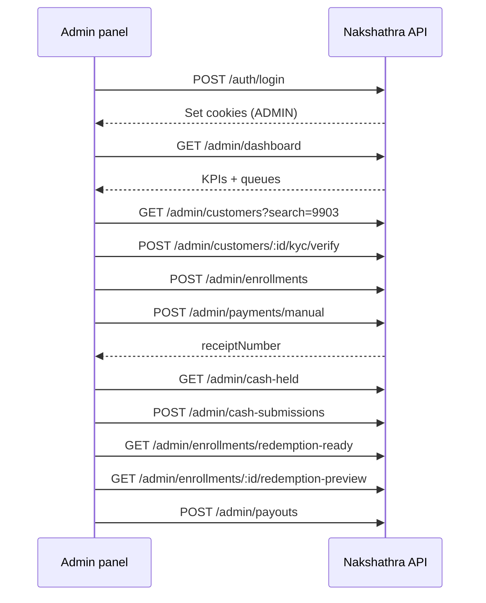


---


## 24. Demo credentials (development / staging)


| Role               | Phone                           | Password         |
| ------------------ | ------------------------------- | ---------------- |
| Admin              | `9999999901` or `+919999999901` | `Nakshathra@123` |
| Customer (testing) | `9999999903`                    | `Nakshathra@123` |


**Do not ship demo credentials in production builds.**

Local dev default port: **2020** → `http://localhost:2020/api/v1`

---


## 25. Frontend implementation checklist

1. Use `credentials: 'include'` / `withCredentials: true` on every request.
2. Route guard: only render admin shell when `GET /auth/me` returns `role: "ADMIN"`.
3. Centralize API client with 401 → refresh → retry interceptor (single-flight refresh).
4. Format all money from paise; send paise to API.
5. Use cursor pagination components for all list screens.
6. Show server `reasonMessage` / validation errors — never invent business rules client-side.
7. Confirm destructive actions (reverse payment, reject KYC, close accounting period).
8. Use `idempotencyKey` (UUID) on manual payment, payout, refund, premature close forms.
9. Link related entities: customer ↔ enrollment ↔ payments ↔ payouts.
10. Fetch `GET /api/v1/openapi.json` in dev tools for schema discovery.

---


## 26. Planned API updates — contribution rules & Mark as paid

> **Status: PLANNED — not implemented in the backend yet.**  
> This section is the contract for the next backend sprint. Once shipped, move each endpoint into the main sections above and add Appendix examples.

### 26.1 Goal

Give the **admin panel** the same rule-aware payment UX as staff:

- Show **Flexible (months 1–6)** vs **Capped (months 7–11)** vs **Redemption (month 12)** on customer/enrollment screens.
- On **Mark as paid / Record payment**, show **how much the customer can still pay this month** (`remainingCapPaise` in capped months).
- Validate amount **before submit** via a payment-preview endpoint (same engine as staff).
- Optional dashboard counts: how many active enrollments are in each phase.

Backend will reuse existing `getPaymentRules()` / `previewContributionPayment()` — no duplicate business logic.

### 26.2 Shared object — `contribution`

Attached to enrollment/customer responses when the enrollment is **ACTIVE** (or optionally **MATURED** in redemption month). `null` if no active enrollment.

```json
{
  "schemeMonth": 7,
  "phase": "CAPPED",
  "phaseLabel": "Capped contribution month",
  "minimumPaymentPaise": 100000,
  "monthlyCapPaise": 200000,
  "capPaise": 200000,
  "paidThisMonthPaise": 50000,
  "remainingCapPaise": 150000,
  "remainingPaise": 150000,
  "capApplies": true,
  "capStrategy": "AVERAGE_SUCCESSFUL_PAYMENT_FIRST_6",
  "firstPeriodEmpty": false,
  "computedAverageCapPaise": 200000,
  "installmentAlreadyPaid": false,
  "calculatedAt": "2026-09-12T06:00:00.000Z"
}
```

| Field | UI label suggestion | Notes |
| --- | --- | --- |
| `phase` | Badge: Flexible / Capped / Redemption | `FLEXIBLE` \| `CAPPED` \| `REDEMPTION` \| `NOT_PAYABLE` |
| `phaseLabel` | Human-readable badge text | From server |
| `schemeMonth` | “Scheme month N” | 1–11 contribution; 12 = redemption |
| `minimumPaymentPaise` | “Minimum per payment” | Plan floor |
| `monthlyCapPaise` / `capPaise` | “Monthly cap” | **Same value** — both keys for staff parity |
| `paidThisMonthPaise` | “Paid this month” | Sum of SUCCESS payments in current scheme month |
| `remainingCapPaise` / `remainingPaise` | **“Can pay up to”** | **Key field for capped months.** `null` in flexible months (no upper cap) |
| `capApplies` | Show cap UI | `true` only in capped months 7–11 |
| `computedAverageCapPaise` | “Cap from month 7 will be ~₹X” | Useful in months 1–6 before cap applies |
| `firstPeriodEmpty` | Warning banner | `true` → month 7+ blocked until month 1–6 has payments |
| `installmentAlreadyPaid` | Disable pay button | Capped month fully paid (`remainingCapPaise === 0`) |

**Flexible month UI:** show `minimumPaymentPaise` only; hide cap row or show “No monthly cap (flexible phase)”.

**Capped month UI:** show `monthlyCapPaise`, `paidThisMonthPaise`, **`remainingCapPaise`** prominently.

### 26.3 New API

#### `GET /admin/enrollments/:id/payment-preview`

Live validation while owner types amount on Mark as paid (mirrors `GET /staff/schemes/:id/payment-preview`).

**Query params:**

| Param | Required | Description |
| --- | --- | --- |
| `amountPaise` | yes | Amount being considered (positive int paise) |
| `paymentDate` | no | ISO datetime; default `now` (IST scheme month) |
| `schemeMonth` | no | **Omit in UI** — server derives from `paymentDate` |

**Response** `200` — `data`:

```json
{
  "enrollmentId": "67a1b2c3d4e5f6789012345e",
  "schemeMonth": 7,
  "phase": "CAPPED",
  "phaseLabel": "Capped contribution month",
  "requestedAmountPaise": 100000,
  "minimumPaymentPaise": 100000,
  "monthlyCapPaise": 200000,
  "paidThisMonthPaise": 50000,
  "remainingCapPaise": 150000,
  "remainingPaise": 150000,
  "capApplies": true,
  "capStrategy": "AVERAGE_SUCCESSFUL_PAYMENT_FIRST_6",
  "allowed": true,
  "paymentAllowed": true,
  "reasonCode": null,
  "reasonMessage": null,
  "calculatedAt": "2026-09-12T06:00:00.000Z",
  "quoteExpiresAt": "2026-09-12T06:05:00.000Z"
}
```

When blocked, `allowed: false`, `reasonCode` e.g. `PAYMENT_LIMIT_EXCEEDED`, `reasonMessage` explains limit — still returns cap fields so UI can show “₹1,500 remaining”.

**Frontend usage:** debounce `GET .../payment-preview?amountPaise=` on amount field change (same pattern as staff app).

---

### 26.4 Updated APIs (existing routes)

| Priority | Method | Path | Change |
| --- | --- | --- | --- |
| P0 | GET | `/admin/enrollments/:id` | Add top-level **`contribution`** |
| P0 | GET | `/admin/customers/:id/enrollment` | Add **`contribution`** (same as enrollment detail) |
| P0 | GET | `/admin/customers/:id` | Add **`contribution`** on active enrollment + **`schemeSummary`** (align with staff customer view) |
| P0 | POST | `/admin/payments/manual` | Response: add **`contribution`** (state **after** payment) + keep `schemeMonth` |
| P1 | GET | `/admin/enrollments` | Each active row: **`contribution.phase`**, **`contribution.schemeMonth`**, **`contribution.remainingCapPaise`** |
| P1 | GET | `/admin/enrollments/due` | Each row: **`phase`**, **`remainingCapPaise`**, **`monthlyCapPaise`** |
| P1 | GET | `/admin/enrollments/overdue` | Add enrollment-level **`contribution`** summary |
| P1 | GET | `/admin/dashboard` | Add **`contributionPhaseCounts`**; enrich **`upcomingInstallments[]`** with phase + cap fields |
| P2 | GET | `/admin/enrollments/redemption-ready` | Add **`contribution.phase: "REDEMPTION"`**, `schemeMonth: 12` |
| P2 | GET | `/admin/customers` | Optional **`activeContribution.phase`** badge per row |
| P2 | GET | `/admin/enrollments` | New filter **`contributionPhase=FLEXIBLE\|CAPPED\|REDEMPTION`** |

**No change** to plan CRUD, settings, finance ops, refunds — static plan fields (`flexibleMonths`, `fixedPaymentDay`) stay on scheme plan objects.

#### Dashboard addition — `contributionPhaseCounts`

On `GET /admin/dashboard` → `data`:

```json
"contributionPhaseCounts": {
  "flexible": 18,
  "capped": 24,
  "redemption": 2
}
```

Counts are **active enrollments only**, based on current calendar scheme month vs policy (same logic as `contribution.phase`).

#### Manual payment response (updated)

`POST /admin/payments/manual` — existing fields plus:

```json
{
  "paymentId": "...",
  "receiptNumber": "NKS-2026-0000012",
  "amountPaise": 100000,
  "method": "CASH",
  "paymentDate": "2026-09-12T06:00:00.000Z",
  "status": "SUCCESS",
  "schemeMonth": 7,
  "contribution": {
    "schemeMonth": 7,
    "phase": "CAPPED",
    "paidThisMonthPaise": 150000,
    "remainingCapPaise": 50000,
    "monthlyCapPaise": 200000
  }
}
```

Success screen should show **`schemeMonth`** and updated **`remainingCapPaise`** (“₹500 still payable this month” or “Month 7 fully paid”).

---

### 26.5 Mark as paid — admin API sequence (wireframe §3)

```
1. GET /admin/customers?search=          → pick customer
2. GET /admin/customers/:id/enrollment   → show enrollment + contribution (phase, caps)
3. [User types amount]
4. GET /admin/enrollments/:id/payment-preview?amountPaise=&paymentDate=  → live validation
5. POST /admin/payments/manual           → submit; show receipt + contribution after pay
```

**Do not send** `schemeMonth` in POST body unless debugging — server assigns from `paymentDate`.

**UI blocks before submit:**

| Condition | UI |
| --- | --- |
| `contribution.firstPeriodEmpty` | Banner: cannot pay month 7+ until month 1–6 has payments |
| `contribution.phase === "CAPPED"` && `remainingCapPaise === 0` | Disable pay — month fully paid |
| Preview `allowed === false` | Show `reasonMessage`; disable submit |
| `kycStatus !== VERIFIED` (when `KYC_REQUIRED`) | Link to verify — existing 409 |

---

### 26.6 Screen → field mapping (frontend design)

| Admin screen | API | New / updated fields to render |
| --- | --- | --- |
| Dashboard queues | `GET /admin/dashboard` | `contributionPhaseCounts.*`; `upcomingInstallments[].phase`, `remainingCapPaise` |
| Mark as paid step 2 | `GET .../customers/:id/enrollment` | Full **`contribution`** card |
| Mark as paid step 3 | `GET .../payment-preview` | `allowed`, `reasonMessage`, cap rows |
| Mark as paid success | `POST .../payments/manual` | `schemeMonth`, `contribution.remainingCapPaise` |
| Customer detail — Schemes tab | `GET /admin/customers/:id` | **`contribution`** badge on active scheme |
| Enrollment detail header | `GET /admin/enrollments/:id` | **`contribution`** card above schedule |
| Enrollment list | `GET /admin/enrollments` | Column: **`contribution.phase`**, **`contribution.schemeMonth`** |
| Due / overdue queues | `GET .../due`, `.../overdue` | **`remainingCapPaise`**, **`phase`** per row |

---

### 26.7 Backend implementation notes (for devs)

1. Extract **`buildContributionStatus(enrollmentId, at?)`** from existing `getPaymentRules(..., enforceLimit: false)` — single source of truth.
2. **`previewContributionPayment`** already exists — wire admin route to it (same as staff handler).
3. **`getCustomerDetails`** (admin) should call the same helper staff uses in `getCustomerFinancialView` — avoid admin/staff drift.
4. Dashboard phase counts: batch `getPaymentRules` for active enrollments or derive from `schemeMonth(startDate, now)` + policy (prefer shared helper).
5. OpenAPI: add schemas `ContributionStatus`, `ContributionPaymentPreview`, `ContributionPhaseCounts`.
6. Tests: admin preview parity with staff; capped month `remainingCapPaise`; flexible month `remainingCapPaise === null`.

### 26.8 Decisions locked (no open blockers)

| Question | Decision |
| --- | --- |
| Separate admin preview route vs reuse staff URL? | **`GET /admin/enrollments/:id/payment-preview`** — admin auth only |
| Field names: `capPaise` vs `monthlyCapPaise`? | Return **both** (same value) for staff doc parity |
| `remainingCapPaise` vs `remainingPaise`? | Return **both** (same value) |
| Client sends `schemeMonth` on manual pay? | **No** — display server-assigned month in response only |
| PhonePe on admin Mark as paid? | **Out of scope** — manual methods only (`CASH`, `UPI`, `BANK`, `CARD`) per existing API |

### 26.9 After implementation checklist

- [ ] Move §26 endpoints into §9 Enrollments / §10 Payments / §4 Dashboard
- [ ] Add Appendix **C.1–C.6** with example JSON for preview + contribution
- [ ] Update [ADMIN_PANEL_WIREFRAMES.md](./ADMIN_PANEL_WIREFRAMES.md) §3.2 contribution card + preview call
- [ ] Update §20 endpoint index (+1 new route)
- [ ] Regenerate `GET /api/v1/openapi.json`

---


## 27. Related docs

- [ADMIN_PANEL_FRONTEND_GUIDE.md](./ADMIN_PANEL_FRONTEND_GUIDE.md) — React folder structure, Redux Toolkit, RTK Query patterns
- [FLUTTER_API_HANDOFF.md](./FLUTTER_API_HANDOFF.md) — staff/customer mobile apps (not admin, but shared auth conventions)
- [FLUTTER_PAYMENT_API_FLOW.md](./FLUTTER_PAYMENT_API_FLOW.md) — PhonePe SDK flow for mobile
- [FLUTTER_APP_FLOWS.md](./FLUTTER_APP_FLOWS.md) — staff/customer screen flows admin should understand
- [PRODUCTION_GO_LIVE_CHECKLIST.md](./PRODUCTION_GO_LIVE_CHECKLIST.md) — deployment checklist

---


## Appendix completeness audit (code vs doc, 2026-09-11)

This audit compares **every admin-panel route registered in code** (`src/routes/admin/*.ts`, `auth.routes.ts`, `upload.routes.ts`) against this document.

### Summary

| Check | Result |
| --- | --- |
| Routes in code (incl. 17 report slugs + `reports/:report`) | **113** |
| Listed in [§20 Complete endpoint index](#20-complete-endpoint-index) | **113 / 113** ✅ |
| Described in main body (§1–§19) | **113 / 113** ✅ |
| Request payload documented (body or N/A for GET) | **113 / 113** ✅ |
| Full example response in Appendix A or B | **113 / 113** ✅ (see index below) |
| Phantom endpoints in doc (not in code) | **0** ✅ |

**Code sources audited:**

- `src/routes/auth.routes.ts` — 4 routes
- `src/routes/upload.routes.ts` — 2 routes
- `src/routes/admin/index.ts` — dashboard
- `src/routes/admin/staff-admin.routes.ts` — 6 routes
- `src/routes/admin/customer-admin.routes.ts` — 7 routes
- `src/routes/admin/scheme-admin.routes.ts` — 20 routes
- `src/routes/admin/finance-admin.routes.ts` — 42 routes
- `src/routes/admin/report-admin.routes.ts` — 11 routes (+ 17 report slugs via `getReportHandler`)
- `src/routes/admin/settings-admin.routes.ts` — 2 routes

**Notes:**

- `POST /admin/customers/:id/reset-password` uses the same body as `POST /admin/users/:id/reset-password` (Appendix A.13).
- `GET /admin/reports/payouts` returns the same shape as `payout-totals`.
- `GET /admin/reports/cash-position` mirrors dashboard cash-position KPIs.
- PhonePe mobile config `GET /api/v1/payments/phonepe/config` is documented in §15 for reference but is **not** an admin-only route.

### Endpoint documentation map

| Method | Path | §20 | Body § | Request | Response example |
| --- | --- | --- | --- | --- | --- |
| POST | `/auth/login` | ✅ | §2 | A.1 | A.1 |
| GET | `/auth/me` | ✅ | §2 | N/A | A.2 |
| POST | `/auth/refresh` | ✅ | §2 | empty | A.3 |
| POST | `/auth/logout` | ✅ | §2 | empty | A.4 |
| GET | `/admin/dashboard` | ✅ | §3 | N/A | A.5 |
| GET | `/admin/settings` | ✅ | §18 | N/A | A.6 |
| PATCH | `/admin/settings` | ✅ | §18 | §18 | A.7 |
| GET | `/admin/staff` | ✅ | §4 | N/A | A.8 |
| POST | `/admin/staff` | ✅ | §4 | §4 | A.9 |
| GET | `/admin/staff/:id` | ✅ | §4 | N/A | A.10 |
| PATCH | `/admin/staff/:id` | ✅ | §4 | §4 | A.11 |
| PATCH | `/admin/users/:id/status` | ✅ | §4 | §4 | A.12 |
| POST | `/admin/users/:id/reset-password` | ✅ | §4 | §4 | A.13 |
| GET | `/admin/customers` | ✅ | §5 | N/A | A.14 |
| POST | `/admin/customers` | ✅ | §5 | §5 | A.15 |
| GET | `/admin/customers/:id` | ✅ | §5 | N/A | A.16 |
| PATCH | `/admin/customers/:id` | ✅ | §5 | §5 | A.17 |
| GET | `/admin/customers/:id/enrollment` | ✅ | §5 | N/A | A.18 |
| POST | `/admin/customers/:id/kyc/verify` | ✅ | §5 | empty | A.19 |
| POST | `/admin/customers/:id/kyc/reject` | ✅ | §5 | §5 | A.20 |
| POST | `/admin/customers/:id/reset-password` | ✅ | §5 | §4 (= A.13) | A.13 |
| POST | `/uploads/presign` | ✅ | §6 | §6 | A.21 |
| POST | `/uploads/` | ✅ | §6 | binary | B.1 |
| GET | `/admin/scheme-plans` | ✅ | §8 | N/A | A.22 |
| POST | `/admin/scheme-plans` | ✅ | §8 | §8 | A.23 |
| GET | `/admin/scheme-plans/:id` | ✅ | §8 | N/A | B.2 |
| PATCH | `/admin/scheme-plans/:id` | ✅ | §8 | §8 | B.2 |
| POST | `/admin/enrollments` | ✅ | §9 | §9 | A.24 |
| GET | `/admin/enrollments` | ✅ | §9 | N/A | B.3 |
| GET | `/admin/enrollments/due` | ✅ | §9 | N/A | B.3 |
| GET | `/admin/enrollments/overdue` | ✅ | §9 | N/A | B.3 |
| GET | `/admin/enrollments/redemption-ready` | ✅ | §9 | N/A | A.26 |
| GET | `/admin/maturity-calendar` | ✅ | §9 | N/A | §9 |
| GET | `/admin/enrollments/:id` | ✅ | §9 | N/A | A.25 |
| PATCH | `/admin/enrollments/:id/status` | ✅ | §9 | §9 | B.4 |
| POST | `/admin/enrollments/:id/cancel` | ✅ | §9 | §9 | B.4 |
| GET | `/admin/enrollments/:id/premature-closure-preview` | ✅ | §9 | N/A | B.5 |
| POST | `/admin/enrollments/:id/premature-close` | ✅ | §9 | §9 | A.28 |
| GET | `/admin/enrollments/:id/redemption-preview` | ✅ | §9 | N/A | A.27 |
| POST | `/admin/gold-rates` | ✅ | §17.6 | §17.6 | B.6 |
| GET | `/admin/gold-rates` | ✅ | §17.6 | N/A | B.6 |
| GET | `/admin/gold-rates/:id` | ✅ | §17.6 | N/A | B.6 |
| PATCH | `/admin/gold-rates/:id` | ✅ | §17.6 | §17.6 | B.6 |
| POST | `/admin/payments/manual` | ✅ | §10 | §10 | A.29 |
| GET | `/admin/payments` | ✅ | §10 | N/A | A.30 |
| GET | `/admin/payments/:id` | ✅ | §10 | N/A | A.31 |
| POST | `/admin/payments/:id/reverse` | ✅ | §10 | §10 | A.32 |
| POST | `/admin/payments/:id/refund` | ✅ | §10 | §10 | A.33 |
| GET | `/admin/refunds` | ✅ | §14 | N/A | A.39 |
| GET | `/admin/refunds/:id` | ✅ | §14 | N/A | B.7 |
| POST | `/admin/refunds/:id/check-status` | ✅ | §14 | empty | B.7 |
| POST | `/admin/refunds/:id/retry` | ✅ | §14 | §14 | B.7 |
| POST | `/admin/payouts` | ✅ | §11 | §11 | A.36 |
| GET | `/admin/payouts` | ✅ | §11 | N/A | B.8 |
| GET | `/admin/cash-held` | ✅ | §12 | N/A | A.34 |
| POST | `/admin/cash-submissions` | ✅ | §12 | §12 | A.35 |
| GET | `/admin/cash-submissions` | ✅ | §12 | N/A | B.9 |
| GET | `/admin/corrections` | ✅ | §13 | N/A | A.37 |
| PATCH | `/admin/corrections/:id` | ✅ | §13 | §13 | A.38 |
| GET | `/admin/audit-logs` | ✅ | §19 | N/A | B.10 |
| GET | `/admin/phonepe-transactions` | ✅ | §15 | N/A | A.40 |
| GET | `/admin/phonepe-transactions/:id` | ✅ | §15 | N/A | B.11 |
| GET | `/admin/reports/:report` | ✅ | §16 | N/A | B.12 |
| GET | `/admin/reports/collection` | ✅ | §16 | N/A | A.41 |
| GET | `/admin/reports/daily-collection` | ✅ | §16 | N/A | A.42 |
| GET | `/admin/reports/staff-performance` | ✅ | §16 | N/A | A.43 |
| GET | `/admin/reports/customer-ledger` | ✅ | §16 | N/A | A.44 |
| GET | `/admin/reports/*` (13 other slugs) | ✅ | §16 | N/A | B.12 |
| GET | `/admin/reports/financial-periods/:periodKey` | ✅ | §16 | N/A | B.13 |
| GET | `/admin/reports/bank-settlement-ledger` | ✅ | §16 | N/A | B.13 |
| GET | `/admin/reports/gateway-expenses` | ✅ | §16 | N/A | B.13 |
| GET | `/admin/reports/refunds` | ✅ | §16 | N/A | B.13 |
| GET | `/admin/reports/suspense-ledger` | ✅ | §16 | N/A | B.13 |
| GET | `/admin/reports/gold-control` | ✅ | §16 | N/A | B.13 |
| GET | `/admin/reports/financial-exceptions-aging` | ✅ | §16 | N/A | B.13 |
| GET | `/admin/operation-records/:module/:id` | ✅ | §16 | N/A | B.14 |
| GET | `/admin/finance/exceptions` | ✅ | §17.1 | N/A | A.45 |
| GET | `/admin/finance/exceptions/:id` | ✅ | §17.1 | N/A | B.15 |
| POST | `/admin/finance/exceptions/:id/acknowledge` | ✅ | §17.1 | §17.1 | B.15 |
| POST | `/admin/finance/exceptions/:id/resolve` | ✅ | §17.1 | §17.1 | B.15 |
| POST | `/admin/finance/suspense` | ✅ | §17.2 | §17.2 | B.16 |
| GET | `/admin/finance/suspense` | ✅ | §17.2 | N/A | B.16 |
| POST | `/admin/finance/suspense/:id/resolve` | ✅ | §17.2 | §17.2 | B.16 |
| POST | `/admin/finance/disputes` | ✅ | §17.3 | §17.3 | B.17 |
| GET | `/admin/finance/disputes` | ✅ | §17.3 | N/A | B.17 |
| GET | `/admin/finance/disputes/:id` | ✅ | §17.3 | N/A | B.17 |
| PATCH | `/admin/finance/disputes/:id` | ✅ | §17.3 | §17.3 | B.17 |
| POST | `/admin/finance/gateway-settlements` | ✅ | §17.4 | §17.4 | A.46 |
| GET | `/admin/finance/gateway-settlements` | ✅ | §17.4 | N/A | B.18 |
| GET | `/admin/finance/gateway-settlements/summary` | ✅ | §17.4 | N/A | B.18 |
| GET | `/admin/finance/gateway-settlements/:id` | ✅ | §17.4 | N/A | B.18 |
| POST | `/admin/finance/gateway-settlements/:id/confirm-bank-credit` | ✅ | §17.4 | §17.4 | B.18 |
| POST | `/admin/finance/gateway-settlements/:id/close` | ✅ | §17.4 | §17.4 | B.18 |
| GET | `/admin/finance/accounting-periods` | ✅ | §17.5 | N/A | B.19 |
| GET | `/admin/finance/accounting-periods/:periodKey` | ✅ | §17.5 | N/A | B.19 |
| POST | `/admin/finance/accounting-periods/:periodKey/close` | ✅ | §17.5 | §17.5 | B.19 |
| POST | `/admin/finance/accounting-periods/:periodKey/reopen` | ✅ | §17.5 | §17.5 | B.19 |
| POST | `/admin/finance/gold-inventory/movements` | ✅ | §17.6 | §17.6 | B.20 |
| GET | `/admin/finance/gold-inventory/movements` | ✅ | §17.6 | N/A | B.20 |
| GET | `/admin/finance/gold-control/summary` | ✅ | §17.6 | N/A | B.20 |
| GET | `/admin/finance/gold-control/liability-movements` | ✅ | §17.6 | N/A | B.20 |

---


## Appendix A — Example request & response payloads

All examples use the standard envelope. **IDs and dates are illustrative** — your responses will use real MongoDB ObjectIds and ISO timestamps.

Cookies are omitted from JSON below. After login, the browser/client must send `Cookie: access_token=…; refresh_token=…` on every authenticated call.

### Coverage index

Every admin-panel route in code is mapped below. **Appendix A** = primary examples; **Appendix B** = supplemental responses from the [2026-09-11 audit](#appendix-completeness-audit-code-vs-doc-2026-09-11). **§N** = request/query documented in main body section N.


| Endpoint | Appendix |
| --- | --- |
| **Auth** | |
| `POST /auth/login` | A.1 |
| `GET /auth/me` | A.2 |
| `POST /auth/refresh` | A.3 |
| `POST /auth/logout` | A.4 |
| **Dashboard & settings** | |
| `GET /admin/dashboard` | A.5 |
| `GET /admin/settings` | A.6 |
| `PATCH /admin/settings` | A.7 |
| **Staff** | |
| `GET /admin/staff` | A.8 |
| `POST /admin/staff` | A.9 |
| `GET /admin/staff/:id` | A.10 |
| `PATCH /admin/staff/:id` | A.11 |
| `PATCH /admin/users/:id/status` | A.12 |
| `POST /admin/users/:id/reset-password` | A.13 |
| **Customers & KYC** | |
| `GET /admin/customers` | A.14 |
| `POST /admin/customers` | A.15 |
| `GET /admin/customers/:id` | A.16 |
| `PATCH /admin/customers/:id` | A.17 |
| `GET /admin/customers/:id/enrollment` | A.18 |
| `POST /admin/customers/:id/kyc/verify` | A.19 |
| `POST /admin/customers/:id/kyc/reject` | A.20 |
| `POST /admin/customers/:id/reset-password` | A.13 (same body) |
| **Uploads** | |
| `POST /uploads/presign` | A.21 |
| `POST /uploads/` | B.1 |
| **Scheme plans & enrollments** | |
| `GET /admin/scheme-plans` | A.22 |
| `POST /admin/scheme-plans` | A.23 |
| `GET /admin/scheme-plans/:id` | B.2 |
| `PATCH /admin/scheme-plans/:id` | B.2 |
| `POST /admin/enrollments` | A.24 |
| `GET /admin/enrollments` | B.3 |
| `GET /admin/enrollments/due` | B.3 |
| `GET /admin/enrollments/overdue` | B.3 |
| `GET /admin/enrollments/redemption-ready` | A.26 |
| `GET /admin/enrollments/:id` | A.25 |
| `PATCH /admin/enrollments/:id/status` | §9 / B.4 |
| `POST /admin/enrollments/:id/cancel` | §9 / B.4 |
| `GET /admin/enrollments/:id/premature-closure-preview` | B.5 |
| `POST /admin/enrollments/:id/premature-close` | A.28 |
| `GET /admin/enrollments/:id/redemption-preview` | A.27 |
| **Gold rates** | |
| `GET /admin/gold-rates` | B.6 |
| `POST /admin/gold-rates` | §17.6 / B.6 |
| `GET /admin/gold-rates/:id` | B.6 |
| `PATCH /admin/gold-rates/:id` | §17.6 / B.6 |
| **Payments & cash** | |
| `POST /admin/payments/manual` | A.29 |
| `GET /admin/payments` | A.30 |
| `GET /admin/payments/:id` | A.31 |
| `POST /admin/payments/:id/reverse` | A.32 |
| `POST /admin/payments/:id/refund` | A.33 |
| `GET /admin/cash-held` | A.34 |
| `POST /admin/cash-submissions` | A.35 |
| `GET /admin/cash-submissions` | B.9 |
| **Payouts & corrections** | |
| `POST /admin/payouts` | A.36 |
| `GET /admin/payouts` | B.8 |
| `GET /admin/corrections` | A.37 |
| `PATCH /admin/corrections/:id` | A.38 |
| **Refunds & PhonePe** | |
| `GET /admin/refunds` | A.39 |
| `GET /admin/refunds/:id` | B.7 |
| `POST /admin/refunds/:id/check-status` | B.7 |
| `POST /admin/refunds/:id/retry` | §14 / B.7 |
| `GET /admin/phonepe-transactions` | A.40 |
| `GET /admin/phonepe-transactions/:id` | B.11 |
| **Audit** | |
| `GET /admin/audit-logs` | B.10 |
| **Reports** | |
| `GET /admin/reports/collection` | A.41 |
| `GET /admin/reports/daily-collection` | A.42 |
| `GET /admin/reports/staff-performance` | A.43 |
| `GET /admin/reports/customer-ledger?id=` | A.44 |
| `GET /admin/reports/:report` (other slugs) | B.12 |
| `GET /admin/reports/financial-periods/:periodKey` | B.13 |
| `GET /admin/reports/bank-settlement-ledger` | B.13 |
| `GET /admin/reports/gateway-expenses` | B.13 |
| `GET /admin/reports/refunds` | B.13 |
| `GET /admin/reports/suspense-ledger` | B.13 |
| `GET /admin/reports/gold-control` | B.13 |
| `GET /admin/reports/financial-exceptions-aging` | B.13 |
| `GET /admin/operation-records/:module/:id` | B.14 |
| **Finance ops** | |
| `GET /admin/finance/exceptions` | A.45 |
| `GET /admin/finance/exceptions/:id` | B.15 |
| `POST /admin/finance/exceptions/:id/acknowledge` | §17.1 / B.15 |
| `POST /admin/finance/exceptions/:id/resolve` | §17.1 / B.15 |
| `POST /admin/finance/suspense` | §17.2 / B.16 |
| `GET /admin/finance/suspense` | B.16 |
| `POST /admin/finance/suspense/:id/resolve` | §17.2 / B.16 |
| `POST /admin/finance/disputes` | §17.3 / B.17 |
| `GET /admin/finance/disputes` | B.17 |
| `GET /admin/finance/disputes/:id` | B.17 |
| `PATCH /admin/finance/disputes/:id` | §17.3 / B.17 |
| `POST /admin/finance/gateway-settlements` | A.46 |
| `GET /admin/finance/gateway-settlements` | B.18 |
| `GET /admin/finance/gateway-settlements/summary` | B.18 |
| `GET /admin/finance/gateway-settlements/:id` | B.18 |
| `POST /admin/finance/gateway-settlements/:id/confirm-bank-credit` | §17.4 / B.18 |
| `POST /admin/finance/gateway-settlements/:id/close` | §17.4 / B.18 |
| `GET /admin/finance/accounting-periods` | B.19 |
| `GET /admin/finance/accounting-periods/:periodKey` | B.19 |
| `POST /admin/finance/accounting-periods/:periodKey/close` | §17.5 / B.19 |
| `POST /admin/finance/accounting-periods/:periodKey/reopen` | §17.5 / B.19 |
| `POST /admin/finance/gold-inventory/movements` | §17.6 / B.20 |
| `GET /admin/finance/gold-inventory/movements` | B.20 |
| `GET /admin/finance/gold-control/summary` | B.20 |
| `GET /admin/finance/gold-control/liability-movements` | B.20 |
| **Errors** | |
| Validation error shape | A.47 |


---


### A.1 Login — `POST /auth/login`

**Request:**

```json
{
  "phone": "9999999901",
  "password": "Nakshathra@123"
}
```

**Response** `200`**:** (also sets `access_token` + `refresh_token` cookies)

```json
{
  "success": true,
  "data": {
    "user": {
      "id": "67a1b2c3d4e5f6789012345a",
      "name": "Demo Admin",
      "phone": "+919999999901",
      "role": "ADMIN",
      "permissions": []
    },
    "redirectTo": "/admin"
  }
}
```

**Error** `401`**:**

```json
{
  "success": false,
  "error": {
    "code": "INVALID_CREDENTIALS",
    "message": "Invalid phone or password",
    "retryable": false,
    "details": []
  },
  "requestId": "req_01JABC123"
}
```

---


### A.2 Current session — `GET /auth/me`

**Request:** no body

**Response** `200`**:**

```json
{
  "success": true,
  "data": {
    "userId": "67a1b2c3d4e5f6789012345a",
    "role": "ADMIN",
    "permissions": [],
    "sessionVersion": 0
  }
}
```

---


### A.3 Refresh — `POST /auth/refresh`

**Request:** no body (requires `refresh_token` cookie)

**Response** `200`**:** same `data` shape as login; cookies are rotated.

---


### A.4 Logout — `POST /auth/logout`

**Response** `200`**:**

```json
{
  "success": true,
  "data": {
    "loggedOut": true
  }
}
```

---


### A.5 Dashboard — `GET /admin/dashboard`

**Response** `200`**:** (abbreviated — real payload can be large)

```json
{
  "success": true,
  "data": {
    "totalCollectionPaise": 5250000,
    "todayCollectionPaise": 100000,
    "todayPaymentCount": 1,
    "monthCollectionPaise": 850000,
    "monthPaymentCount": 8,
    "cashCollectionPaise": 2100000,
    "phonepeCollectionPaise": 2500000,
    "upiCollectionPaise": 400000,
    "bankCollectionPaise": 150000,
    "cardCollectionPaise": 200000,
    "cashSubmittedPaise": 1800000,
    "cashWithStaffPaise": 300000,
    "cashPayoutPaise": 1100000,
    "cashInVaultPaise": 950000,
    "activeSchemes": 42,
    "maturedSchemes": 5,
    "redemptionReadySchemes": 3,
    "dueInstallmentCount": 12,
    "overdueInstallmentCount": 4,
    "activeCashSchemes": 42,
    "activeGoldWeightSchemes": 0,
    "goldLiabilityMg": 0,
    "currentGoldRate": null,
    "recentPayments": [
      {
        "_id": "67a1b2c3d4e5f6789012345f",
        "amountPaise": 100000,
        "method": "CASH",
        "status": "SUCCESS",
        "paymentDate": "2026-08-17T10:00:00.000Z",
        "schemeMonth": 3,
        "receiptNumber": "NKS-2026-0000004",
        "customerId": {
          "userId": { "name": "Demo Customer", "phone": "+919876543210" }
        },
        "schemeId": { "enrollmentNumber": "NKS-ENR-2026-000001", "schemeType": "CASH" }
      }
    ],
    "recentCustomers": [
      {
        "_id": "67a1b2c3d4e5f6789012345c",
        "customerCode": "NKS-C000001",
        "kycStatus": "VERIFIED",
        "status": "ACTIVE"
      }
    ],
    "upcomingMaturities": [],
    "upcomingInstallments": [
      {
        "schemeMonth": 3,
        "status": "OVERDUE",
        "amountPaise": 100000,
        "dueDate": "2026-08-31T18:29:59.000Z",
        "enrollmentId": "67a1b2c3d4e5f6789012345e",
        "enrollmentNumber": "NKS-ENR-2026-000001",
        "customerId": {
          "userId": { "name": "Demo Customer", "phone": "+919876543210" }
        }
      }
    ],
    "monthlyCollections": [
      { "_id": { "year": 2026, "month": 8, "schemeType": "CASH" }, "totalPaise": 850000 }
    ]
  }
}
```

---


### A.6 Settings — `GET /admin/settings`

**Response** `200`**:**

```json
{
  "success": true,
  "data": {
    "singletonKey": "GLOBAL",
    "businessName": "Nakshathra Jewellers",
    "supportPhone": "+919876543210",
    "supportEmail": "support@nakshathra.example",
    "businessAddress": "Hassan, Karnataka",
    "receiptFooter": "Thank you for saving with Nakshathra Jewellers.",
    "customerPhonePeEnabled": true,
    "updatedBy": "67a1b2c3d4e5f6789012345a",
    "updatedAt": "2026-08-17T08:00:00.000Z"
  }
}
```

---


### A.7 Update settings — `PATCH /admin/settings`

**Request:** all fields required

```json
{
  "businessName": "Nakshathra Jewellers",
  "supportPhone": "+919876543210",
  "supportEmail": "support@nakshathra.example",
  "businessAddress": "MG Road, Hassan, Karnataka 573201",
  "receiptFooter": "Thank you for saving with Nakshathra Jewellers.",
  "customerPhonePeEnabled": true
}
```

**Response** `200`**:** same shape as A.6 with updated values.

---


### A.8 List staff — `GET /admin/staff?search=9876&limit=20`

**Response** `200`**:**

```json
{
  "success": true,
  "data": [
    {
      "_id": "67a1b2c3d4e5f6789012345b0",
      "userId": {
        "_id": "67a1b2c3d4e5f6789012345b",
        "name": "Counter Staff",
        "phone": "+919988776655",
        "status": "ACTIVE"
      },
      "employeeCode": "STF-001",
      "permissions": [
        "canViewCustomers",
        "canCreateCustomer",
        "canEnrollScheme",
        "canCollectPayment",
        "canSubmitCorrectionRequest"
      ],
      "cashVersion": 3,
      "createdAt": "2026-07-01T09:00:00.000Z"
    }
  ],
  "meta": {
    "mode": "cursor",
    "limit": 20,
    "nextCursor": null,
    "hasMore": false
  }
}
```

---


### A.9 Create staff — `POST /admin/staff`

**Request:**

```json
{
  "name": "Report Staff",
  "phone": "9876543210",
  "password": "StaffPass123!",
  "employeeCode": "NKS-S701",
  "permissions": ["canViewCustomers", "canCollectPayment"],
  "notes": "Counter team"
}
```

**Response** `201`**:**

```json
{
  "success": true,
  "data": {
    "userId": "67a1b2c3d4e5f6789012345b",
    "profileId": "67a1b2c3d4e5f6789012345b0"
  }
}
```

---


### A.10 Staff detail — `GET /admin/staff/:id?from=2026-08-01&to=2026-08-31`

**Response** `200`**:** (abbreviated)

```json
{
  "success": true,
  "data": {
    "profile": {
      "_id": "67a1b2c3d4e5f6789012345b0",
      "employeeCode": "STF-001",
      "permissions": ["canViewCustomers", "canCollectPayment"],
      "userId": {
        "name": "Counter Staff",
        "phone": "+919988776655",
        "status": "ACTIVE"
      }
    },
    "collectionSummary": {
      "collectionPaise": 350000,
      "paymentCount": 4,
      "cashCollectedPaise": 250000,
      "cashSubmittedPaise": 150000,
      "cashWithStaffPaise": 100000,
      "byMethod": {
        "CASH": { "totalPaise": 250000, "count": 3 },
        "PHONEPE": { "totalPaise": 100000, "count": 1 }
      }
    },
    "recentPayments": [],
    "recentCorrections": [],
    "cashSubmissions": []
  }
}
```

---


### A.11 Update staff — `PATCH /admin/staff/:id`

**Request:**

```json
{
  "permissions": [
    "canViewCustomers",
    "canCreateCustomer",
    "canEnrollScheme",
    "canCollectPayment",
    "canSubmitCorrectionRequest"
  ]
}
```

**Response** `200`**:**

```json
{
  "success": true,
  "data": {
    "profileId": "67a1b2c3d4e5f6789012345b0",
    "profile": {
      "permissions": [
        "canViewCustomers",
        "canCreateCustomer",
        "canEnrollScheme",
        "canCollectPayment",
        "canSubmitCorrectionRequest"
      ]
    }
  }
}
```

---


### A.12 Update user status — `PATCH /admin/users/:id/status`

**Request:**

```json
{
  "status": "INACTIVE"
}
```

**Response** `200`**:**

```json
{
  "success": true,
  "data": {
    "userId": "67a1b2c3d4e5f6789012345b",
    "status": "INACTIVE"
  }
}
```

---


### A.13 Reset password — `POST /admin/users/:id/reset-password`

**Request:**

```json
{
  "newPassword": "NewSecurePass1!"
}
```

**Response** `200`**:**

```json
{
  "success": true,
  "data": {
    "userId": "67a1b2c3d4e5f6789012345b",
    "passwordReset": true
  }
}
```

---


### A.14 List customers — `GET /admin/customers?search=9876&limit=20`

**Response** `200`**:**

```json
{
  "success": true,
  "data": [
    {
      "_id": "67a1b2c3d4e5f6789012345c",
      "customerCode": "NKS-C000001",
      "kycStatus": "VERIFIED",
      "status": "ACTIVE",
      "userId": {
        "_id": "67a1b2c3d4e5f6789012345a",
        "name": "Demo Customer",
        "phone": "+919876543210"
      },
      "createdAt": "2026-08-01T09:00:00.000Z"
    }
  ],
  "meta": {
    "mode": "cursor",
    "limit": 20,
    "nextCursor": null,
    "hasMore": false
  }
}
```

---


### A.15 Create customer — `POST /admin/customers`

**Request:**

```json
{
  "name": "Anita Sharma",
  "phone": "9876512345",
  "password": "TempPass12!",
  "address": {
    "line1": "12 MG Road",
    "city": "Hassan",
    "state": "Karnataka",
    "postalCode": "573201"
  },
  "aadhaar": {
    "frontKey": "nakshathra-jewellery/aadhaar/67a1/front.jpg",
    "backKey": "nakshathra-jewellery/aadhaar/67a1/back.jpg"
  },
  "nominee": {
    "name": "Raj Sharma",
    "relationship": "Spouse",
    "phone": "9876512346"
  },
  "enrollment": {
    "schemePlanId": "67a1b2c3d4e5f6789012345aa",
    "startDate": "2026-08-01T00:00:00.000Z",
    "monthlyInstallmentPaise": 100000
  }
}
```

**Response** `201`**:**

```json
{
  "success": true,
  "data": {
    "customer": {
      "_id": "67a1b2c3d4e5f6789012345bb",
      "customerCode": "NKS-C000002",
      "kycStatus": "PENDING",
      "status": "ACTIVE",
      "userId": "67a1b2c3d4e5f6789012345bc"
    },
    "enrollment": {
      "_id": "67a1b2c3d4e5f6789012345bd",
      "enrollmentNumber": "NKS-ENR-2026-000002",
      "schemeType": "CASH",
      "status": "ACTIVE",
      "monthlyInstallmentPaise": 100000
    }
  }
}
```

If `enrollment` was omitted, `data.enrollment` is `null`.

---


### A.16 Customer detail — `GET /admin/customers/:id`

**Response** `200`**:** (abbreviated)

```json
{
  "success": true,
  "data": {
    "customer": {
      "_id": "67a1b2c3d4e5f6789012345c",
      "customerCode": "NKS-C000001",
      "kycStatus": "VERIFIED",
      "status": "ACTIVE",
      "userId": {
        "name": "Demo Customer",
        "phone": "+919876543210",
        "status": "ACTIVE"
      },
      "address": {
        "line1": "12 MG Road",
        "city": "Hassan",
        "state": "Karnataka",
        "postalCode": "573201"
      },
      "aadhaar": {
        "frontKey": "nakshathra-jewellery/aadhaar/.../front.jpg",
        "backKey": "nakshathra-jewellery/aadhaar/.../back.jpg",
        "frontUrl": "https://signed-s3-url...",
        "backUrl": "https://signed-s3-url..."
      }
    },
    "schemes": [
      {
        "_id": "67a1b2c3d4e5f6789012345e",
        "enrollmentNumber": "NKS-ENR-2026-000001",
        "schemeType": "CASH",
        "status": "ACTIVE",
        "monthlyInstallmentPaise": 100000,
        "totalPaidPaise": 200000,
        "paymentsCompleted": 2,
        "schemeName": "Nakshathra Cash 11"
      }
    ],
    "payments": [
      {
        "_id": "67a1b2c3d4e5f6789012345cc",
        "amountPaise": 100000,
        "method": "CASH",
        "status": "SUCCESS",
        "paymentDate": "2026-08-17T10:00:00.000Z",
        "schemeMonth": 3,
        "receiptNumber": "NKS-2026-0000004"
      }
    ],
    "payouts": [],
    "paymentIntents": []
  }
}
```

---


### A.17 Update customer — `PATCH /admin/customers/:id`

**Request:**

```json
{
  "name": "Anita Sharma Updated",
  "address": {
    "line1": "45 New Street",
    "city": "Hassan",
    "state": "Karnataka",
    "postalCode": "573201"
  },
  "nominee": {
    "name": "Raj Sharma",
    "relationship": "Spouse",
    "phone": "9876512346"
  }
}
```

**Response** `200`**:** full customer detail (same shape as A.16).

---


### A.18 Active enrollment — `GET /admin/customers/:id/enrollment`

**Response** `200`**:**

```json
{
  "success": true,
  "data": {
    "_id": "67a1b2c3d4e5f6789012345e",
    "enrollmentNumber": "NKS-ENR-2026-000001",
    "schemeType": "CASH",
    "status": "ACTIVE",
    "monthlyInstallmentPaise": 100000,
    "totalPaidPaise": 200000,
    "paymentsCompleted": 2,
    "startDate": "2026-08-01T00:00:00.000Z",
    "maturityDate": "2027-07-01T00:00:00.000Z",
    "schemePlanId": {
      "_id": "67a1b2c3d4e5f6789012345aa",
      "name": "Nakshathra Cash 11",
      "type": "CASH"
    }
  }
}
```

**Response** `404` **when no active enrollment:**

```json
{
  "success": false,
  "error": {
    "code": "ACTIVE_ENROLLMENT_NOT_FOUND",
    "message": "This customer has no active scheme enrollment",
    "retryable": false,
    "details": []
  },
  "requestId": "req_01JABC127"
}
```

---


### A.19 Verify KYC — `POST /admin/customers/:id/kyc/verify`

**Request:** no body

**Response** `200`**:**

```json
{
  "success": true,
  "data": {
    "customerId": "67a1b2c3d4e5f6789012345c",
    "kycStatus": "VERIFIED",
    "kycReviewedAt": "2026-08-17T11:00:00.000Z"
  }
}
```

---


### A.20 Reject KYC — `POST /admin/customers/:id/kyc/reject`

**Request:**

```json
{
  "reason": "Aadhaar image is unreadable"
}
```

**Response** `200`**:**

```json
{
  "success": true,
  "data": {
    "customerId": "67a1b2c3d4e5f6789012345c",
    "kycStatus": "REJECTED",
    "kycRejectionReason": "Aadhaar image is unreadable"
  }
}
```

---


### A.21 Aadhaar presign — `POST /uploads/presign`

**Request:**

```json
{
  "kind": "aadhaar-front",
  "contentType": "image/jpeg",
  "fileName": "front.jpg"
}
```

**Response** `200`**:**

```json
{
  "success": true,
  "data": {
    "key": "nakshathra-jewellery/aadhaar/67a1/front.jpg",
    "uploadUrl": "https://bucket.s3.ap-south-1.amazonaws.com/...",
    "method": "PUT",
    "headers": { "Content-Type": "image/jpeg" },
    "maxBytes": 10485760,
    "expiresIn": 900
  }
}
```

Upload the file with `PUT` to `uploadUrl`, then use `key` in customer create/update.

---


### A.22 List scheme plans — `GET /admin/scheme-plans`

**Response** `200`**:**

```json
{
  "success": true,
  "data": [
    {
      "_id": "67a1b2c3d4e5f6789012345aa",
      "name": "Nakshathra Cash 11",
      "type": "CASH",
      "status": "ACTIVE",
      "durationMonths": 11,
      "minimumPaymentPaise": 100000,
      "termsText": "Contribute for 11 months. Months 1-6 flexible; 7-11 capped.",
      "paymentWindowType": "FIXED_DAY",
      "fixedPaymentDay": 5,
      "prematureClosureEnabled": true,
      "maturitySettlementAssets": ["CASH", "JEWELLERY"]
    }
  ]
}
```

---


### A.23 Create scheme plan — `POST /admin/scheme-plans`

**Request:**

```json
{
  "name": "Nakshathra Cash 11",
  "minimumPaymentPaise": 100000,
  "termsText": "Eleven contribution months then cash or jewellery payout.",
  "benefitText": "Making charge waiver on maturity jewellery.",
  "paymentWindowType": "FIXED_DAY",
  "fixedPaymentDay": 5,
  "prematureClosureEnabled": true,
  "prematureClosureMinElapsedMonths": 6,
  "maturitySettlementAssets": ["CASH", "JEWELLERY"],
  "prematureClosureSettlementAssets": ["CASH"]
}
```

**Response** `201`**:**

```json
{
  "success": true,
  "data": {
    "_id": "67a1b2c3d4e5f6789012345aa",
    "name": "Nakshathra Cash 11",
    "type": "CASH",
    "status": "ACTIVE",
    "durationMonths": 11,
    "minimumPaymentPaise": 100000
  }
}
```

---


### A.24 Create enrollment — `POST /admin/enrollments`

**Request:**

```json
{
  "customerId": "67a1b2c3d4e5f6789012345c",
  "schemePlanId": "67a1b2c3d4e5f6789012345aa",
  "startDate": "2026-08-01T00:00:00.000Z",
  "monthlyInstallmentPaise": 100000
}
```

**Response** `201`**:**

```json
{
  "success": true,
  "data": {
    "_id": "67a1b2c3d4e5f6789012345e",
    "customerId": "67a1b2c3d4e5f6789012345c",
    "enrollmentNumber": "NKS-ENR-2026-000001",
    "schemeType": "CASH",
    "status": "ACTIVE",
    "startDate": "2026-08-01T00:00:00.000Z",
    "maturityDate": "2027-07-01T00:00:00.000Z",
    "monthlyInstallmentPaise": 100000,
    "totalPaidPaise": 0,
    "paymentsCompleted": 0,
    "durationMonths": 11
  }
}
```

---


### A.25 Enrollment detail — `GET /admin/enrollments/:id`

**Response** `200`**:** (abbreviated)

```json
{
  "success": true,
  "data": {
    "enrollment": {
      "_id": "67a1b2c3d4e5f6789012345e",
      "enrollmentNumber": "NKS-ENR-2026-000001",
      "schemeType": "CASH",
      "status": "ACTIVE",
      "monthlyInstallmentPaise": 100000,
      "totalPaidPaise": 200000,
      "paymentsCompleted": 2,
      "customerId": {
        "customerCode": "NKS-C000001",
        "userId": { "name": "Demo Customer", "phone": "+919876543210" }
      },
      "schemePlanId": { "name": "Nakshathra Cash 11", "type": "CASH" }
    },
    "payments": [],
    "payouts": [],
    "installmentSchedule": [
      {
        "schemeMonth": 1,
        "amountPaise": 100000,
        "status": "PAID",
        "dueDate": "2026-08-31T18:29:59.000Z",
        "payment": {
          "paymentId": "67a1b2c3d4e5f6789012345aa",
          "receiptNumber": "NKS-2026-0000001",
          "method": "CASH"
        }
      },
      {
        "schemeMonth": 3,
        "amountPaise": 100000,
        "status": "DUE",
        "dueDate": "2026-10-31T18:29:59.000Z",
        "payment": null
      }
    ],
    "installmentSummary": {
      "paidCount": 2,
      "dueCount": 1,
      "overdueCount": 0,
      "upcomingCount": 8
    }
  }
}
```

---


### A.26 Redemption-ready list — `GET /admin/enrollments/redemption-ready?limit=20`

**Response** `200`**:**

```json
{
  "success": true,
  "data": [
    {
      "_id": "67a1b2c3d4e5f6789012345e",
      "enrollmentNumber": "NKS-ENR-2026-000001",
      "schemeType": "CASH",
      "status": "ACTIVE",
      "totalPaidPaise": 1100000,
      "paymentsCompleted": 11,
      "customerId": {
        "customerCode": "NKS-C000001",
        "userId": { "name": "Demo Customer", "phone": "+919876543210" }
      },
      "redemptionStartDate": "2027-08-01T00:00:00.000Z"
    }
  ],
  "meta": {
    "mode": "cursor",
    "limit": 20,
    "nextCursor": null,
    "hasMore": false
  }
}
```

---


### A.27 Redemption preview — `GET /admin/enrollments/:id/redemption-preview`

**Response** `200`**:**

```json
{
  "success": true,
  "data": {
    "enrollmentId": "67a1b2c3d4e5f6789012345e",
    "enrollmentNumber": "NKS-ENR-2026-000001",
    "schemeType": "CASH",
    "settlementAssetOptions": ["CASH", "JEWELLERY"],
    "contributionValuePaise": 1100000,
    "eligible": true,
    "reasonCode": null,
    "reasonMessage": null,
    "paymentsCompleted": 11,
    "maturityDate": "2027-07-01T00:00:00.000Z"
  }
}
```

---


### A.28 Premature close — `POST /admin/enrollments/:id/premature-close`

Call `GET /admin/enrollments/:id/premature-closure-preview` first.

**Request:**

```json
{
  "settlementAsset": "CASH",
  "payoutDate": "2026-08-17T10:00:00.000Z",
  "reason": "Customer requested early closure",
  "method": "CASH",
  "referenceNumber": "PC-2026-001",
  "notes": "Paid at counter",
  "idempotencyKey": "prem-close-uuid-001"
}
```

**Response** `201`**:**

```json
{
  "success": true,
  "data": {
    "payoutId": "67a1b2c3d4e5f6789012345ee",
    "enrollmentId": "67a1b2c3d4e5f6789012345e",
    "payoutType": "PREMATURE_CLOSE",
    "amountPaise": 600000,
    "settlementPrincipalPaise": 600000,
    "method": "CASH",
    "status": "SUCCESS",
    "referenceNumber": "PC-2026-001"
  }
}
```

---


### A.29 Manual payment — `POST /admin/payments/manual`

**Request:**

```json
{
  "customerId": "67a1b2c3d4e5f6789012345c",
  "schemeId": "67a1b2c3d4e5f6789012345e",
  "amountPaise": 100000,
  "schemeMonth": 3,
  "method": "CASH",
  "paymentDate": "2026-08-17T10:00:00.000Z",
  "referenceNumber": "ADMIN-001",
  "notes": "Owner collection at shop",
  "idempotencyKey": "admin-pay-20260817-001"
}
```

**Response** `201`**:**

```json
{
  "success": true,
  "data": {
    "paymentId": "67a1b2c3d4e5f6789012345cc",
    "receiptNumber": "NKS-2026-0000004",
    "amountPaise": 100000,
    "method": "CASH",
    "paymentDate": "2026-08-17T10:00:00.000Z",
    "status": "SUCCESS",
    "schemeMonth": 3
  }
}
```

---


### A.30 List payments — `GET /admin/payments?limit=20`

**Response** `200`**:**

```json
{
  "success": true,
  "data": [
    {
      "_id": "67a1b2c3d4e5f6789012345cc",
      "customerId": "67a1b2c3d4e5f6789012345c",
      "schemeId": "67a1b2c3d4e5f6789012345e",
      "amountPaise": 100000,
      "method": "CASH",
      "status": "SUCCESS",
      "paymentDate": "2026-08-17T10:00:00.000Z",
      "schemeMonth": 3,
      "receiptNumber": "NKS-2026-0000004",
      "collectorRole": "ADMIN",
      "referenceNumber": "ADMIN-001"
    }
  ],
  "meta": {
    "mode": "cursor",
    "limit": 20,
    "nextCursor": null,
    "hasMore": false
  }
}
```

---


### A.31 Payment detail — `GET /admin/payments/:id`

**Response** `200`**:**

```json
{
  "success": true,
  "data": {
    "payment": {
      "_id": "67a1b2c3d4e5f6789012345cc",
      "amountPaise": 100000,
      "method": "CASH",
      "status": "SUCCESS",
      "paymentDate": "2026-08-17T10:00:00.000Z",
      "schemeMonth": 3,
      "receiptNumber": "NKS-2026-0000004",
      "collectorRole": "ADMIN",
      "customerId": {
        "customerCode": "NKS-C000001",
        "userId": { "name": "Demo Customer", "phone": "+919876543210" }
      },
      "schemeId": {
        "enrollmentNumber": "NKS-ENR-2026-000001",
        "schemeType": "CASH"
      },
      "collectedBy": { "name": "Demo Admin", "phone": "+919999999901" }
    },
    "refund": null,
    "corrections": []
  }
}
```

---


### A.32 Reverse payment — `POST /admin/payments/:id/reverse`

**Request:**

```json
{
  "reason": "Duplicate entry recorded in error"
}
```

**Response** `200`**:**

```json
{
  "success": true,
  "data": {
    "paymentId": "67a1b2c3d4e5f6789012345cc",
    "status": "REVERSED",
    "reversedAt": "2026-08-17T11:30:00.000Z"
  }
}
```

---


### A.33 Initiate refund — `POST /admin/payments/:id/refund`

PhonePe/gateway payments only. Full refund.

**Request:**

```json
{
  "reason": "Customer requested refund",
  "idempotencyKey": "refund-uuid-001",
  "amountPaise": 100000
}
```

**Response** `201`**:**

```json
{
  "success": true,
  "data": {
    "refundId": "67a1b2c3d4e5f6789012345ff",
    "paymentId": "67a1b2c3d4e5f6789012345f",
    "merchantRefundId": "RFD-1723886400000-a1b2c3d4",
    "status": "PENDING",
    "amountPaise": 100000
  }
}
```

---


### A.34 Cash held — `GET /admin/cash-held`

**Response** `200`**:**

```json
{
  "success": true,
  "data": [
    {
      "staffId": "67a1b2c3d4e5f6789012345b",
      "name": "Counter Staff",
      "phone": "+919988776655",
      "employeeCode": "STF-001",
      "cashHeldPaise": 100000
    }
  ]
}
```

---


### A.35 Record cash handover — `POST /admin/cash-submissions`

**Request:**

```json
{
  "staffId": "67a1b2c3d4e5f6789012345b",
  "amountPaise": 150000,
  "submissionDate": "2026-08-16T18:00:00.000Z",
  "notes": "Counter closing handover"
}
```

**Response** `201`**:**

```json
{
  "success": true,
  "data": {
    "_id": "67a1b2c3d4e5f6789012345c0",
    "staffId": "67a1b2c3d4e5f6789012345b",
    "amountPaise": 150000,
    "submissionDate": "2026-08-16T18:00:00.000Z",
    "status": "SUCCESS",
    "notes": "Counter closing handover",
    "createdAt": "2026-08-16T18:05:00.000Z"
  }
}
```

**Error** `409` **over-handover:**

```json
{
  "success": false,
  "error": {
    "code": "INSUFFICIENT_STAFF_CASH",
    "message": "Staff does not hold enough cash for this submission",
    "retryable": false,
    "details": []
  },
  "requestId": "req_01JABC128"
}
```

---


### A.36 Create payout — `POST /admin/payouts`

**Request (CASH maturity):**

```json
{
  "customerId": "67a1b2c3d4e5f6789012345c",
  "schemeId": "67a1b2c3d4e5f6789012345e",
  "payoutType": "PAYOUT",
  "settlementAsset": "CASH",
  "method": "CASH",
  "payoutDate": "2027-08-15T10:00:00.000Z",
  "referenceNumber": "MAT-2027-001",
  "notes": "Maturity settlement",
  "idempotencyKey": "payout-uuid-001"
}
```

**Response** `201`**:**

```json
{
  "success": true,
  "data": {
    "payoutId": "67a1b2c3d4e5f6789012345ee",
    "amountPaise": 1100000,
    "settlementPrincipalPaise": 1100000,
    "payoutType": "PAYOUT",
    "method": "CASH",
    "status": "SUCCESS",
    "referenceNumber": "MAT-2027-001"
  }
}
```

---


### A.37 List corrections — `GET /admin/corrections?limit=20`

**Response** `200`**:**

```json
{
  "success": true,
  "data": [
    {
      "_id": "67a1b2c3d4e5f6789012345dd",
      "paymentId": "67a1b2c3d4e5f6789012345cc",
      "requestedBy": "67a1b2c3d4e5f6789012345b",
      "correctionType": "CHANGE_AMOUNT",
      "requestedChanges": { "amountPaise": 90000 },
      "reason": "Customer paid ₹900 instead of ₹1000",
      "status": "PENDING",
      "reviewedBy": null,
      "createdAt": "2026-08-17T10:15:00.000Z"
    }
  ],
  "meta": {
    "mode": "cursor",
    "limit": 20,
    "nextCursor": null,
    "hasMore": false
  }
}
```

---


### A.38 Review correction — `PATCH /admin/corrections/:id`

**Request:**

```json
{
  "decision": "APPROVED",
  "reviewNotes": "Verified with customer at counter"
}
```

**Response** `200`**:**

```json
{
  "success": true,
  "data": {
    "_id": "67a1b2c3d4e5f6789012345dd",
    "status": "APPROVED",
    "reviewedBy": "67a1b2c3d4e5f6789012345a",
    "reviewedAt": "2026-08-17T12:00:00.000Z",
    "reviewNotes": "Verified with customer at counter"
  }
}
```

---


### A.39 List refunds — `GET /admin/refunds?limit=20`

**Response** `200`**:**

```json
{
  "success": true,
  "data": [
    {
      "_id": "67a1b2c3d4e5f6789012345ff",
      "paymentId": "67a1b2c3d4e5f6789012345f",
      "merchantRefundId": "RFD-1723886400000-a1b2c3d4",
      "status": "PENDING",
      "amountPaise": 100000,
      "reason": "Customer requested refund",
      "requestedAt": "2026-08-17T11:00:00.000Z"
    }
  ],
  "meta": {
    "mode": "cursor",
    "limit": 20,
    "nextCursor": null,
    "hasMore": false
  }
}
```

---


### A.40 PhonePe transactions — `GET /admin/phonepe-transactions?limit=20`

**Response** `200`**:**

```json
{
  "success": true,
  "data": [
    {
      "_id": "67a1b2c3d4e5f6789012345aa",
      "merchantTransactionId": "NKS-1723886400000-a1b2c3d4",
      "customerId": "67a1b2c3d4e5f6789012345c",
      "schemeId": "67a1b2c3d4e5f6789012345e",
      "amountPaise": 100000,
      "status": "SUCCESS",
      "checkoutChannel": "SDK",
      "providerOrderId": "OMO12345678901234567890123456789012",
      "createdAt": "2026-08-17T07:30:00.000Z"
    }
  ],
  "meta": {
    "mode": "cursor",
    "limit": 20,
    "nextCursor": null,
    "hasMore": false
  }
}
```

---


### A.41 Collection report — `GET /admin/reports/collection?from=2026-08-01&to=2026-08-31`

**Response** `200`**:**

```json
{
  "success": true,
  "data": {
    "summary": [
      { "method": "CASH", "totalPaise": 250000, "count": 3 },
      { "method": "PHONEPE", "totalPaise": 100000, "count": 1 },
      { "method": "UPI", "totalPaise": 150000, "count": 1 }
    ],
    "totalPaise": 500000,
    "totalCount": 5
  }
}
```

---


### A.42 Daily collection — `GET /admin/reports/daily-collection?from=2026-08-13&to=2026-08-13`

**Response** `200`**:**

```json
{
  "success": true,
  "data": {
    "timezone": "Asia/Kolkata",
    "days": [
      { "businessDate": "2026-08-13", "totalPaise": 250000, "count": 1 }
    ],
    "totalPaise": 250000,
    "totalCount": 1
  }
}
```

---


### A.43 Staff performance — `GET /admin/reports/staff-performance?from=2026-08-01&to=2026-08-31`

**Response** `200`**:**

```json
{
  "success": true,
  "data": {
    "staff": [
      {
        "staffId": "67a1b2c3d4e5f6789012345b",
        "name": "Counter Staff",
        "employeeCode": "STF-001",
        "collectionPaise": 350000,
        "paymentCount": 4,
        "cashHeldPaise": 100000
      }
    ],
    "totalCollectionPaise": 350000
  }
}
```

---


### A.44 Customer ledger — `GET /admin/reports/customer-ledger?id=67a1b2c3d4e5f6789012345c`

**Response** `200`**:**

```json
{
  "success": true,
  "data": {
    "customer": {
      "_id": "67a1b2c3d4e5f6789012345c",
      "customerCode": "NKS-C000001",
      "userId": { "name": "Demo Customer", "phone": "+919876543210" }
    },
    "enrollments": [],
    "payments": [],
    "payouts": [],
    "paymentIntents": []
  }
}
```

---


### A.45 Financial exceptions — `GET /admin/finance/exceptions?status=OPEN&limit=20`

**Response** `200`**:**

```json
{
  "success": true,
  "data": [
    {
      "_id": "67a1b2c3d4e5f6789012345xx",
      "type": "DUPLICATE_GATEWAY_CAPTURE",
      "severity": "HIGH",
      "status": "OPEN",
      "title": "Duplicate PhonePe capture detected",
      "createdAt": "2026-08-17T09:00:00.000Z",
      "agingBucket": "0_24H"
    }
  ],
  "meta": {
    "mode": "cursor",
    "limit": 20,
    "nextCursor": null,
    "hasMore": false
  }
}
```

---


### A.46 Gateway settlement — `POST /admin/finance/gateway-settlements`

**Request:**

```json
{
  "settlementId": "PP-SETTLE-2026-08-001",
  "periodFrom": "2026-08-01T00:00:00.000Z",
  "periodTo": "2026-08-07T23:59:59.999Z",
  "settlementDate": "2026-08-09T00:00:00.000Z",
  "grossCollectionPaise": 500000,
  "refundDeductionPaise": 100000,
  "chargebackDeductionPaise": 0,
  "gatewayFeePaise": 5000,
  "gatewayFeeGstPaise": 900,
  "otherAdjustmentPaise": 0,
  "netSettlementPaise": 394100,
  "source": "PHONEPE_DASHBOARD",
  "providerUtr": "UTR123456789",
  "notes": "Weekly settlement"
}
```

**Response** `201`**:**

```json
{
  "success": true,
  "data": {
    "_id": "67a1b2c3d4e5f6789012345yy",
    "settlementId": "PP-SETTLE-2026-08-001",
    "status": "RECORDED",
    "netSettlementPaise": 394100,
    "grossCollectionPaise": 500000
  }
}
```

---


### A.47 Validation error — any route

**Request:** invalid body (example: password too short on staff create)

**Response** `422`**:**

```json
{
  "success": false,
  "error": {
    "code": "VALIDATION_ERROR",
    "message": "The request is invalid",
    "retryable": false,
    "details": [
      {
        "path": "password",
        "message": "Too small: expected string to have >=10 characters"
      }
    ]
  },
  "requestId": "req_01JABC125"
}
```

---


## Appendix B — Supplemental response payloads

Endpoints below share patterns with Appendix A but were added during the [code audit](#appendix-completeness-audit-code-vs-doc-2026-09-11). All use the standard `success` envelope unless noted.

### B.1 Direct binary upload — `POST /uploads/`

**Request:** raw bytes in body. Headers: `Content-Type: image/jpeg` (or actual MIME), `X-Upload-Filename: aadhaar-front.jpg`.

**Response** `201`**:**

```json
{
  "success": true,
  "data": {
    "key": "nakshathra-jewellery/aadhaar/67a1b2c3d4e5f6789012345a/front.jpg",
    "url": "https://storage.example.com/...",
    "sizeBytes": 245760,
    "contentType": "image/jpeg"
  }
}
```

---

### B.2 Scheme plan detail / update — `GET|PATCH /admin/scheme-plans/:id`

**Response** `200` (GET)**:**

```json
{
  "success": true,
  "data": {
    "_id": "67a1b2c3d4e5f6789012345aa",
    "name": "Nakshathra Cash 11",
    "schemeType": "CASH",
    "durationMonths": 11,
    "minimumPaymentPaise": 100000,
    "status": "ACTIVE",
    "paymentWindowType": "FIXED_DAY",
    "fixedPaymentDay": 5,
    "prematureClosureEnabled": true,
    "maturitySettlementAssets": ["CASH", "JEWELLERY"],
    "createdAt": "2026-01-01T00:00:00.000Z"
  }
}
```

PATCH returns the updated plan document in the same shape.

---

### B.3 Enrollment lists — `GET /admin/enrollments|due|overdue`

**Response** `200`**:**

```json
{
  "success": true,
  "data": [
    {
      "_id": "67a1b2c3d4e5f6789012345bb",
      "enrollmentNumber": "NKS-ENR-2025-000001",
      "status": "ACTIVE",
      "schemeMonth": 3,
      "monthlyInstallmentPaise": 100000,
      "totalPaidPaise": 200000,
      "customerId": {
        "_id": "67a1b2c3d4e5f6789012345c",
        "customerCode": "NKS-C000001",
        "userId": { "name": "Anita Sharma", "phone": "+919876543210" }
      },
      "schemePlanId": { "name": "Nakshathra Cash 11", "schemeType": "CASH" },
      "nextDueDate": "2026-09-05T00:00:00.000Z",
      "installmentStatus": "DUE"
    }
  ],
  "meta": { "mode": "cursor", "limit": 20, "nextCursor": null, "hasMore": false }
}
```

`due` and `overdue` queues return the same list item shape with queue-specific filters applied server-side.

---

### B.4 Enrollment status / cancel — `PATCH .../status`, `POST .../cancel`

**Response** `200`**:**

```json
{
  "success": true,
  "data": {
    "_id": "67a1b2c3d4e5f6789012345bb",
    "enrollmentNumber": "NKS-ENR-2025-000001",
    "status": "CANCELLED",
    "statusReason": "Customer requested cancellation before first payment",
    "updatedAt": "2026-08-17T10:30:00.000Z"
  }
}
```

---

### B.5 Premature closure preview — `GET /admin/enrollments/:id/premature-closure-preview`

**Response** `200`**:**

```json
{
  "success": true,
  "data": {
    "enrollmentId": "67a1b2c3d4e5f6789012345bb",
    "eligible": true,
    "elapsedMonths": 7,
    "totalPaidPaise": 700000,
    "settlementOptions": [
      { "asset": "CASH", "grossAmountPaise": 700000, "deductionsPaise": 0, "netAmountPaise": 700000 }
    ],
    "blockers": []
  }
}
```

When ineligible, `eligible: false` with populated `blockers` array.

---

### B.6 Gold rates — `GET|POST|PATCH /admin/gold-rates*`

**Response** `200` / `201`**:**

```json
{
  "success": true,
  "data": {
    "_id": "67a1b2c3d4e5f6789012345gg",
    "ratePerGramPaise": 650000,
    "purity": "916",
    "status": "ACTIVE",
    "effectiveFrom": "2026-08-01T00:00:00.000Z",
    "notes": "Daily rate update",
    "createdAt": "2026-08-01T06:00:00.000Z"
  }
}
```

List (`GET /admin/gold-rates`) returns `data` as an array with cursor `meta`.

---

### B.7 Refund detail / actions — `GET /admin/refunds/:id`, `POST .../check-status`, `POST .../retry`

**Response** `200` (detail)**:**

```json
{
  "success": true,
  "data": {
    "_id": "67a1b2c3d4e5f6789012345rr",
    "refundId": "NKS-RFD-2026-000001",
    "status": "PENDING",
    "amountPaise": 100000,
    "paymentId": "67a1b2c3d4e5f6789012345pp",
    "providerRefundId": null,
    "attemptCount": 1,
    "lastError": null,
    "createdAt": "2026-08-16T12:00:00.000Z"
  }
}
```

`check-status` and `retry` return the updated refund document in the same shape.

---

### B.8 Payout list — `GET /admin/payouts`

**Response** `200`**:**

```json
{
  "success": true,
  "data": [
    {
      "_id": "67a1b2c3d4e5f6789012345po",
      "payoutId": "NKS-PAY-2026-000001",
      "type": "MATURITY",
      "amountPaise": 1100000,
      "method": "CASH",
      "status": "COMPLETED",
      "enrollmentId": { "enrollmentNumber": "NKS-ENR-2025-000001" },
      "customerId": { "customerCode": "NKS-C000001" },
      "payoutDate": "2026-08-17T10:00:00.000Z"
    }
  ],
  "meta": { "mode": "cursor", "limit": 20, "nextCursor": null, "hasMore": false }
}
```

---

### B.9 Cash submission history — `GET /admin/cash-submissions`

**Response** `200`**:**

```json
{
  "success": true,
  "data": [
    {
      "_id": "67a1b2c3d4e5f6789012345cs",
      "submissionId": "NKS-CSH-2026-000001",
      "staffId": { "name": "Staff User", "staffCode": "NKS-S000002" },
      "amountPaise": 150000,
      "submissionDate": "2026-08-16T18:00:00.000Z",
      "notes": "Counter closing handover",
      "recordedBy": { "name": "Demo Admin" }
    }
  ],
  "meta": { "mode": "cursor", "limit": 20, "nextCursor": null, "hasMore": false }
}
```

---

### B.10 Audit logs — `GET /admin/audit-logs`

**Response** `200`**:**

```json
{
  "success": true,
  "data": [
    {
      "_id": "67a1b2c3d4e5f6789012345al",
      "action": "PAYMENT_REVERSED",
      "module": "PAYMENT",
      "entityId": "67a1b2c3d4e5f6789012345pp",
      "performedBy": { "name": "Demo Admin", "role": "ADMIN" },
      "metadata": { "reason": "Duplicate entry" },
      "createdAt": "2026-08-17T11:00:00.000Z"
    }
  ],
  "meta": { "mode": "cursor", "limit": 50, "nextCursor": null, "hasMore": false }
}
```

Query: `module`, `action`, `entityId`, `performedBy`, `from`, `to`.

---

### B.11 PhonePe transaction detail — `GET /admin/phonepe-transactions/:id`

**Response** `200`**:**

```json
{
  "success": true,
  "data": {
    "_id": "67a1b2c3d4e5f6789012345ph",
    "merchantTransactionId": "NKS-PP-2026-000001",
    "status": "SUCCESS",
    "amountPaise": 100000,
    "providerTransactionId": "PP-TXN-123456",
    "paymentId": "67a1b2c3d4e5f6789012345pp",
    "customerId": { "customerCode": "NKS-C000001" },
    "createdAt": "2026-08-15T09:30:00.000Z",
    "reconciliation": { "matched": true, "paymentStatus": "COMPLETED" }
  }
}
```

---

### B.12 Standard reports — remaining slugs + `GET /admin/reports/:report`

All report endpoints return `200` with `data` containing report-specific rows/totals. Example for `GET /admin/reports/monthly-collection?from=2026-08-01&to=2026-08-31`:

```json
{
  "success": true,
  "data": {
    "from": "2026-08-01T00:00:00.000Z",
    "to": "2026-08-31T23:59:59.999Z",
    "rows": [
      { "month": "2026-08", "totalPaise": 2500000, "cashPaise": 800000, "phonepePaise": 1700000 }
    ],
    "totals": { "totalPaise": 2500000 }
  }
}
```

Applies to slugs: `phonepe`, `cash`, `monthly-collection`, `scheme-collection`, `attribution`, `corrections`, `payout-totals`, `payouts`, `maturity`, `cash-position`, `all-schemes`, `gold-liability`, `scheme-ledger` (requires `?id=`), and the generic `:report` handler.

See A.41–A.44 for collection, daily-collection, staff-performance, and customer-ledger examples.

---

### B.13 Operational reports — dedicated routes under `/admin/reports/*`

**Response** `200` (example: bank-settlement-ledger)**:**

```json
{
  "success": true,
  "data": {
    "from": "2026-08-01T00:00:00.000Z",
    "to": "2026-08-31T23:59:59.999Z",
    "rows": [
      {
        "settlementId": "PP-SETTLE-2026-08-001",
        "status": "BANK_CREDITED",
        "netSettlementPaise": 394100,
        "bankCreditedAt": "2026-08-09T12:00:00.000Z"
      }
    ],
    "totals": { "netSettlementPaise": 394100 }
  }
}
```

Same envelope pattern for: `financial-periods/:periodKey`, `gateway-expenses`, `refunds`, `suspense-ledger`, `gold-control`, `financial-exceptions-aging`.

---

### B.14 Operation record drill-down — `GET /admin/operation-records/:module/:id`

**Response** `200`**:**

```json
{
  "success": true,
  "data": {
    "module": "PAYMENT",
    "record": {
      "_id": "67a1b2c3d4e5f6789012345pp",
      "paymentId": "NKS-PAY-2026-000012",
      "amountPaise": 100000,
      "method": "PHONEPE",
      "status": "COMPLETED"
    },
    "related": {
      "customer": { "customerCode": "NKS-C000001" },
      "enrollment": { "enrollmentNumber": "NKS-ENR-2025-000001" }
    }
  }
}
```

---

### B.15 Financial exceptions — detail & actions

**GET** `/admin/finance/exceptions/:id` **Response** `200`**:**

```json
{
  "success": true,
  "data": {
    "_id": "67a1b2c3d4e5f6789012345ex",
    "exceptionId": "NKS-EX-2026-000001",
    "type": "SETTLEMENT_MISMATCH",
    "severity": "HIGH",
    "status": "OPEN",
    "description": "Gateway settlement net does not match ledger",
    "agingDays": 3,
    "createdAt": "2026-08-14T00:00:00.000Z"
  }
}
```

Acknowledge/resolve actions return the updated exception with `status`: `ACKNOWLEDGED`, `RESOLVED`, or `IGNORED`.

---

### B.16 Suspense entries

List/detail/action responses use:

```json
{
  "success": true,
  "data": {
    "_id": "67a1b2c3d4e5f6789012345su",
    "entryId": "NKS-SUS-2026-000001",
    "entryType": "UNIDENTIFIED_CREDIT",
    "amountPaise": 100000,
    "status": "OPEN",
    "description": "Unmatched bank credit",
    "source": "MANUAL"
  }
}
```

List returns `data` as array + cursor `meta`. Resolve returns `status`: `RESOLVED` or `WRITTEN_OFF`.

---

### B.17 Disputes / chargebacks

```json
{
  "success": true,
  "data": {
    "_id": "67a1b2c3d4e5f6789012345dp",
    "disputeId": "NKS-DSP-2026-000001",
    "paymentId": "67a1b2c3d4e5f6789012345pp",
    "status": "OPEN",
    "amountPaise": 100000,
    "reason": "Customer reported unauthorized charge",
    "detectedVia": "PHONEPE_ALERT",
    "responseDueAt": "2026-08-20T00:00:00.000Z"
  }
}
```

List returns array + `meta`. PATCH returns updated dispute.

---

### B.18 Gateway settlements — list, detail, confirm, close

**GET list/summary/detail Response** `200`**:**

```json
{
  "success": true,
  "data": {
    "_id": "67a1b2c3d4e5f6789012345yy",
    "settlementId": "PP-SETTLE-2026-08-001",
    "status": "RECORDED",
    "netSettlementPaise": 394100,
    "grossCollectionPaise": 500000,
    "periodFrom": "2026-08-01T00:00:00.000Z",
    "periodTo": "2026-08-07T23:59:59.999Z"
  }
}
```

Summary returns aggregated totals in `data.totals`. Confirm sets `status`: `BANK_CREDITED`. Close sets `status`: `CLOSED`.

---

### B.19 Accounting periods

```json
{
  "success": true,
  "data": {
    "periodKey": "2026-08",
    "status": "OPEN",
    "startDate": "2026-08-01T00:00:00.000Z",
    "endDate": "2026-08-31T23:59:59.999Z",
    "closedAt": null,
    "closeNotes": null
  }
}
```

List returns `data` as array. Close sets `status`: `CLOSED`. Reopen sets `status`: `OPEN`.

---

### B.20 Gold inventory & control

**Movement create/list:**

```json
{
  "success": true,
  "data": {
    "_id": "67a1b2c3d4e5f6789012345gm",
    "movementType": "PURCHASE",
    "goldWeightMg": 5000,
    "purity": "916",
    "movementDate": "2026-08-01T00:00:00.000Z",
    "reason": "Gold purchase from supplier"
  }
}
```

**Gold control summary** (`GET .../gold-control/summary`):

```json
{
  "success": true,
  "data": {
    "inventoryWeightMg": 150000,
    "liabilityWeightMg": 120000,
    "varianceWeightMg": 30000,
    "asOf": "2026-08-17T00:00:00.000Z"
  }
}
```

**Liability movements** returns paginated rows with weight deltas per enrollment/payout event.

---
