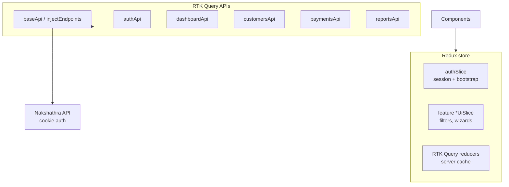

# Nakshathra Admin Panel — Frontend Structure & Redux Guide (JSX)

Hand this to the **web frontend developer** building the owner/admin panel. Pair with:

- [ADMIN_PANEL_API.md](./ADMIN_PANEL_API.md) — endpoints, flows, example payloads
- [ADMIN_PANEL_WIREFRAMES.md](./ADMIN_PANEL_WIREFRAMES.md) — page wireframes, Mark as paid flow, field checklist
- [FLUTTER_APP_FLOWS.md](./FLUTTER_APP_FLOWS.md) — how staff/customer apps relate to admin actions

**Stack assumed:** React 18+, **JavaScript (JSX)**, **Redux Toolkit (RTK)**, **RTK Query**, React Router v6, Vite.

**API:** cookie auth only (`credentials: 'include'`). Base URL: `https://{host}/api/v1`.

---

## 1. Principles

1. **Feature-first folders** — group by admin module (customers, payments), not by file type alone.
2. **Server state in RTK Query** — lists, details, mutations; avoid duplicating API data in manual slices.
3. **Client/UI state in slices** — filters, drawer open, wizard step, selected rows.
4. **One API client** — shared base query with cookie credentials + refresh interceptor.
5. **Paise in API, rupees in UI** — convert at the display/form boundary only.
6. **No Bearer tokens** — the backend uses HttpOnly cookies; do not store JWT in `localStorage`.

---

## 2. Recommended folder structure

```
admin-panel/
├── public/
├── src/
│   ├── app/                          # App shell & global setup
│   │   ├── App.jsx
│   │   ├── router.jsx                # React Router routes + guards
│   │   ├── store.js                  # configureStore
│   │   ├── hooks.js                  # useAppDispatch, useAppSelector
│   │   └── providers.jsx             # Redux + Router + Theme
│   │
│   ├── shared/                       # Cross-feature reusable code
│   │   ├── api/
│   │   │   ├── baseApi.js            # RTK Query createApi + baseQuery
│   │   │   └── tagTypes.js           # RTK Query cache tag constants
│   │   ├── components/
│   │   │   ├── DataTable/
│   │   │   ├── MoneyInput/           # paise ↔ rupees
│   │   │   ├── PhoneInput/
│   │   │   ├── ConfirmDialog/
│   │   │   ├── PageHeader/
│   │   │   ├── EmptyState/
│   │   │   └── LoadingState/
│   │   ├── hooks/
│   │   │   ├── useCursorPagination.js
│   │   │   └── useDebouncedSearch.js
│   │   ├── layouts/
│   │   │   ├── AdminLayout.jsx       # sidebar + header + outlet
│   │   │   └── AuthLayout.jsx
│   │   ├── lib/
│   │   │   ├── formatMoney.js
│   │   │   ├── formatDate.js         # Asia/Kolkata display
│   │   │   └── idempotencyKey.js
│   │   └── utils/
│   │       └── errors.js             # map API error codes → toast messages
│   │
│   ├── features/                     # One folder per admin domain
│   │   ├── auth/
│   │   │   ├── api/authApi.js
│   │   │   ├── slice/authSlice.js    # session flags only
│   │   │   ├── pages/
│   │   │   │   └── LoginPage.jsx
│   │   │   └── components/
│   │   │       └── RequireAdmin.jsx  # route guard
│   │   │
│   │   ├── dashboard/
│   │   │   ├── api/dashboardApi.js
│   │   │   ├── pages/DashboardPage.jsx
│   │   │   └── components/
│   │   │       ├── KpiCards.jsx
│   │   │       ├── RecentPayments.jsx
│   │   │       └── DueInstallments.jsx
│   │   │
│   │   ├── staff/
│   │   │   ├── api/staffApi.js
│   │   │   ├── slice/staffUiSlice.js
│   │   │   ├── pages/
│   │   │   │   ├── StaffListPage.jsx
│   │   │   │   ├── StaffCreatePage.jsx
│   │   │   │   └── StaffDetailPage.jsx
│   │   │   └── components/
│   │   │       ├── StaffForm.jsx
│   │   │       └── PermissionsChecklist.jsx
│   │   │
│   │   ├── customers/
│   │   │   ├── api/customersApi.js
│   │   │   ├── slice/customersUiSlice.js
│   │   │   ├── pages/
│   │   │   │   ├── CustomerListPage.jsx
│   │   │   │   ├── CustomerCreatePage.jsx
│   │   │   │   └── CustomerDetailPage.jsx
│   │   │   └── components/
│   │   │       ├── CustomerForm.jsx
│   │   │       ├── KycActions.jsx
│   │   │       └── AadhaarUpload.jsx
│   │   │
│   │   ├── scheme-plans/
│   │   │   ├── api/schemePlansApi.js
│   │   │   └── pages/ ...
│   │   │
│   │   ├── enrollments/
│   │   │   ├── api/enrollmentsApi.js
│   │   │   ├── slice/enrollmentsUiSlice.js
│   │   │   └── pages/
│   │   │       ├── EnrollmentListPage.jsx
│   │   │       ├── DueEnrollmentsPage.jsx
│   │   │       ├── OverdueEnrollmentsPage.jsx
│   │   │       ├── RedemptionReadyPage.jsx
│   │   │       └── EnrollmentDetailPage.jsx
│   │   │
│   │   ├── payments/
│   │   │   ├── api/paymentsApi.js
│   │   │   └── pages/
│   │   │       ├── PaymentListPage.jsx
│   │   │       ├── PaymentDetailPage.jsx
│   │   │       └── ManualPaymentPage.jsx
│   │   │
│   │   ├── payouts/
│   │   │   ├── api/payoutsApi.js
│   │   │   └── pages/ ...
│   │   │
│   │   ├── cash/
│   │   │   ├── api/cashApi.js
│   │   │   └── pages/
│   │   │       ├── CashHeldPage.jsx
│   │   │       └── CashSubmissionPage.jsx
│   │   │
│   │   ├── corrections/
│   │   │   ├── api/correctionsApi.js
│   │   │   └── pages/ ...
│   │   │
│   │   ├── refunds/
│   │   │   ├── api/refundsApi.js
│   │   │   └── pages/ ...
│   │   │
│   │   ├── phonepe/
│   │   │   ├── api/phonepeApi.js
│   │   │   └── pages/ ...
│   │   │
│   │   ├── reports/
│   │   │   ├── api/reportsApi.js
│   │   │   ├── slice/reportsUiSlice.js
│   │   │   └── pages/ ...
│   │   │
│   │   ├── finance/
│   │   │   ├── api/financeApi.js
│   │   │   └── pages/
│   │   │       ├── ExceptionsPage.jsx
│   │   │       ├── SuspensePage.jsx
│   │   │       ├── DisputesPage.jsx
│   │   │       └── GatewaySettlementsPage.jsx
│   │   │
│   │   ├── settings/
│   │   │   ├── api/settingsApi.js
│   │   │   └── pages/SettingsPage.jsx
│   │   │
│   │   └── audit/
│   │       ├── api/auditApi.js
│   │       └── pages/AuditLogsPage.jsx
│   │
│   ├── config/
│   │   ├── env.js                    # VITE_API_BASE_URL
│   │   └── navigation.js             # sidebar menu config
│   │
│   └── main.jsx
│
├── .env.example
├── package.json
├── jsconfig.json                     # path aliases (@/ → src/)
└── vite.config.js
```

### Naming rules

| Item | Convention | Example |
| --- | --- | --- |
| Feature folder | kebab-case | `scheme-plans/` |
| React component | PascalCase `.jsx` | `CustomerDetailPage.jsx` |
| RTK Query file | camelCase + `Api.js` | `customersApi.js` |
| UI slice | camelCase + `UiSlice.js` | `customersUiSlice.js` |
| Route path | kebab-case | `/enrollments/redemption-ready` |

### Vite + JSX entry

```jsx
// src/main.jsx
import React from 'react';
import ReactDOM from 'react-dom/client';
import { Providers } from './app/providers';
import './index.css';

ReactDOM.createRoot(document.getElementById('root')).render(
  <React.StrictMode>
    <Providers />
  </React.StrictMode>,
);
```

```jsx
// src/app/providers.jsx
import { Provider } from 'react-redux';
import { RouterProvider } from 'react-router-dom';
import { store } from './store';
import { router } from './router';

export function Providers() {
  return (
    <Provider store={store}>
      <RouterProvider router={router} />
    </Provider>
  );
}
```

```json
// jsconfig.json
{
  "compilerOptions": {
    "baseUrl": ".",
    "paths": { "@/*": ["src/*"] }
  }
}
```

---

## 3. Route map (matches sidebar)

```jsx
// src/app/router.jsx
import { createBrowserRouter, Navigate } from 'react-router-dom';
import { RequireAdmin } from '@/features/auth/components/RequireAdmin';
import { AdminLayout } from '@/shared/layouts/AdminLayout';
import { LoginPage } from '@/features/auth/pages/LoginPage';
import { DashboardPage } from '@/features/dashboard/pages/DashboardPage';
// ... import other pages

export const router = createBrowserRouter([
  { path: '/login', element: <LoginPage /> },
  {
    path: '/',
    element: (
      <RequireAdmin>
        <AdminLayout />
      </RequireAdmin>
    ),
    children: [
      { index: true, element: <Navigate to="/dashboard" replace /> },
      { path: 'dashboard', element: <DashboardPage /> },
      { path: 'staff', element: <StaffListPage /> },
      { path: 'staff/new', element: <StaffCreatePage /> },
      { path: 'staff/:id', element: <StaffDetailPage /> },
      { path: 'customers', element: <CustomerListPage /> },
      { path: 'customers/new', element: <CustomerCreatePage /> },
      { path: 'customers/:id', element: <CustomerDetailPage /> },
      { path: 'enrollments', element: <EnrollmentListPage /> },
      { path: 'enrollments/due', element: <DueEnrollmentsPage /> },
      { path: 'enrollments/overdue', element: <OverdueEnrollmentsPage /> },
      { path: 'enrollments/redemption-ready', element: <RedemptionReadyPage /> },
      { path: 'enrollments/:id', element: <EnrollmentDetailPage /> },
      { path: 'payments', element: <PaymentListPage /> },
      { path: 'payments/manual', element: <ManualPaymentPage /> },
      { path: 'payments/:id', element: <PaymentDetailPage /> },
      { path: 'cash-held', element: <CashHeldPage /> },
      { path: 'cash-submissions', element: <CashSubmissionPage /> },
      { path: 'corrections', element: <CorrectionsPage /> },
      { path: 'settings', element: <SettingsPage /> },
      { path: 'audit-logs', element: <AuditLogsPage /> },
    ],
  },
]);
```

---

## 4. Redux store architecture



### What goes where

| State type | Where | Examples |
| --- | --- | --- |
| API list/detail | RTK Query cache | customers list, payment detail |
| Auth bootstrap | `authSlice` | `status`, `user` |
| List filters | `*UiSlice` | search text, status filter, date range |
| Form drafts | React Hook Form local state | create customer form |
| Modal open | `useState` or UI slice | confirm reverse payment |
| Pagination cursor | RTK Query arg OR ui slice | `cursor`, `limit` |

**Do not** put API response arrays in a manual Redux slice — RTK Query already caches them.

---

## 5. Store setup

```js
// src/app/store.js
import { configureStore } from '@reduxjs/toolkit';
import { setupListeners } from '@reduxjs/toolkit/query';
import { baseApi } from '@/shared/api/baseApi';
import authReducer from '@/features/auth/slice/authSlice';
import customersUiReducer from '@/features/customers/slice/customersUiSlice';
import reportsUiReducer from '@/features/reports/slice/reportsUiSlice';

export const store = configureStore({
  reducer: {
    auth: authReducer,
    customersUi: customersUiReducer,
    reportsUi: reportsUiReducer,
    [baseApi.reducerPath]: baseApi.reducer,
  },
  middleware: (getDefault) => getDefault().concat(baseApi.middleware),
});

setupListeners(store.dispatch);
```

```js
// src/app/hooks.js
import { useDispatch, useSelector } from 'react-redux';

export const useAppDispatch = () => useDispatch();
export const useAppSelector = useSelector;
```

---

## 6. API layer (RTK Query + cookies)

```js
// src/shared/api/baseApi.js
import { createApi, fetchBaseQuery } from '@reduxjs/toolkit/query/react';
import { tagTypes } from './tagTypes';

const rawBaseQuery = fetchBaseQuery({
  baseUrl: import.meta.env.VITE_API_BASE_URL,
  credentials: 'include',
  prepareHeaders: (headers) => {
    headers.set('Accept', 'application/json');
    return headers;
  },
});

let refreshPromise = null;

const baseQueryWithRefresh = async (args, api, extraOptions) => {
  let result = await rawBaseQuery(args, api, extraOptions);

  if (result.error?.status === 401) {
    if (!refreshPromise) {
      refreshPromise = (async () => {
        const refresh = await rawBaseQuery(
          { url: '/auth/refresh', method: 'POST' },
          api,
          extraOptions,
        );
        return !refresh.error;
      })().finally(() => {
        refreshPromise = null;
      });
    }
    const refreshed = await refreshPromise;
    if (refreshed) {
      result = await rawBaseQuery(args, api, extraOptions);
    }
  }

  return result;
};

export const baseApi = createApi({
  reducerPath: 'api',
  baseQuery: baseQueryWithRefresh,
  tagTypes,
  endpoints: () => ({}),
});

/** Unwrap { success, data } or throw for RTK Query */
export function unwrapEnvelope(response) {
  if (!response.success) {
    throw response.error ?? new Error('Request failed');
  }
  return response.data;
}
```

```js
// src/shared/api/tagTypes.js
export const tagTypes = [
  'Auth',
  'Dashboard',
  'Staff',
  'Customer',
  'SchemePlan',
  'Enrollment',
  'Payment',
  'Payout',
  'CashHeld',
  'CashSubmission',
  'Correction',
  'Refund',
  'PhonePeTransaction',
  'Report',
  'Settings',
  'AuditLog',
  'FinanceException',
];
```

---

## 7. Feature API modules (inject endpoints)

```js
// src/features/customers/api/customersApi.js
import { baseApi, unwrapEnvelope } from '@/shared/api/baseApi';

export const customersApi = baseApi.injectEndpoints({
  endpoints: (build) => ({
    listCustomers: build.query({
      query: ({ search, cursor, limit = 50 }) => ({
        url: '/admin/customers',
        params: { search, cursor, limit },
      }),
      transformResponse: (res) => ({
        items: unwrapEnvelope(res),
        meta: res.meta,
      }),
      providesTags: (result) =>
        result
          ? [
              ...result.items.map(({ _id }) => ({ type: 'Customer', id: _id })),
              { type: 'Customer', id: 'LIST' },
            ]
          : [{ type: 'Customer', id: 'LIST' }],
    }),

    getCustomer: build.query({
      query: (id) => `/admin/customers/${id}`,
      transformResponse: unwrapEnvelope,
      providesTags: (_r, _e, id) => [{ type: 'Customer', id }],
    }),

    createCustomer: build.mutation({
      query: (body) => ({ url: '/admin/customers', method: 'POST', body }),
      transformResponse: unwrapEnvelope,
      invalidatesTags: [{ type: 'Customer', id: 'LIST' }, 'Dashboard'],
    }),

    verifyKyc: build.mutation({
      query: (id) => ({
        url: `/admin/customers/${id}/kyc/verify`,
        method: 'POST',
      }),
      transformResponse: unwrapEnvelope,
      invalidatesTags: (_r, _e, id) => [{ type: 'Customer', id }],
    }),

    rejectKyc: build.mutation({
      query: ({ id, reason }) => ({
        url: `/admin/customers/${id}/kyc/reject`,
        method: 'POST',
        body: { reason },
      }),
      invalidatesTags: (_r, _e, { id }) => [{ type: 'Customer', id }],
    }),
  }),
});

export const {
  useListCustomersQuery,
  useGetCustomerQuery,
  useCreateCustomerMutation,
  useVerifyKycMutation,
  useRejectKycMutation,
} = customersApi;
```

Repeat for `staffApi.js`, `paymentsApi.js`, `enrollmentsApi.js`, etc. See [ADMIN_PANEL_API.md](./ADMIN_PANEL_API.md).

---

## 8. Auth slice & guard

```js
// src/features/auth/slice/authSlice.js
import { createSlice } from '@reduxjs/toolkit';

const initialState = {
  status: 'idle', // idle | loading | authenticated | anonymous
  user: null,
};

const authSlice = createSlice({
  name: 'auth',
  initialState,
  reducers: {
    setAuthenticated(state, action) {
      state.status = 'authenticated';
      state.user = action.payload;
    },
    setAnonymous(state) {
      state.status = 'anonymous';
      state.user = null;
    },
    setLoading(state) {
      state.status = 'loading';
    },
  },
});

export const { setAuthenticated, setAnonymous, setLoading } = authSlice.actions;
export default authSlice.reducer;
```

```js
// src/features/auth/api/authApi.js
import { baseApi, unwrapEnvelope } from '@/shared/api/baseApi';
import { setAuthenticated, setAnonymous } from '../slice/authSlice';

export const authApi = baseApi.injectEndpoints({
  endpoints: (build) => ({
    login: build.mutation({
      query: (body) => ({ url: '/auth/login', method: 'POST', body }),
      transformResponse: unwrapEnvelope,
      async onQueryStarted(_arg, { dispatch, queryFulfilled }) {
        const { data } = await queryFulfilled;
        if (data.user.role === 'ADMIN') {
          dispatch(setAuthenticated(data.user));
        }
      },
    }),
    me: build.query({
      query: () => '/auth/me',
      transformResponse: unwrapEnvelope,
    }),
    logout: build.mutation({
      query: () => ({ url: '/auth/logout', method: 'POST' }),
      async onQueryStarted(_arg, { dispatch, queryFulfilled }) {
        await queryFulfilled;
        dispatch(setAnonymous());
        dispatch(baseApi.util.resetApiState());
      },
    }),
  }),
});

export const { useLoginMutation, useMeQuery, useLogoutMutation } = authApi;
```

```jsx
// src/features/auth/pages/LoginPage.jsx
import { useState } from 'react';
import { useNavigate } from 'react-router-dom';
import { useLoginMutation } from '../api/authApi';
import { toastApiError } from '@/shared/utils/errors';

export function LoginPage() {
  const navigate = useNavigate();
  const [login, { isLoading }] = useLoginMutation();
  const [phone, setPhone] = useState('');
  const [password, setPassword] = useState('');

  const onSubmit = async (e) => {
    e.preventDefault();
    try {
      const result = await login({ phone, password }).unwrap();
      if (result.user.role === 'ADMIN') {
        navigate('/dashboard');
      } else {
        alert('This portal is for admin users only.');
      }
    } catch (err) {
      toastApiError(err?.data?.error ?? err);
    }
  };

  return (
    <form onSubmit={onSubmit}>
      <h1>Nakshathra Admin</h1>
      <input
        value={phone}
        onChange={(e) => setPhone(e.target.value)}
        placeholder="Phone"
      />
      <input
        type="password"
        value={password}
        onChange={(e) => setPassword(e.target.value)}
        placeholder="Password"
      />
      <button type="submit" disabled={isLoading}>
        {isLoading ? 'Signing in…' : 'Sign in'}
      </button>
    </form>
  );
}
```

```jsx
// src/features/auth/components/RequireAdmin.jsx
import { Navigate, Outlet } from 'react-router-dom';
import { useAppSelector } from '@/app/hooks';
import { useMeQuery } from '../api/authApi';
import { LoadingState } from '@/shared/components/LoadingState';

export function RequireAdmin() {
  const authStatus = useAppSelector((s) => s.auth.status);
  const { data, isLoading, isError } = useMeQuery(undefined, {
    skip: authStatus === 'anonymous',
  });

  if (isLoading) return <LoadingState />;
  if (isError || !data || data.role !== 'ADMIN') {
    return <Navigate to="/login" replace />;
  }
  return <Outlet />;
}
```

---

## 9. Example page component (JSX)

```jsx
// src/features/customers/pages/CustomerListPage.jsx
import { useEffect } from 'react';
import { Link } from 'react-router-dom';
import { useAppDispatch, useAppSelector } from '@/app/hooks';
import { useListCustomersQuery } from '../api/customersApi';
import { setSearch } from '../slice/customersUiSlice';
import { useDebouncedSearch } from '@/shared/hooks/useDebouncedSearch';
import { PageHeader } from '@/shared/components/PageHeader';
import { DataTable } from '@/shared/components/DataTable';

export function CustomerListPage() {
  const dispatch = useAppDispatch();
  const search = useAppSelector((s) => s.customersUi.search);
  const debouncedSearch = useDebouncedSearch(search, 300);
  const { data, isFetching, isError } = useListCustomersQuery({
    search: debouncedSearch,
    limit: 50,
  });

  return (
    <div>
      <PageHeader
        title="Customers"
        action={<Link to="/customers/new">+ New customer</Link>}
      />

      <input
        value={search}
        onChange={(e) => dispatch(setSearch(e.target.value))}
        placeholder="Search name or phone"
      />

      {isFetching && <p>Loading…</p>}
      {isError && <p>Failed to load customers.</p>}

      <DataTable
        rows={data?.items ?? []}
        columns={[
          { key: 'customerCode', label: 'Passbook ID' },
          { key: 'userId.name', label: 'Name' },
          { key: 'userId.phone', label: 'Phone' },
          { key: 'kycStatus', label: 'KYC' },
          { key: 'status', label: 'Status' },
        ]}
        rowLink={(row) => `/customers/${row._id}`}
      />
    </div>
  );
}
```

---

## 10. UI slices (filters)

```js
// src/features/customers/slice/customersUiSlice.js
import { createSlice } from '@reduxjs/toolkit';

const initialState = {
  search: '',
  kycFilter: 'ALL', // ALL | PENDING | VERIFIED | REJECTED
};

const customersUiSlice = createSlice({
  name: 'customersUi',
  initialState,
  reducers: {
    setSearch(state, action) {
      state.search = action.payload;
    },
    setKycFilter(state, action) {
      state.kycFilter = action.payload;
    },
    resetFilters: () => initialState,
  },
});

export const { setSearch, setKycFilter, resetFilters } = customersUiSlice.actions;
export default customersUiSlice.reducer;
```

---

## 11. Admin layout (JSX)

```jsx
// src/shared/layouts/AdminLayout.jsx
import { Outlet, NavLink } from 'react-router-dom';
import { navigation } from '@/config/navigation';
import { useLogoutMutation } from '@/features/auth/api/authApi';
import { useNavigate } from 'react-router-dom';

export function AdminLayout() {
  const navigate = useNavigate();
  const [logout] = useLogoutMutation();

  const onLogout = async () => {
    await logout().unwrap();
    navigate('/login');
  };

  return (
    <div className="admin-shell">
      <aside className="sidebar">
        <h2>Nakshathra</h2>
        <nav>
          {navigation.map((item) => (
            <NavLink key={item.path} to={item.path}>
              {item.label}
            </NavLink>
          ))}
        </nav>
        <button type="button" onClick={onLogout}>
          Logout
        </button>
      </aside>
      <main className="content">
        <Outlet />
      </main>
    </div>
  );
}
```

```js
// src/config/navigation.js
export const navigation = [
  { path: '/dashboard', label: 'Dashboard' },
  { path: '/staff', label: 'Staff' },
  { path: '/customers', label: 'Customers' },
  { path: '/scheme-plans', label: 'Scheme plans' },
  { path: '/enrollments', label: 'Enrollments' },
  { path: '/enrollments/due', label: 'Due' },
  { path: '/enrollments/overdue', label: 'Overdue' },
  { path: '/enrollments/redemption-ready', label: 'Redemption ready' },
  { path: '/payments', label: 'Payments' },
  { path: '/payouts', label: 'Payouts' },
  { path: '/cash-held', label: 'Cash held' },
  { path: '/cash-submissions', label: 'Cash submissions' },
  { path: '/corrections', label: 'Corrections' },
  { path: '/refunds', label: 'Refunds' },
  { path: '/phonepe-transactions', label: 'PhonePe' },
  { path: '/reports', label: 'Reports' },
  { path: '/settings', label: 'Settings' },
  { path: '/audit-logs', label: 'Audit logs' },
];
```

---

## 12. Mutations & cache invalidation

| Action | Mutation | Invalidate tags |
| --- | --- | --- |
| Manual payment | `createManualPayment` | `Payment`, `Enrollment`, `Dashboard`, `CashHeld` |
| Cash handover | `createCashSubmission` | `CashHeld`, `CashSubmission`, `Dashboard` |
| Approve correction | `reviewCorrection` | `Correction`, `Payment` |
| Verify KYC | `verifyKyc` | `Customer` |
| Create enrollment | `createEnrollment` | `Enrollment`, `Customer`, `Dashboard` |
| Premature close | `prematureClose` | `Enrollment`, `Payout` |
| Update settings | `updateSettings` | `Settings` |

---

## 13. Pagination, money, idempotency, errors

```js
// src/shared/hooks/useCursorPagination.js
import { useState, useCallback } from 'react';

export function useCursorPagination(limit = 50) {
  const [cursor, setCursor] = useState(undefined);
  const [history, setHistory] = useState([]);

  const nextPage = useCallback(
    (nextCursor) => {
      if (nextCursor) {
        setHistory((h) => [...h, cursor ?? '']);
        setCursor(nextCursor);
      }
    },
    [cursor],
  );

  const prevPage = useCallback(() => {
    setHistory((h) => {
      const copy = [...h];
      const prev = copy.pop();
      setCursor(prev || undefined);
      return copy;
    });
  }, []);

  const reset = useCallback(() => {
    setCursor(undefined);
    setHistory([]);
  }, []);

  return { cursor, limit, nextPage, prevPage, reset };
}
```

```js
// src/shared/lib/formatMoney.js
export const paiseToRupees = (paise) => paise / 100;

export const formatInr = (paise) =>
  new Intl.NumberFormat('en-IN', {
    style: 'currency',
    currency: 'INR',
    maximumFractionDigits: 2,
  }).format(paiseToRupees(paise));

export const rupeesToPaise = (rupees) => Math.round(rupees * 100);
```

```js
// src/shared/lib/idempotencyKey.js
export const newIdempotencyKey = () => `web-${crypto.randomUUID()}`;
```

```js
// src/shared/utils/errors.js
const messages = {
  AUTHENTICATION_REQUIRED: 'Please sign in again.',
  PERMISSION_DENIED: 'You do not have access to this action.',
  CUSTOMER_ALREADY_ENROLLED: 'Customer already has an active enrollment.',
  KYC_VERIFICATION_REQUIRED: 'Customer KYC must be verified first.',
  INSUFFICIENT_STAFF_CASH: 'Staff does not hold enough cash for this handover.',
  INSTALLMENT_ALREADY_PAID: 'This scheme month is already paid.',
  VALIDATION_ERROR: 'Please fix the highlighted fields.',
};

export function toastApiError(error) {
  return (error?.code && messages[error.code]) || error?.message || 'Something went wrong';
}
```

---

## 14. Manual payment form (JSX example)

```jsx
// src/features/payments/pages/ManualPaymentPage.jsx
import { useRef } from 'react';
import { useNavigate } from 'react-router-dom';
import { useCreateManualPaymentMutation } from '../api/paymentsApi';
import { newIdempotencyKey } from '@/shared/lib/idempotencyKey';
import { rupeesToPaise, formatInr } from '@/shared/lib/formatMoney';

export function ManualPaymentPage() {
  const navigate = useNavigate();
  const [createPayment, { isLoading }] = useCreateManualPaymentMutation();
  const idempotencyRef = useRef(newIdempotencyKey());

  const onSubmit = async (e) => {
    e.preventDefault();
    const form = new FormData(e.target);

    try {
      const result = await createPayment({
        customerId: form.get('customerId'),
        schemeId: form.get('schemeId'),
        amountPaise: rupeesToPaise(Number(form.get('amountRupees'))),
        method: form.get('method'),
        paymentDate: new Date(form.get('paymentDate')).toISOString(),
        referenceNumber: form.get('referenceNumber') || undefined,
        notes: form.get('notes') || undefined,
        idempotencyKey: idempotencyRef.current,
      }).unwrap();

      alert(`Payment recorded: ${result.receiptNumber} (${formatInr(result.amountPaise)})`);
      navigate(`/payments/${result.paymentId}`);
    } catch (err) {
      alert(err?.data?.error?.message ?? 'Payment failed');
      idempotencyRef.current = newIdempotencyKey();
    }
  };

  return (
    <form onSubmit={onSubmit}>
      <h1>Manual payment</h1>
      <input name="customerId" placeholder="Customer ID" required />
      <input name="schemeId" placeholder="Enrollment ID" required />
      <input name="amountRupees" type="number" step="0.01" placeholder="Amount (₹)" required />
      <select name="method" required>
        <option value="CASH">Cash</option>
        <option value="UPI">UPI</option>
        <option value="BANK">Bank</option>
        <option value="CARD">Card</option>
      </select>
      <input name="paymentDate" type="datetime-local" required />
      <input name="referenceNumber" placeholder="Reference (optional)" />
      <textarea name="notes" placeholder="Notes (optional)" />
      <button type="submit" disabled={isLoading}>
        {isLoading ? 'Saving…' : 'Record payment'}
      </button>
    </form>
  );
}
```

---

## 15. Feature checklist

| Admin module | API file | UI slice | Page (`.jsx`) |
| --- | --- | --- | --- |
| Dashboard | `dashboardApi.js` | — | `DashboardPage.jsx` |
| Staff | `staffApi.js` | `staffUiSlice.js` | list, create, detail |
| Customers | `customersApi.js` | `customersUiSlice.js` | list, create, detail |
| Enrollments | `enrollmentsApi.js` | `enrollmentsUiSlice.js` | list, due, overdue, detail |
| Payments | `paymentsApi.js` | — | list, detail, manual |
| Cash | `cashApi.js` | — | held, submissions |
| Auth | `authApi.js` | `authSlice.js` | `LoginPage.jsx` |

Full API mapping: [ADMIN_PANEL_API.md](./ADMIN_PANEL_API.md).

---

## 16. Environment & dependencies

```bash
# .env.example
VITE_API_BASE_URL=https://nakshatra-bnglr-hassan.retailkerala.com/api/v1
```

```json
{
  "dependencies": {
    "@reduxjs/toolkit": "^2.2.0",
    "react": "^18.3.0",
    "react-dom": "^18.3.0",
    "react-redux": "^9.1.0",
    "react-router-dom": "^6.26.0"
  }
}
```

Use the **API host** (`retailkerala.com`), not the Netlify frontend URL, unless it proxies the full API.

---

## 17. Related docs

- [ADMIN_PANEL_API.md](./ADMIN_PANEL_API.md) — API reference + Appendix A payloads
- [FLUTTER_APP_FLOWS.md](./FLUTTER_APP_FLOWS.md) — staff/customer flows admin interacts with
- [PRODUCTION_GO_LIVE_CHECKLIST.md](./PRODUCTION_GO_LIVE_CHECKLIST.md) — deployment
