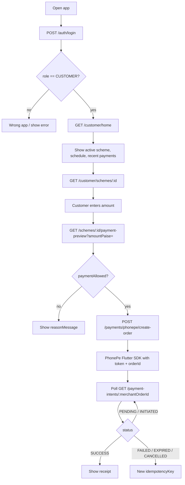
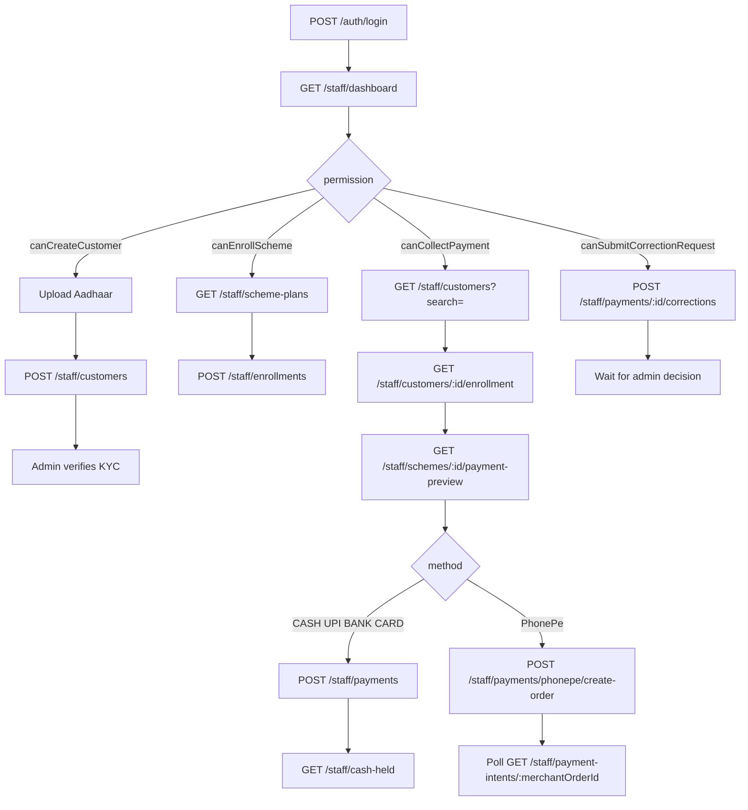

# Nakshathra Jewellers — Flutter API Handoff

Hand this file to the Flutter developer. It describes how the live backend works today. Do not invent Bearer-token auth, GOLD_WEIGHT screens, or customer self-signup — those are not in this API.

**Base path:** `https://{host}/api/v1`  
**Health (no auth):** `GET /health` · `GET /ready`  
**Money:** integer **paise** only (₹100 = `10000`). Never send rupees as floats.  
**Timezone:** `Asia/Kolkata`  
**Live product:** CASH schemes only. GOLD_WEIGHT is dormant (`409 GOLD_WEIGHT_DISABLED`).

**Example JSON:** every customer, staff, auth, and upload endpoint has sample request/response bodies in [Appendix A](#appendix-a--example-request--response-payloads).

**Flow diagrams:** screen maps, sequence charts, and permission flows for both apps are in [FLUTTER_APP_FLOWS.md](./FLUTTER_APP_FLOWS.md).

---

## 1. What this backend is

Nakshathra is an 11-month jewellery **cash savings scheme**:

- Months **1–6**: flexible contribution
- Months **7–11**: capped (average of successful payments in the first 6 months)
- Month **12**: redemption / payout (owner/admin, not the customer app)

Roles:

| Role       | App                                  | How they get an account                          |
| ---------- | ------------------------------------ | ------------------------------------------------ |
| `CUSTOMER` | Customer Flutter app                 | Created by staff or admin. **No self-register.** |
| `STAFF`    | Staff Flutter app                    | Created by admin, with granular permissions      |
| `ADMIN`    | Owner web (not this Flutter handoff) | Seeded / ops                                     |

Customers pay their own scheme via **PhonePe SDK**. Staff collect at the counter (cash / UPI / bank / card) or start PhonePe for a customer.

---

## 2. Cookie auth — Flutter does support this

The API is **cookie-only**. There is no `Authorization: Bearer` header. Login sets two cookies; every later call must send them.

| Cookie          | HttpOnly | Purpose                                                                                      |
| --------------- | -------- | -------------------------------------------------------------------------------------------- |
| `access_token`  | yes      | JWT for authenticated routes. Default TTL **480 minutes**.                                   |
| `refresh_token` | yes      | Rotation only. Used by `POST /auth/refresh` and `POST /auth/logout`. Default TTL **7 days**. |

Cookie flags: `Path=/`, `SameSite=Lax`, `Secure` when `COOKIE_SECURE=true` (required in production).

Flutter is **not a browser**. It does not refuse cookies. The usual failure is using an HTTP client that **does not store or replay** `Set-Cookie`.

### Native iOS / Android (required)

Use **one shared Dio** for the whole app, with a **persistent cookie jar**, initialized **before** any API call.

```dart
import 'package:cookie_jar/cookie_jar.dart';
import 'package:dio/dio.dart';
import 'package:dio_cookie_manager/dio_cookie_manager.dart';
import 'package:path/path.dart' as p;
import 'package:path_provider/path_provider.dart';

late final Dio dio;
late final PersistCookieJar cookieJar;

Future<void> initApi({required String baseUrl}) async {
  final dir = await getApplicationDocumentsDirectory();
  cookieJar = PersistCookieJar(
    storage: FileStorage(p.join(dir.path, '.cookies')),
  );
  dio = Dio(BaseOptions(
    baseUrl: '$baseUrl/api/v1',
    connectTimeout: const Duration(seconds: 20),
    receiveTimeout: const Duration(seconds: 20),
    headers: { 'Accept': 'application/json' },
  ));
  dio.interceptors.add(CookieManager(cookieJar));
}
```

**pubspec:** `dio`, `dio_cookie_manager`, `cookie_jar`, `path_provider`, `path`.

After `POST /auth/login`, Dio stores both cookies and sends them automatically.

`HttpOnly` only blocks **browser JavaScript** (`document.cookie`). On native, the HTTP client is the cookie store — `cookie_jar` **can** see those cookies. Do **not** log cookie values.

On logout: call `POST /auth/logout`, then `await cookieJar.deleteAll()`.

### Why people think “Flutter doesn’t support cookies”

| Mistake                                         | What happens                                                                                              |
| ----------------------------------------------- | --------------------------------------------------------------------------------------------------------- |
| `package:http` one-off `http.post` / `http.get` | No cookie store. Next call is anonymous.                                                                  |
| New `Dio()` per request                         | Cookies never carry over.                                                                                 |
| Memory `CookieJar()` only                       | Session dies when the app is killed. Use `PersistCookieJar`.                                              |
| Production API on HTTP                          | `Secure` cookies will not stick. API must be HTTPS.                                                       |
| Flutter **Web** without credentials             | Browser will not send cookies.                                                                            |
| Flutter **Web** on another domain               | This API uses `SameSite=Lax`. Cross-site POSTs will **not** send the cookie. Native apps ignore SameSite. |

### Flutter Web (only if you ship a web build)

The **browser** owns HttpOnly cookies. Dart cannot read them. Do **not** use `cookie_jar` for these cookies on web.

```dart
dio.options.extra['withCredentials'] = true;
```

The API already enables CORS `credentials: true`. The web origin must be listed in server `WEB_ORIGINS`. If the Flutter web host and the API host are different sites, `SameSite=Lax` will block cookie POSTs until the backend cookie policy is changed (that is a backend change — confirm before doing it).

### Session lifecycle (native)

1. Cold start: if cookies exist, `GET /auth/me`.
2. If `401 SESSION_EXPIRED` or `401 AUTHENTICATION_REQUIRED`, call `POST /auth/refresh` **once**.
3. If refresh succeeds, retry the original request.
4. If refresh fails with `TOKEN_REUSE_DETECTED` or `SESSION_EXPIRED`, delete the jar and show login.
5. **Single-flight refresh.** If two calls refresh at once, the API returns **409 `REFRESH_RACE`** (retryable). Wait ~300ms and retry with the **same Dio**. Do not run two refresh interceptors in parallel.

Fingerprint: refresh also compares IP + User-Agent. Keep a stable `User-Agent` on Dio.

---

## 3. Conventions

### Envelope

Success:

```json
{ "success": true, "data": {}, "meta": {} }
```

`meta` is present on paginated lists.

Error:

```json
{
  "success": false,
  "error": {
    "code": "AUTHENTICATION_REQUIRED",
    "message": "Authentication required",
    "retryable": false,
    "details": []
  },
  "requestId": "..."
}
```

### Phone numbers

Send `9876543210` or `+919876543210`. Server stores `+91XXXXXXXXXX` (Indian mobile, first digit 6–9).

### Passwords

- Login: 8–128 characters
- Create customer / staff: 10–128 characters

### Idempotency

Any collect / PhonePe / payout / premature-close body needs `idempotencyKey` (8–120 chars). Generate a new UUID per **user-initiated** attempt. Reusing the same key with different amount/scheme → `409 IDEMPOTENCY_KEY_REUSED`. Retrying the **same** payment after a network drop should reuse the same key.

### Pagination

Default is **cursor**. Max `limit` 100, default 50.

- First page: omit `cursor`, or `cursor=`
- Next: `?cursor={meta.nextCursor}&limit=50`
- Legacy: `?page=1&limit=50`

Cursor `meta`:

```json
{ "mode": "cursor", "limit": 50, "nextCursor": "...", "hasMore": true }
```

Offset `meta`:

```json
{ "mode": "offset", "page": 1, "limit": 50, "total": 120 }
```

### Rate limits

- Login: 20 attempts / 15 minutes per IP
- Other routes: 300 / minute per IP

### Amounts

Minimum payment floor is **10000 paise (₹100)** unless the scheme plan sets a higher floor. Always call **payment-preview** before charging; the server is authoritative.

### KYC

If the server has `KYC_REQUIRED=true`, enroll / pay / settle require customer KYC `VERIFIED`. Staff create the customer and upload Aadhaar; **admin** verifies. Customer app does not submit KYC.

---

## 4. Auth API

All auth URLs are under `/api/v1/auth`.

### `POST /auth/login`

No cookies required. Body:

```json
{ "phone": "9876543210", "password": "your-password" }
```

Sets `access_token` and `refresh_token`. JSON `data`:

```json
{
  "user": {
    "id": "...",
    "name": "...",
    "phone": "+919876543210",
    "role": "CUSTOMER",
    "permissions": []
  },
  "redirectTo": "/customer"
}
```

Route the app by `user.role`:

| `role`     | Open                                                    |
| ---------- | ------------------------------------------------------- |
| `CUSTOMER` | Customer home                                           |
| `STAFF`    | Staff home (`permissions` is the staff capability list) |
| `ADMIN`    | Not a Flutter portal in this handoff                    |

Errors: `INVALID_CREDENTIALS` 401, `ACCOUNT_INACTIVE` 403, `ACCOUNT_LOCKED` 429 (retryable), `PORTAL_NOT_AVAILABLE` 403.

### `POST /auth/refresh`

Sends `refresh_token` cookie. Rotates both cookies. Same `data` shape as login.

Errors: `AUTHENTICATION_REQUIRED` 401, `SESSION_EXPIRED` 401, `TOKEN_REUSE_DETECTED` 401 (wipe cookies → login), `REFRESH_RACE` 409 retryable.

### `POST /auth/logout`

Revokes the refresh session and clears both cookies. Then delete the local jar.

### `GET /auth/me`

Requires `access_token`. Returns:

```json
{
  "userId": "...",
  "role": "CUSTOMER",
  "permissions": [],
  "sessionVersion": 0
}
```

---

## 5. Customer app

All routes require cookie auth and role `CUSTOMER`. Prefix: `/api/v1/customer`.

### 5.1 Customer flow

See [FLUTTER_APP_FLOWS.md §4–§6](./FLUTTER_APP_FLOWS.md) for full screen maps, sequence diagrams, and lifecycle charts.



Customers **cannot**: register, collect cash, enroll themselves, close a scheme, or approve payouts.

### 5.2 Endpoints

| Method | Path                                      | Purpose                                        |
| ------ | ----------------------------------------- | ---------------------------------------------- |
| GET    | `/customer/home`                          | Dashboard                                      |
| GET    | `/customer/profile`                       | Own customer record                            |
| GET    | `/customer/schemes`                       | All enrollments + installment schedule         |
| GET    | `/customer/schemes/:id`                   | One scheme (`:id` is enrollment id)            |
| GET    | `/customer/schemes/:id/payment-preview`   | **Required before pay**                        |
| POST   | `/customer/payments/phonepe/create-order` | **Use this on Flutter** (PhonePe SDK)          |
| POST   | `/customer/payments/phonepe`              | Web checkout URL — **not** for native          |
| GET    | `/customer/payment-intents/:orderId`      | Poll using `merchantOrderId`                   |
| GET    | `/customer/payments`                      | History (paginated)                            |
| GET    | `/customer/payments/:id/receipt`          | Receipt                                        |
| GET    | `/customer/payouts`                       | Settlements (paginated)                        |
| GET    | `/customer/notifications`                 | Paginated                                      |
| GET    | `/customer/gold-rates`                    | **409 GOLD_WEIGHT_DISABLED** — do not build UI |

### 5.3 Home — `GET /customer/home`

`data` includes:

- `customer` — profile, KYC, passbook code
- `activeScheme` — current CASH enrollment or null
- `previousSchemes`
- `recentPayments` — last 5 successful
- `schemeStatus` — month, phase, caps, remaining, whether payment window is open
- `paymentRules` — cap / paid / remaining / minimum for the current month
- `installmentSchedule` / `installmentSummary`
- `currentGoldRate` — null while GOLD_WEIGHT is off

Use `schemeStatus.paymentWindowOpen` and preview `paymentAllowed` before showing Pay.

### 5.4 Payment preview — `GET /customer/schemes/:id/payment-preview`

Query:

| Param         | Required | Notes                                                       |
| ------------- | -------- | ----------------------------------------------------------- |
| `amountPaise` | yes      | integer ≥ plan minimum (at least 10000)                     |
| `schemeMonth` | no       | 1–11. Omit unless you are targeting a specific unpaid month |

Do **not** start PhonePe unless `paymentAllowed` (also returned as `allowed`) is true. Show `reasonMessage` / `validationMessage` when false.

Useful fields: `schemeMonth`, `phase`, `phaseLabel`, `minimumPaymentPaise`, `monthlyCapPaise`, `remainingCapPaise`, `paidInCurrentMonthPaise`, `quoteExpiresAt`.

### 5.5 PhonePe SDK — `POST /customer/payments/phonepe/create-order`

Body:

```json
{
  "schemeId": "<enrollment id>",
  "amountPaise": 100000,
  "schemeMonth": 3,
  "idempotencyKey": "device-unique-uuid"
}
```

`schemeMonth` optional (1–11). Status **201**. `data`:

```json
{
  "merchantOrderId": "NKS-...",
  "orderId": "<PhonePe order id>",
  "token": "<PhonePe SDK token>"
}
```

Pass `token` and `orderId` into the PhonePe Flutter SDK. Keep `merchantOrderId` for polling.

Do **not** use `POST /customer/payments/phonepe` on native (that returns a web `checkoutUrl`).

If customer PhonePe is disabled by admin settings: `503 CUSTOMER_PAYMENTS_DISABLED` (retryable).

### 5.6 Poll intent — `GET /customer/payment-intents/:orderId`

`:orderId` is **`merchantOrderId`** (not PhonePe `orderId`).

Safe `data` fields: `merchantTransactionId`, `status`, `expiresAt`, `amountPaise`, `checkoutChannel`, gold quote fields, and `payment` when `status === SUCCESS` (receipt number, amount, date).

Poll every 2–3s while status is `INITIATED`, `PROVIDER_CREATING`, `PROVIDER_CREATE_UNCERTAIN`, or `PENDING`. Stop on `SUCCESS`, `FAILED`, `EXPIRED`, `CANCELLED`, `REFUNDED`, `REVERSED`, `REVIEW_REQUIRED`.

On `SUCCESS`, show `GET /customer/payments/:id/receipt` using `payment._id`.

---

## 6. Staff app

All routes require cookie auth and role `STAFF`. Prefix: `/api/v1/staff`.

Staff capabilities come from `user.permissions` on login (and `GET /auth/me`). Hide buttons the user cannot use. The server still enforces them (`403 PERMISSION_DENIED`).

### 6.1 Permissions

| Permission                   | Gates                                  |
| ---------------------------- | -------------------------------------- |
| `canViewCustomers`           | Search / get customer / get enrollment |
| `canCreateCustomer`          | Create customer + Aadhaar upload       |
| `canEnrollScheme`            | Create enrollment                      |
| `canCollectPayment`          | Preview, manual collect, PhonePe       |
| `canSubmitCorrectionRequest` | Correction on **own** collection       |

Always available to any staff: dashboard, profile, own payments, receipts, cash held, cash submissions, scheme-plan list, own collection report.

Admin role bypasses these flags (admin is not this app).

### 6.2 Staff flow

See [FLUTTER_APP_FLOWS.md §7–§13](./FLUTTER_APP_FLOWS.md) for permission gating, onboarding, collection, correction, and cash handover flows.



Typical counter path: search customer → open enrollment → preview → collect cash or start PhonePe → print receipt. Cash collections increase **cash held** until the owner records a handover (admin API).

### 6.3 Endpoints

| Method | Path                                              | Permission                                 |
| ------ | ------------------------------------------------- | ------------------------------------------ |
| GET    | `/staff/dashboard`                                | —                                          |
| GET    | `/staff/profile`                                  | —                                          |
| GET    | `/staff/reports/collection?from=&to=`             | —                                          |
| GET    | `/staff/scheme-plans`                             | —                                          |
| GET    | `/staff/customers?search=`                        | `canViewCustomers`                         |
| POST   | `/staff/customers`                                | `canCreateCustomer`                        |
| GET    | `/staff/customers/:id`                            | `canViewCustomers`                         |
| GET    | `/staff/customers/:id/enrollment`                 | `canViewCustomers`                         |
| GET    | `/staff/enrollments/:id`                          | `canViewCustomers`                         |
| POST   | `/staff/enrollments`                              | `canEnrollScheme`                          |
| GET    | `/staff/schemes/:id/payment-preview?amountPaise=` | `canCollectPayment`                        |
| POST   | `/staff/payments`                                 | `canCollectPayment`                        |
| POST   | `/staff/payments/phonepe/create-order`            | `canCollectPayment`                        |
| POST   | `/staff/payments/phonepe`                         | web checkout — skip on native              |
| GET    | `/staff/payment-intents/:orderId`                 | `canCollectPayment`                        |
| GET    | `/staff/payments`                                 | own collections (`from`, `to`, pagination) |
| GET    | `/staff/payments/:id/receipt`                     | —                                          |
| POST   | `/staff/payments/:id/corrections`                 | `canSubmitCorrectionRequest`               |
| GET    | `/staff/corrections`                              | —                                          |
| GET    | `/staff/cash-held`                                | `{ "cashHeldPaise": 0 }`                   |
| GET    | `/staff/cash-submissions`                         | —                                          |

Staff preview query is **`amountPaise` only** (no `schemeMonth`). The server derives the scheme month in Asia/Kolkata.

### 6.4 Create customer — `POST /staff/customers`

Status **201**.

```json
{
  "name": "Anita",
  "phone": "9876543210",
  "password": "TempPass12!",
  "address": {
    "line1": "...",
    "city": "...",
    "state": "...",
    "postalCode": "..."
  },
  "aadhaar": { "frontKey": "s3-key", "backKey": "s3-key" },
  "nominee": {
    "name": "...",
    "relationship": "Spouse",
    "phone": "9876543211"
  },
  "enrollment": {
    "schemePlanId": "...",
    "startDate": "2026-08-17T00:00:00.000Z",
    "monthlyInstallmentPaise": 100000
  }
}
```

`address`, `aadhaar`, `nominee`, `enrollment` are optional. Duplicate phone → `409`.

### 6.5 Aadhaar upload

Allowed for **admin**, or **staff with `canCreateCustomer`**. Prefix `/api/v1/uploads`.

**Presign (JSON):**

`POST /uploads/presign`

```json
{
  "kind": "aadhaar-front",
  "contentType": "image/jpeg",
  "fileName": "front.jpg"
}
```

`kind`: `aadhaar-front` | `aadhaar-back`  
`contentType`: `image/jpeg` | `image/png` | `image/webp` | `application/pdf`

Use the returned object key as `aadhaar.frontKey` / `aadhaar.backKey`.

**Direct upload:**

`POST /uploads?kind=aadhaar-front`  
Raw body, header `x-file-content-type: image/jpeg` (or `x-upload-kind`). Status **201**.

### 6.6 Enroll — `POST /staff/enrollments`

Status **201**.

```json
{
  "customerId": "...",
  "schemePlanId": "...",
  "startDate": "2026-08-17T00:00:00.000Z",
  "monthlyInstallmentPaise": 100000
}
```

`enrollmentNumber` is optional; server can assign `NKS-ENR-...`.

If KYC is required and not verified: `409 KYC_VERIFICATION_REQUIRED`.

### 6.7 Manual collect — `POST /staff/payments`

Status **201**. `method`: `CASH` | `UPI` | `BANK` | `CARD` (not `PHONEPE` — use the PhonePe routes).

```json
{
  "customerId": "...",
  "schemeId": "<enrollment id>",
  "amountPaise": 100000,
  "method": "CASH",
  "paymentDate": "2026-08-17T10:00:00.000Z",
  "referenceNumber": "optional",
  "notes": "optional",
  "idempotencyKey": "staff-pay-uuid"
}
```

Always preview first. CASH increases this staff member’s cash held.

### 6.8 Staff PhonePe SDK — `POST /staff/payments/phonepe/create-order`

```json
{
  "customerId": "...",
  "schemeId": "...",
  "amountPaise": 100000,
  "idempotencyKey": "staff-phonepe-uuid"
}
```

Response same as customer SDK (`merchantOrderId`, `orderId`, `token`). Poll `GET /staff/payment-intents/:merchantOrderId`.

### 6.9 Corrections — `POST /staff/payments/:id/corrections`

Only on **own** collections. Status **201**.

Allowed `correctionType`:

- `CHANGE_AMOUNT`
- `CHANGE_METHOD`
- `CHANGE_REFERENCE`
- `CHANGE_NOTES`
- `REVERSE_PAYMENT`

**`CHANGE_DATE` is not allowed.** Staff cannot approve; admin does.

```json
{
  "correctionType": "CHANGE_AMOUNT",
  "requestedChanges": { "amountPaise": 90000 },
  "reason": "Customer paid 900 not 1000"
}
```

`reason` min 5 characters. List own requests: `GET /staff/corrections`.

---

## 7. Scheme rules to show on pay screens

| Scheme months | Phase      | Cap                                              |
| ------------- | ---------- | ------------------------------------------------ |
| 1–6           | Flexible   | Plan / remaining-in-month rules                  |
| 7–11          | Capped     | Average of successful payments in first 6 months |
| 12            | Redemption | No contribution; owner pays out                  |

Duration is **11** contribution months. Redemption month is **12**.

Preview / `schemeStatus` fields to display:

- `phaseLabel`
- `minimumPaymentPaise`
- `monthlyCapPaise` / `remainingCapPaise`
- `paidInCurrentMonthPaise`
- `reasonMessage` when payment is blocked

Do not trust a client-invented scheme month for staff cash collect. Customer preview may pass `schemeMonth` 1–11; staff preview does not.

---

## 8. Error codes Flutter should handle

| Code                         | HTTP | What to do                         |
| ---------------------------- | ---- | ---------------------------------- |
| `AUTHENTICATION_REQUIRED`    | 401  | Refresh, then login                |
| `SESSION_EXPIRED`            | 401  | Refresh, then login                |
| `TOKEN_REUSE_DETECTED`       | 401  | Wipe jar, force login              |
| `REFRESH_RACE`               | 409  | Wait, retry refresh once           |
| `INVALID_CREDENTIALS`        | 401  | Show on login                      |
| `ACCOUNT_LOCKED`             | 429  | Wait; `retryable: true`            |
| `ACCOUNT_INACTIVE`           | 403  | Contact shop                       |
| `PERMISSION_DENIED`          | 403  | Hide the action                    |
| `VALIDATION_ERROR`           | 422  | Show `error.details`               |
| `KYC_VERIFICATION_REQUIRED`  | 409  | Staff: wait for admin KYC          |
| `SCHEME_NOT_ACTIVE`          | 409  | Do not pay                         |
| `GOLD_WEIGHT_DISABLED`       | 409  | Do not show gold UI                |
| `IDEMPOTENCY_KEY_REUSED`     | 409  | New key if the user changed amount |
| `CUSTOMER_PAYMENTS_DISABLED` | 503  | Retry later                        |
| `INVALID_CURSOR`             | 422  | Reset to first page                |
| `ROUTE_NOT_FOUND`            | 404  | Bug in path                        |

`error.retryable === true` means a later retry may succeed.

---

## 9. Socket.IO (optional)

Path: `/socket.io`  
Auth: same `access_token` cookie  
Events: `gold-rate:current`, `gold-rate:updated`

Live product is CASH-only. Skip this unless you later enable GOLD_WEIGHT.

---

## 10. Admin API (not Flutter)

Owner web uses `/api/v1/admin/*` (dashboard, KYC verify/reject, payouts, premature close, cash handover, reports, settings). The customer and staff Flutter apps do not call these routes.

Machine webhook (not the app): `POST /api/v1/webhooks/phonepe`.

---

## Appendix A — Example request & response payloads

All examples use the standard envelope. **IDs and dates are illustrative** — your responses will use real MongoDB ObjectIds and ISO timestamps.

Cookies are omitted from JSON below. After login, the HTTP client must send `Cookie: access_token=…; refresh_token=…` on every authenticated call.

### Coverage index

| Endpoint                                       | Appendix |
| ---------------------------------------------- | -------- |
| **Auth**                                       |          |
| `POST /auth/login`                             | A.2      |
| `GET /auth/me`                                 | A.3      |
| `POST /auth/refresh`                           | A.4      |
| `POST /auth/logout`                            | A.5      |
| **Customer**                                   |          |
| `GET /customer/home`                           | A.6      |
| `GET /customer/profile`                        | A.21     |
| `GET /customer/schemes`                        | A.22     |
| `GET /customer/schemes/:id`                    | A.23     |
| `GET /customer/schemes/:id/payment-preview`    | A.7      |
| `POST /customer/payments/phonepe/create-order` | A.8      |
| `POST /customer/payments/phonepe`              | A.24     |
| `GET /customer/payment-intents/:orderId`       | A.9      |
| `GET /customer/payments`                       | A.10     |
| `GET /customer/payments/:id/receipt`           | A.11     |
| `GET /customer/payouts`                        | A.25     |
| `GET /customer/notifications`                  | A.26     |
| `GET /customer/gold-rates`                     | A.27     |
| **Staff**                                      |          |
| `GET /staff/dashboard`                         | A.12     |
| `GET /staff/profile`                           | A.28     |
| `GET /staff/reports/collection`                | A.29     |
| `GET /staff/scheme-plans`                      | A.30     |
| `GET /staff/customers`                         | A.13     |
| `POST /staff/customers`                        | A.15     |
| `GET /staff/customers/:id`                     | A.14     |
| `GET /staff/customers/:id/enrollment`          | A.31     |
| `GET /staff/enrollments/:id`                   | A.32     |
| `POST /staff/enrollments`                      | A.33     |
| `GET /staff/schemes/:id/payment-preview`       | A.34     |
| `POST /staff/payments`                         | A.16     |
| `POST /staff/payments/phonepe/create-order`    | A.35     |
| `POST /staff/payments/phonepe`                 | A.36     |
| `GET /staff/payment-intents/:orderId`          | A.37     |
| `GET /staff/payments`                          | A.38     |
| `GET /staff/payments/:id/receipt`              | A.39     |
| `POST /staff/payments/:id/corrections`         | A.18     |
| `GET /staff/corrections`                       | A.40     |
| `GET /staff/cash-held`                         | A.17     |
| `GET /staff/cash-submissions`                  | A.41     |
| **Upload**                                     |          |
| `POST /uploads/presign`                        | A.19     |
| `POST /uploads`                                | A.42     |
| **Other**                                      |          |
| `GET /health`                                  | A.1      |
| Validation error shape                         | A.20     |

---

### A.1 Health

**Request:** `GET /health` (no body)

**Response `200`:**

```json
{
  "status": "ok",
  "service": "nakshathra-api"
}
```

---

### A.2 Login — `POST /auth/login`

**Request:**

```json
{
  "phone": "9876543210",
  "password": "Nakshathra@123"
}
```

**Response `200`:** (also sets `access_token` + `refresh_token` cookies)

```json
{
  "success": true,
  "data": {
    "user": {
      "id": "67a1b2c3d4e5f6789012345a",
      "name": "Demo Customer",
      "phone": "+919876543210",
      "role": "CUSTOMER",
      "permissions": []
    },
    "redirectTo": "/customer"
  }
}
```

**Staff login** — same shape; `role` is `"STAFF"` and `permissions` lists capability strings:

```json
{
  "success": true,
  "data": {
    "user": {
      "id": "67a1b2c3d4e5f6789012345b",
      "name": "Counter Staff",
      "phone": "+919988776655",
      "role": "STAFF",
      "permissions": [
        "canViewCustomers",
        "canCreateCustomer",
        "canEnrollScheme",
        "canCollectPayment",
        "canSubmitCorrectionRequest"
      ]
    },
    "redirectTo": "/staff"
  }
}
```

**Error `401`:**

```json
{
  "success": false,
  "error": {
    "code": "INVALID_CREDENTIALS",
    "message": "Invalid phone or password",
    "retryable": false,
    "details": []
  },
  "requestId": "req_01JABC123"
}
```

---

### A.3 Current session — `GET /auth/me`

**Request:** no body (requires `access_token` cookie)

**Response `200`:**

```json
{
  "success": true,
  "data": {
    "userId": "67a1b2c3d4e5f6789012345a",
    "role": "CUSTOMER",
    "permissions": [],
    "sessionVersion": 0
  }
}
```

---

### A.4 Refresh — `POST /auth/refresh`

**Request:** no body (requires `refresh_token` cookie)

**Response `200`:** same `data` shape as login; cookies are rotated.

**Error `409` (retry once):**

```json
{
  "success": false,
  "error": {
    "code": "REFRESH_RACE",
    "message": "Refresh is already in progress. Retry with the latest session.",
    "retryable": true,
    "details": []
  },
  "requestId": "req_01JABC124"
}
```

---

### A.5 Logout — `POST /auth/logout`

**Request:** no body

**Response `200`:**

```json
{
  "success": true,
  "data": {
    "loggedOut": true
  }
}
```

---

### A.6 Customer home — `GET /customer/home`

**Request:** no body

**Response `200`:** (abbreviated — real `data` can be large)

```json
{
  "success": true,
  "data": {
    "customer": {
      "_id": "67a1b2c3d4e5f6789012345c",
      "userId": {
        "_id": "67a1b2c3d4e5f6789012345a",
        "name": "Demo Customer",
        "phone": "+919876543210"
      },
      "customerCode": "NKS-C000001",
      "kycStatus": "VERIFIED",
      "status": "ACTIVE",
      "nomineeId": {
        "_id": "67a1b2c3d4e5f6789012345d",
        "name": "Demo Nominee",
        "relationship": "Spouse",
        "phone": "+919999999904"
      }
    },
    "activeScheme": {
      "_id": "67a1b2c3d4e5f6789012345e",
      "enrollmentNumber": "NKS-ENR-2026-000001",
      "schemeType": "CASH",
      "status": "ACTIVE",
      "startDate": "2026-08-01T00:00:00.000Z",
      "maturityDate": "2027-07-01T00:00:00.000Z",
      "monthlyInstallmentPaise": 100000,
      "totalPaidPaise": 200000,
      "paymentsCompleted": 2,
      "durationMonths": 11,
      "schemeName": "Nakshathra Cash 11"
    },
    "previousSchemes": [],
    "recentPayments": [
      {
        "_id": "67a1b2c3d4e5f6789012345f",
        "amountPaise": 100000,
        "method": "PHONEPE",
        "status": "SUCCESS",
        "paymentDate": "2026-08-10T09:30:00.000Z",
        "schemeMonth": 2,
        "receiptNumber": "NKS-2026-0000002"
      }
    ],
    "schemeStatus": {
      "schemeId": "67a1b2c3d4e5f6789012345e",
      "schemeName": "Nakshathra Cash 11",
      "enrollmentNumber": "NKS-ENR-2026-000001",
      "schemeType": "CASH",
      "status": "ACTIVE",
      "schemeMonth": 3,
      "phase": "FLEXIBLE",
      "phaseLabel": "Flexible contribution month",
      "totalPaidPaise": 200000,
      "monthlyCapPaise": 100000,
      "paidInCurrentMonthPaise": 0,
      "remainingCapPaise": 100000,
      "minimumPaymentPaise": 100000,
      "paymentWindowOpen": true,
      "redemptionWindowOpen": false,
      "installmentsRemaining": 9
    },
    "paymentRules": {
      "schemeMonth": 3,
      "phase": "FLEXIBLE",
      "phaseLabel": "Flexible contribution month",
      "capPaise": 100000,
      "paidThisMonthPaise": 0,
      "remainingPaise": 100000,
      "minimumPaymentPaise": 100000
    },
    "installmentSchedule": [
      {
        "schemeMonth": 1,
        "amountPaise": 100000,
        "dueDate": "2026-08-31T18:29:59.000Z",
        "status": "PAID",
        "daysOverdue": 0,
        "canRecord": false,
        "payment": {
          "paymentId": "67a1b2c3d4e5f6789012345aa",
          "paymentDate": "2026-08-05T10:00:00.000Z",
          "amountPaise": 100000,
          "receiptNumber": "NKS-2026-0000001",
          "method": "CASH"
        }
      },
      {
        "schemeMonth": 2,
        "amountPaise": 100000,
        "dueDate": "2026-09-30T18:29:59.000Z",
        "status": "PAID",
        "daysOverdue": 0,
        "canRecord": false,
        "payment": {
          "paymentId": "67a1b2c3d4e5f6789012345f",
          "paymentDate": "2026-08-10T09:30:00.000Z",
          "amountPaise": 100000,
          "receiptNumber": "NKS-2026-0000002",
          "method": "PHONEPE"
        }
      },
      {
        "schemeMonth": 3,
        "amountPaise": 100000,
        "dueDate": "2026-10-31T18:29:59.000Z",
        "status": "DUE",
        "daysOverdue": 0,
        "canRecord": true,
        "payment": null
      }
    ],
    "installmentSummary": {
      "paidCount": 2,
      "dueCount": 1,
      "overdueCount": 0,
      "upcomingCount": 8
    },
    "currentGoldRate": null
  }
}
```

---

### A.7 Payment preview (customer) — `GET /customer/schemes/:id/payment-preview?amountPaise=100000`

**Request:** query only

**Response `200` when payment allowed:**

```json
{
  "success": true,
  "data": {
    "enrollmentId": "67a1b2c3d4e5f6789012345e",
    "schemeId": "67a1b2c3d4e5f6789012345e",
    "schemeName": "Nakshathra Cash 11",
    "schemeType": "CASH",
    "enrollmentNumber": "NKS-ENR-2026-000001",
    "schemeMonth": 3,
    "unpaidMonths": [3, 4, 5, 6, 7, 8, 9, 10, 11],
    "nextUnpaidMonth": 3,
    "phase": "FLEXIBLE",
    "phaseLabel": "Flexible contribution month",
    "amountPaise": 100000,
    "requestedAmountPaise": 100000,
    "minimumPaymentPaise": 100000,
    "monthlyCapPaise": 100000,
    "paidInCurrentMonthPaise": 0,
    "remainingCapPaise": 100000,
    "paymentAllowed": true,
    "allowed": true,
    "validationMessage": null,
    "reasonCode": null,
    "reasonMessage": null,
    "calculatedAt": "2026-08-17T07:30:00.000Z",
    "quoteExpiresAt": "2026-08-17T07:35:00.000Z",
    "totalPaidPaise": 200000,
    "status": "ACTIVE"
  }
}
```

**Response `200` when blocked** (still HTTP 200 — check flags):

```json
{
  "success": true,
  "data": {
    "schemeMonth": 3,
    "amountPaise": 5000,
    "paymentAllowed": false,
    "allowed": false,
    "reasonCode": "AMOUNT_BELOW_MINIMUM",
    "reasonMessage": "Amount is below the minimum payment for this scheme",
    "minimumPaymentPaise": 100000
  }
}
```

---

### A.8 PhonePe SDK create-order (customer) — `POST /customer/payments/phonepe/create-order`

**Request:**

```json
{
  "schemeId": "67a1b2c3d4e5f6789012345e",
  "amountPaise": 100000,
  "schemeMonth": 3,
  "idempotencyKey": "cust-pay-20260817-001"
}
```

**Response `201`:**

```json
{
  "success": true,
  "data": {
    "merchantOrderId": "NKS-1723886400000-a1b2c3d4",
    "orderId": "OMO12345678901234567890123456789012",
    "token": "eyJhbGciOiJIUzI1NiIsInR5cCI6IkpXVCJ9..."
  }
}
```

Pass `token` and `orderId` to the PhonePe Flutter SDK. Poll using **`merchantOrderId`**.

---

### A.9 Poll payment intent (customer) — `GET /customer/payment-intents/NKS-1723886400000-a1b2c3d4`

**Request:** no body. `:orderId` = `merchantOrderId` from create-order.

**Response `200` while pending:**

```json
{
  "success": true,
  "data": {
    "merchantTransactionId": "NKS-1723886400000-a1b2c3d4",
    "status": "PENDING",
    "expiresAt": "2026-08-17T08:00:00.000Z",
    "amountPaise": 100000,
    "checkoutChannel": "SDK",
    "goldRatePerGramPaise": null,
    "goldWeightMg": null,
    "goldPurity": null,
    "quoteCreatedAt": "2026-08-17T07:30:00.000Z",
    "payment": null
  }
}
```

**Response `200` on success:**

```json
{
  "success": true,
  "data": {
    "merchantTransactionId": "NKS-1723886400000-a1b2c3d4",
    "status": "SUCCESS",
    "amountPaise": 100000,
    "checkoutChannel": "SDK",
    "payment": {
      "_id": "67a1b2c3d4e5f6789012345f",
      "receiptNumber": "NKS-2026-0000003",
      "amountPaise": 100000,
      "paymentDate": "2026-08-17T07:31:15.000Z",
      "status": "SUCCESS",
      "schemeMonth": 3
    }
  }
}
```

---

### A.10 Customer payments list — `GET /customer/payments?limit=20`

**Response `200`:**

```json
{
  "success": true,
  "data": [
    {
      "_id": "67a1b2c3d4e5f6789012345f",
      "customerId": "67a1b2c3d4e5f6789012345c",
      "schemeId": "67a1b2c3d4e5f6789012345e",
      "amountPaise": 100000,
      "method": "PHONEPE",
      "status": "SUCCESS",
      "paymentDate": "2026-08-17T07:31:15.000Z",
      "schemeMonth": 3,
      "receiptNumber": "NKS-2026-0000003",
      "collectorRole": "CUSTOMER"
    }
  ],
  "meta": {
    "mode": "cursor",
    "limit": 20,
    "nextCursor": "MjAyNi0wOC0xN1QwNzozMToxNS4wMDBafDY3YTFiMmMzZDRlNWY2Nzg5MDEyMzQ1Zg",
    "hasMore": false
  }
}
```

---

### A.11 Customer receipt — `GET /customer/payments/:id/receipt`

**Response `200`:**

```json
{
  "success": true,
  "data": {
    "receiptNumber": "NKS-2026-0000003",
    "payment": {
      "_id": "67a1b2c3d4e5f6789012345f",
      "amountPaise": 100000,
      "method": "PHONEPE",
      "status": "SUCCESS",
      "paymentDate": "2026-08-17T07:31:15.000Z",
      "schemeMonth": 3,
      "receiptNumber": "NKS-2026-0000003",
      "referenceNumber": "OMO12345678901234567890123456789012",
      "collectorRole": "CUSTOMER"
    }
  }
}
```

---

### A.12 Staff dashboard — `GET /staff/dashboard`

**Response `200`:**

```json
{
  "success": true,
  "data": {
    "collectionPaise": 450000,
    "todayCollectionPaise": 100000,
    "todayPaymentCount": 1,
    "todayByMethod": {
      "CASH": { "totalPaise": 100000, "count": 1 },
      "PHONEPE": { "totalPaise": 0, "count": 0 },
      "UPI": { "totalPaise": 0, "count": 0 },
      "BANK": { "totalPaise": 0, "count": 0 },
      "CARD": { "totalPaise": 0, "count": 0 }
    },
    "cashCollectedPaise": 300000,
    "cashSubmittedPaise": 200000,
    "cashWithStaffPaise": 100000,
    "customersServedToday": 1,
    "recentPayments": [],
    "recentCustomers": [],
    "currentGoldRate": null
  }
}
```

---

### A.13 Staff search customers — `GET /staff/customers?search=9876&limit=10`

**Response `200`:**

```json
{
  "success": true,
  "data": [
    {
      "_id": "67a1b2c3d4e5f6789012345c",
      "customerCode": "NKS-C000001",
      "kycStatus": "VERIFIED",
      "status": "ACTIVE",
      "userId": {
        "_id": "67a1b2c3d4e5f6789012345a",
        "name": "Demo Customer",
        "phone": "+919876543210"
      }
    }
  ],
  "meta": {
    "mode": "cursor",
    "limit": 10,
    "nextCursor": null,
    "hasMore": false
  }
}
```

---

### A.14 Staff customer detail — `GET /staff/customers/:id`

**Response `200`:** (abbreviated)

```json
{
  "success": true,
  "data": {
    "profile": {
      "customerId": "67a1b2c3d4e5f6789012345c",
      "name": "Demo Customer",
      "phone": "+919876543210",
      "customerCode": "NKS-C000001",
      "kycStatus": "VERIFIED",
      "status": "ACTIVE"
    },
    "customer": {
      "_id": "67a1b2c3d4e5f6789012345c",
      "customerCode": "NKS-C000001",
      "kycStatus": "VERIFIED"
    },
    "activeEnrollment": {
      "_id": "67a1b2c3d4e5f6789012345e",
      "enrollmentNumber": "NKS-ENR-2026-000001",
      "schemeName": "Nakshathra Cash 11",
      "schemeType": "CASH",
      "status": "ACTIVE",
      "monthlyInstallmentPaise": 100000,
      "totalPaidPaise": 200000
    },
    "schemeSummary": {
      "enrollmentId": "67a1b2c3d4e5f6789012345e",
      "enrollmentNumber": "NKS-ENR-2026-000001",
      "schemeName": "Nakshathra Cash 11",
      "status": "ACTIVE",
      "totalContributedPaise": 200000
    },
    "contribution": {
      "schemeMonth": 3,
      "phase": "FLEXIBLE",
      "phaseLabel": "Flexible contribution month",
      "capPaise": 100000,
      "paidThisMonthPaise": 0,
      "remainingPaise": 100000,
      "minimumPaymentPaise": 100000
    },
    "recentPayments": [],
    "schemes": [],
    "paymentRules": []
  }
}
```

---

### A.15 Staff create customer — `POST /staff/customers`

**Request:**

```json
{
  "name": "Anita Sharma",
  "phone": "9876512345",
  "password": "TempPass12!",
  "address": {
    "line1": "12 MG Road",
    "city": "Kochi",
    "state": "Kerala",
    "postalCode": "682001"
  },
  "aadhaar": {
    "frontKey": "nakshathra-jewellery/aadhaar/67a1/front.jpg",
    "backKey": "nakshathra-jewellery/aadhaar/67a1/back.jpg"
  },
  "nominee": {
    "name": "Raj Sharma",
    "relationship": "Spouse",
    "phone": "9876512346"
  },
  "enrollment": {
    "schemePlanId": "67a1b2c3d4e5f6789012345aa",
    "startDate": "2026-08-17T00:00:00.000Z",
    "monthlyInstallmentPaise": 100000
  }
}
```

**Response `201`:**

```json
{
  "success": true,
  "data": {
    "customer": {
      "_id": "67a1b2c3d4e5f6789012345bb",
      "customerCode": "NKS-C000002",
      "kycStatus": "PENDING",
      "status": "ACTIVE",
      "userId": "67a1b2c3d4e5f6789012345bc"
    },
    "enrollment": {
      "_id": "67a1b2c3d4e5f6789012345bd",
      "enrollmentNumber": "NKS-ENR-2026-000002",
      "schemeType": "CASH",
      "status": "ACTIVE",
      "monthlyInstallmentPaise": 100000,
      "startDate": "2026-08-17T00:00:00.000Z"
    }
  }
}
```

If `enrollment` was omitted from the request, `data.enrollment` is `null`.

---

### A.16 Staff manual payment — `POST /staff/payments`

**Request:**

```json
{
  "customerId": "67a1b2c3d4e5f6789012345c",
  "schemeId": "67a1b2c3d4e5f6789012345e",
  "amountPaise": 100000,
  "method": "CASH",
  "paymentDate": "2026-08-17T10:00:00.000Z",
  "referenceNumber": "COUNTER-001",
  "notes": "August installment",
  "idempotencyKey": "staff-pay-20260817-001"
}
```

**Response `201`:**

```json
{
  "success": true,
  "data": {
    "paymentId": "67a1b2c3d4e5f6789012345cc",
    "receiptNumber": "NKS-2026-0000004",
    "amountPaise": 100000,
    "method": "CASH",
    "paymentDate": "2026-08-17T10:00:00.000Z",
    "status": "SUCCESS",
    "schemeMonth": 3
  }
}
```

---

### A.17 Staff cash held — `GET /staff/cash-held`

**Response `200`:**

```json
{
  "success": true,
  "data": {
    "cashHeldPaise": 100000
  }
}
```

---

### A.18 Staff correction request — `POST /staff/payments/:id/corrections`

**Request:**

```json
{
  "correctionType": "CHANGE_AMOUNT",
  "requestedChanges": {
    "amountPaise": 90000
  },
  "reason": "Customer paid ₹900 instead of ₹1000"
}
```

**Response `201`:**

```json
{
  "success": true,
  "data": {
    "_id": "67a1b2c3d4e5f6789012345dd",
    "paymentId": "67a1b2c3d4e5f6789012345cc",
    "correctionType": "CHANGE_AMOUNT",
    "requestedChanges": { "amountPaise": 90000 },
    "reason": "Customer paid ₹900 instead of ₹1000",
    "status": "PENDING",
    "requestedBy": "67a1b2c3d4e5f6789012345b",
    "createdAt": "2026-08-17T10:15:00.000Z"
  }
}
```

---

### A.19 Aadhaar presign — `POST /uploads/presign`

**Request:**

```json
{
  "kind": "aadhaar-front",
  "contentType": "image/jpeg",
  "fileName": "front.jpg"
}
```

**Response `200`:**

```json
{
  "success": true,
  "data": {
    "key": "nakshathra-jewellery/aadhaar/67a1/front.jpg",
    "uploadUrl": "https://bucket.s3.ap-south-1.amazonaws.com/...",
    "method": "PUT",
    "headers": { "Content-Type": "image/jpeg" },
    "maxBytes": 10485760,
    "expiresIn": 900
  }
}
```

Upload the file with `PUT` to `uploadUrl` using the returned headers, then reference `key` in customer create/update.

Upload the file with `PUT` to `uploadUrl` using the returned headers, then reference `key` in customer create/update.

---

### A.21 Customer profile — `GET /customer/profile`

**Request:** no body

**Response `200`:**

```json
{
  "success": true,
  "data": {
    "_id": "67a1b2c3d4e5f6789012345c",
    "userId": {
      "_id": "67a1b2c3d4e5f6789012345a",
      "name": "Demo Customer",
      "phone": "+919876543210"
    },
    "customerCode": "NKS-C000001",
    "address": {
      "line1": "12 MG Road",
      "city": "Kochi",
      "state": "Kerala",
      "postalCode": "682001"
    },
    "kycStatus": "VERIFIED",
    "kycSubmittedAt": "2026-08-01T10:00:00.000Z",
    "kycReviewedAt": "2026-08-02T11:00:00.000Z",
    "nomineeId": {
      "_id": "67a1b2c3d4e5f6789012345d",
      "name": "Demo Nominee",
      "relationship": "Spouse",
      "phone": "+919999999904"
    },
    "status": "ACTIVE",
    "createdAt": "2026-08-01T09:00:00.000Z",
    "updatedAt": "2026-08-02T11:00:00.000Z"
  }
}
```

Note: `aadhaar` keys are **not** returned on customer-facing routes.

---

### A.22 Customer schemes list — `GET /customer/schemes`

**Request:** no body

**Response `200`:**

```json
{
  "success": true,
  "data": [
    {
      "_id": "67a1b2c3d4e5f6789012345e",
      "enrollmentNumber": "NKS-ENR-2026-000001",
      "schemeType": "CASH",
      "status": "ACTIVE",
      "startDate": "2026-08-01T00:00:00.000Z",
      "maturityDate": "2027-07-01T00:00:00.000Z",
      "monthlyInstallmentPaise": 100000,
      "totalPaidPaise": 200000,
      "paymentsCompleted": 2,
      "durationMonths": 11,
      "schemeName": "Nakshathra Cash 11",
      "installmentSchedule": [
        {
          "schemeMonth": 1,
          "amountPaise": 100000,
          "status": "PAID",
          "payment": {
            "paymentId": "67a1b2c3d4e5f6789012345aa",
            "receiptNumber": "NKS-2026-0000001",
            "method": "CASH"
          }
        }
      ],
      "installmentSummary": {
        "paidCount": 2,
        "dueCount": 1,
        "overdueCount": 0,
        "upcomingCount": 8
      }
    }
  ]
}
```

---

### A.23 Customer scheme detail — `GET /customer/schemes/:id`

**Request:** no body. `:id` = enrollment id.

**Response `200`:**

```json
{
  "success": true,
  "data": {
    "scheme": {
      "_id": "67a1b2c3d4e5f6789012345e",
      "enrollmentNumber": "NKS-ENR-2026-000001",
      "schemeType": "CASH",
      "status": "ACTIVE",
      "monthlyInstallmentPaise": 100000,
      "totalPaidPaise": 200000,
      "schemeName": "Nakshathra Cash 11",
      "planSnapshot": {
        "name": "Nakshathra Cash 11",
        "type": "CASH",
        "durationMonths": 11,
        "termsText": "Contribute for 11 months..."
      }
    },
    "payments": [
      {
        "_id": "67a1b2c3d4e5f6789012345f",
        "amountPaise": 100000,
        "method": "PHONEPE",
        "status": "SUCCESS",
        "paymentDate": "2026-08-10T09:30:00.000Z",
        "schemeMonth": 2,
        "receiptNumber": "NKS-2026-0000002"
      }
    ],
    "payouts": [],
    "schemeStatus": {
      "schemeId": "67a1b2c3d4e5f6789012345e",
      "schemeMonth": 3,
      "phase": "FLEXIBLE",
      "paymentWindowOpen": true,
      "remainingCapPaise": 100000
    },
    "currentGoldRate": null,
    "installmentSchedule": [],
    "installmentSummary": {
      "paidCount": 2,
      "dueCount": 1,
      "overdueCount": 0,
      "upcomingCount": 8
    }
  }
}
```

---

### A.24 Customer web PhonePe — `POST /customer/payments/phonepe`

**Not for native Flutter.** Use A.8 (`create-order`) instead. Documented for completeness / Flutter Web only.

**Request:** same body as A.8

**Response `201`:**

```json
{
  "success": true,
  "data": {
    "merchantTransactionId": "NKS-1723886400000-a1b2c3d4",
    "checkoutUrl": "https://mercury.phonepe.com/transact/...",
    "status": "PENDING",
    "quoteExpiresAt": "2026-08-17T07:35:00.000Z",
    "expiresAt": "2026-08-17T08:00:00.000Z",
    "goldRatePerGramPaise": null,
    "goldWeightMg": null,
    "goldPurity": null
  }
}
```

Open `checkoutUrl` in a browser / WebView, then poll A.9.

---

### A.25 Customer payouts — `GET /customer/payouts?limit=20`

**Request:** query pagination only

**Response `200`:**

```json
{
  "success": true,
  "data": [
    {
      "_id": "67a1b2c3d4e5f6789012345ee",
      "customerId": "67a1b2c3d4e5f6789012345c",
      "schemeId": "67a1b2c3d4e5f6789012345e",
      "amountPaise": 1100000,
      "settlementPrincipalPaise": 1100000,
      "payoutType": "PAYOUT",
      "method": "CASH",
      "cashBasis": "CONTRIBUTION_VALUE",
      "payoutDate": "2027-08-15T10:00:00.000Z",
      "status": "SUCCESS",
      "referenceNumber": "MAT-2027-001",
      "notes": "Maturity settlement"
    }
  ],
  "meta": {
    "mode": "cursor",
    "limit": 20,
    "nextCursor": null,
    "hasMore": false
  }
}
```

---

### A.26 Customer notifications — `GET /customer/notifications?limit=20`

**Response `200`:**

```json
{
  "success": true,
  "data": [
    {
      "_id": "67a1b2c3d4e5f6789012345ff",
      "userId": "67a1b2c3d4e5f6789012345a",
      "type": "PAYMENT_RECEIPT_READY",
      "title": "Payment received",
      "body": "Your payment of ₹1,000 was recorded. Receipt NKS-2026-0000003.",
      "readAt": null,
      "data": {
        "paymentId": "67a1b2c3d4e5f6789012345f",
        "receiptNumber": "NKS-2026-0000003"
      },
      "createdAt": "2026-08-17T07:31:20.000Z"
    }
  ],
  "meta": {
    "mode": "cursor",
    "limit": 20,
    "nextCursor": null,
    "hasMore": false
  }
}
```

---

### A.27 Customer gold rates — `GET /customer/gold-rates`

**Live product:** always fails while GOLD_WEIGHT is disabled.

**Response `409`:**

```json
{
  "success": false,
  "error": {
    "code": "GOLD_WEIGHT_DISABLED",
    "message": "GOLD_WEIGHT functionality is not enabled for this deployment",
    "retryable": false,
    "details": []
  },
  "requestId": "req_01JABC126"
}
```

Do not build this screen in the customer Flutter app.

---

### A.28 Staff profile — `GET /staff/profile`

**Response `200`:**

```json
{
  "success": true,
  "data": {
    "_id": "67a1b2c3d4e5f6789012345b0",
    "userId": {
      "_id": "67a1b2c3d4e5f6789012345b",
      "name": "Counter Staff",
      "phone": "+919988776655",
      "lastLoginAt": "2026-08-17T08:00:00.000Z"
    },
    "employeeCode": "STF-001",
    "permissions": [
      "canViewCustomers",
      "canCreateCustomer",
      "canEnrollScheme",
      "canCollectPayment",
      "canSubmitCorrectionRequest"
    ],
    "notes": null,
    "cashVersion": 3,
    "createdAt": "2026-07-01T09:00:00.000Z"
  }
}
```

---

### A.29 Staff collection report — `GET /staff/reports/collection?from=2026-08-01&to=2026-08-17`

**Request:** query `from` and `to` as ISO dates (optional; omit for all-time period metrics in the service default window when both absent — pass explicit dates for a range report).

**Response `200`:**

```json
{
  "success": true,
  "data": {
    "collectionPaise": 350000,
    "paymentCount": 4,
    "cashCollectedPaise": 250000,
    "cashSubmittedPaise": 150000,
    "otherCollectedPaise": 100000,
    "byMethod": {
      "CASH": { "totalPaise": 250000, "count": 3 },
      "PHONEPE": { "totalPaise": 100000, "count": 1 },
      "UPI": { "totalPaise": 0, "count": 0 },
      "BANK": { "totalPaise": 0, "count": 0 },
      "CARD": { "totalPaise": 0, "count": 0 }
    },
    "cashWithStaffPaise": 100000,
    "lifetimeCashWithStaffPaise": 100000,
    "daily": [
      { "date": "2026-08-15", "totalPaise": 100000, "count": 1 },
      { "date": "2026-08-17", "totalPaise": 250000, "count": 3 }
    ]
  },
  "meta": {
    "from": "2026-08-01T00:00:00.000Z",
    "to": "2026-08-17T23:59:59.999Z"
  }
}
```

---

### A.30 Staff scheme plans — `GET /staff/scheme-plans`

**Response `200`:**

```json
{
  "success": true,
  "data": [
    {
      "_id": "67a1b2c3d4e5f6789012345aa",
      "name": "Nakshathra Cash 11",
      "type": "CASH",
      "status": "ACTIVE",
      "durationMonths": 11,
      "redemptionMonth": 12,
      "flexibleMonths": 6,
      "capMonths": 5,
      "capStrategy": "AVERAGE_SUCCESSFUL_PAYMENT_FIRST_6",
      "minimumPaymentPaise": 100000,
      "termsText": "Contribute for 11 months. Months 1-6 are flexible; months 7-11 follow the live scheme contract.",
      "benefitText": "Cash savings scheme.",
      "makingChargeWaiverPercent": 100,
      "gstRateBasisPoints": 300
    }
  ]
}
```

---

### A.31 Staff customer active enrollment — `GET /staff/customers/:id/enrollment`

**Response `200`:** same shape as A.32 (active enrollment for that customer).

**Response `404` when no active enrollment:**

```json
{
  "success": false,
  "error": {
    "code": "ACTIVE_ENROLLMENT_NOT_FOUND",
    "message": "This customer has no active scheme enrollment",
    "retryable": false,
    "details": []
  },
  "requestId": "req_01JABC127"
}
```

---

### A.32 Staff enrollment detail — `GET /staff/enrollments/:id`

**Response `200`:**

```json
{
  "success": true,
  "data": {
    "enrollment": {
      "_id": "67a1b2c3d4e5f6789012345e",
      "enrollmentNumber": "NKS-ENR-2026-000001",
      "schemeType": "CASH",
      "status": "ACTIVE",
      "startDate": "2026-08-01T00:00:00.000Z",
      "maturityDate": "2027-07-01T00:00:00.000Z",
      "monthlyInstallmentPaise": 100000,
      "totalPaidPaise": 200000,
      "paymentsCompleted": 2,
      "schemeName": "Nakshathra Cash 11",
      "customerId": {
        "_id": "67a1b2c3d4e5f6789012345c",
        "customerCode": "NKS-C000001",
        "userId": {
          "name": "Demo Customer",
          "phone": "+919876543210",
          "status": "ACTIVE"
        }
      },
      "schemePlanId": {
        "_id": "67a1b2c3d4e5f6789012345aa",
        "name": "Nakshathra Cash 11",
        "type": "CASH"
      }
    },
    "payments": [
      {
        "_id": "67a1b2c3d4e5f6789012345cc",
        "amountPaise": 100000,
        "method": "CASH",
        "status": "SUCCESS",
        "paymentDate": "2026-08-17T10:00:00.000Z",
        "schemeMonth": 3,
        "receiptNumber": "NKS-2026-0000004",
        "collectedBy": {
          "name": "Counter Staff",
          "phone": "+919988776655"
        }
      }
    ],
    "payouts": [],
    "installmentSchedule": [],
    "installmentSummary": {
      "paidCount": 2,
      "dueCount": 1,
      "overdueCount": 0,
      "upcomingCount": 8
    }
  }
}
```

---

### A.33 Staff create enrollment — `POST /staff/enrollments`

**Request:**

```json
{
  "customerId": "67a1b2c3d4e5f6789012345c",
  "schemePlanId": "67a1b2c3d4e5f6789012345aa",
  "startDate": "2026-08-17T00:00:00.000Z",
  "monthlyInstallmentPaise": 100000
}
```

**Response `201`:**

```json
{
  "success": true,
  "data": {
    "_id": "67a1b2c3d4e5f6789012345bd",
    "customerId": "67a1b2c3d4e5f6789012345c",
    "schemePlanId": "67a1b2c3d4e5f6789012345aa",
    "enrollmentNumber": "NKS-ENR-2026-000002",
    "schemeType": "CASH",
    "status": "ACTIVE",
    "startDate": "2026-08-17T00:00:00.000Z",
    "maturityDate": "2027-07-17T00:00:00.000Z",
    "redemptionStartDate": "2027-08-17T00:00:00.000Z",
    "monthlyInstallmentPaise": 100000,
    "totalPaidPaise": 0,
    "paymentsCompleted": 0,
    "durationMonths": 11,
    "flexibleMonths": 6,
    "capMonths": 5,
    "createdAt": "2026-08-17T11:00:00.000Z"
  }
}
```

**Error `409` if customer already has active enrollment:** `CUSTOMER_ALREADY_ENROLLED`

**Error `409` if KYC required and not verified:** `KYC_VERIFICATION_REQUIRED`

---

### A.34 Staff payment preview — `GET /staff/schemes/:id/payment-preview?amountPaise=100000`

**Request:** query `amountPaise` only (server derives scheme month).

**Response `200`:**

```json
{
  "success": true,
  "data": {
    "schemeId": "67a1b2c3d4e5f6789012345e",
    "schemeMonth": 3,
    "phase": "FLEXIBLE",
    "phaseLabel": "Flexible contribution month",
    "amountPaise": 100000,
    "minimumPaymentPaise": 100000,
    "monthlyCapPaise": 100000,
    "paidThisMonthPaise": 0,
    "remainingPaise": 100000,
    "capApplies": false,
    "allowed": true,
    "paymentAllowed": true,
    "reasonCode": null,
    "reasonMessage": null,
    "calculatedAt": "2026-08-17T07:30:00.000Z",
    "quoteExpiresAt": "2026-08-17T07:35:00.000Z"
  }
}
```

---

### A.35 Staff PhonePe SDK — `POST /staff/payments/phonepe/create-order`

**Request:**

```json
{
  "customerId": "67a1b2c3d4e5f6789012345c",
  "schemeId": "67a1b2c3d4e5f6789012345e",
  "amountPaise": 100000,
  "idempotencyKey": "staff-phonepe-20260817-001"
}
```

**Response `201`:** same shape as A.8 (`merchantOrderId`, `orderId`, `token`).

---

### A.36 Staff web PhonePe — `POST /staff/payments/phonepe`

**Not for native Flutter.** Same request as A.35.

**Response `201`:** same shape as A.24 (`checkoutUrl`, `merchantTransactionId`, `status`, …).

---

### A.37 Staff poll payment intent — `GET /staff/payment-intents/:orderId`

**Request:** `:orderId` = `merchantOrderId`. Staff can only see intents they started.

**Response `200` while pending:**

```json
{
  "success": true,
  "data": {
    "merchantTransactionId": "NKS-1723886400000-a1b2c3d4",
    "status": "PENDING",
    "expiresAt": "2026-08-17T08:00:00.000Z",
    "quoteExpiresAt": "2026-08-17T07:35:00.000Z",
    "checkoutChannel": "SDK",
    "amountPaise": 100000,
    "goldRatePerGramPaise": null,
    "goldWeightMg": null,
    "goldPurity": null,
    "payment": null
  }
}
```

**Response `200` on success** includes `payment` with `_id`, `receiptNumber`, `method`, etc. (staff-collected PhonePe).

---

### A.38 Staff payments list — `GET /staff/payments?from=2026-08-01&to=2026-08-17&limit=20`

**Response `200`:**

```json
{
  "success": true,
  "data": [
    {
      "_id": "67a1b2c3d4e5f6789012345cc",
      "customerId": "67a1b2c3d4e5f6789012345c",
      "schemeId": "67a1b2c3d4e5f6789012345e",
      "amountPaise": 100000,
      "method": "CASH",
      "status": "SUCCESS",
      "paymentDate": "2026-08-17T10:00:00.000Z",
      "schemeMonth": 3,
      "receiptNumber": "NKS-2026-0000004",
      "collectorRole": "STAFF",
      "referenceNumber": "COUNTER-001",
      "notes": "August installment"
    }
  ],
  "meta": {
    "mode": "cursor",
    "limit": 20,
    "nextCursor": null,
    "hasMore": false
  }
}
```

Only returns **this staff member’s** collections.

---

### A.39 Staff receipt — `GET /staff/payments/:id/receipt`

**Response `200`:**

```json
{
  "success": true,
  "data": {
    "receiptNumber": "NKS-2026-0000004",
    "payment": {
      "_id": "67a1b2c3d4e5f6789012345cc",
      "amountPaise": 100000,
      "method": "CASH",
      "status": "SUCCESS",
      "paymentDate": "2026-08-17T10:00:00.000Z",
      "schemeMonth": 3,
      "receiptNumber": "NKS-2026-0000004",
      "referenceNumber": "COUNTER-001",
      "notes": "August installment",
      "collectorRole": "STAFF",
      "customerId": {
        "customerCode": "NKS-C000001",
        "userId": {
          "name": "Demo Customer",
          "phone": "+919876543210"
        }
      },
      "schemeId": {
        "enrollmentNumber": "NKS-ENR-2026-000001",
        "schemeType": "CASH"
      }
    }
  }
}
```

---

### A.40 Staff corrections list — `GET /staff/corrections?limit=20`

**Response `200`:**

```json
{
  "success": true,
  "data": [
    {
      "_id": "67a1b2c3d4e5f6789012345dd",
      "paymentId": "67a1b2c3d4e5f6789012345cc",
      "requestedBy": "67a1b2c3d4e5f6789012345b",
      "correctionType": "CHANGE_AMOUNT",
      "requestedChanges": { "amountPaise": 90000 },
      "reason": "Customer paid ₹900 instead of ₹1000",
      "status": "PENDING",
      "reviewedBy": null,
      "reviewedAt": null,
      "reviewNotes": null,
      "createdAt": "2026-08-17T10:15:00.000Z"
    }
  ],
  "meta": {
    "mode": "cursor",
    "limit": 20,
    "nextCursor": null,
    "hasMore": false
  }
}
```

---

### A.41 Staff cash submissions — `GET /staff/cash-submissions?from=2026-08-01&to=2026-08-17&limit=20`

**Response `200`:**

```json
{
  "success": true,
  "data": [
    {
      "_id": "67a1b2c3d4e5f6789012345c0",
      "staffId": "67a1b2c3d4e5f6789012345b",
      "amountPaise": 150000,
      "submissionDate": "2026-08-16T18:00:00.000Z",
      "receivedBy": "67a1b2c3d4e5f6789012345a1",
      "notes": "Counter handover to owner",
      "status": "SUCCESS",
      "createdAt": "2026-08-16T18:05:00.000Z"
    }
  ],
  "meta": {
    "mode": "cursor",
    "limit": 20,
    "nextCursor": null,
    "hasMore": false
  }
}
```

Cash submissions are **recorded by admin** when staff hands cash to the owner. Staff app is read-only for this history.

---

### A.42 Direct Aadhaar upload — `POST /uploads?kind=aadhaar-front`

**Request:** raw file bytes (not JSON). Headers:

```
Content-Type: image/jpeg
x-file-content-type: image/jpeg
```

Or use query `?kind=aadhaar-front` with header `x-upload-kind: aadhaar-front`.

**Response `201`:**

```json
{
  "success": true,
  "data": {
    "key": "nakshathra-jewellery/aadhaar/67a1/front.jpg",
    "contentType": "image/jpeg",
    "bytes": 245760
  }
}
```

Use `key` in `aadhaar.frontKey` / `aadhaar.backKey` when creating/updating a customer.

---

### A.20 Validation error — any route

**Request:** invalid body (example: password too short on login)

**Response `422`:**

```json
{
  "success": false,
  "error": {
    "code": "VALIDATION_ERROR",
    "message": "The request is invalid",
    "retryable": false,
    "details": [
      {
        "path": "password",
        "message": "Too small: expected string to have >=8 characters"
      }
    ]
  },
  "requestId": "req_01JABC125"
}
```

---

## 11. Flutter implementation checklist

1. One Dio + `PersistCookieJar` on iOS/Android. Never use `package:http` for authenticated calls.
2. Login → cookies persist → on launch `GET /auth/me`; on 401 `POST /auth/refresh`; still 401 → login.
3. Single-flight refresh interceptor. Handle `REFRESH_RACE` and `TOKEN_REUSE_DETECTED`.
4. Stable User-Agent. Production base URL must be **HTTPS**.
5. Customer: home → scheme → preview → SDK create-order → PhonePe SDK → poll intent → receipt.
6. Staff: gate every screen on `permissions`.
7. All money in paise. New `idempotencyKey` per user-initiated payment (reuse the same key only for retries of that same tap).
8. Do not build GOLD_WEIGHT, self-signup, or Bearer-token clients.
9. If shipping Flutter Web: `withCredentials: true` and the web origin listed in `WEB_ORIGINS`.

---

## 12. Local / demo notes

Default API port in development is **2020**. Demo seed (only when `BOOTSTRAP_DEMO=true`, **forbidden in production**) uses password `Nakshathra@123` and admin phone `+919999999901` / customer `+919999999903`. Do not ship those credentials in a store build.
