# Nakshathra Jewellers — Flutter App Flows

Visual flow guide for the **Customer** and **Staff** Flutter apps. Pair this with [FLUTTER_API_HANDOFF.md](./FLUTTER_API_HANDOFF.md) for endpoint details and JSON examples.

**Live product:** CASH schemes only (11 contribution months, redemption in month 12).  
**Auth:** cookie-based (`access_token` + `refresh_token`). No self-signup.

---

## 1. Who does what

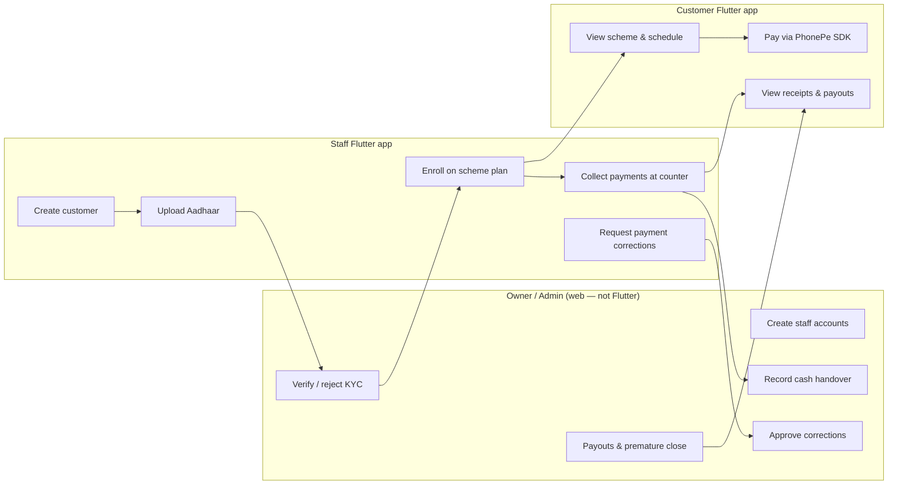

| Action | Customer app | Staff app | Admin web |
|---|---|---|---|
| Login | Yes | Yes | Yes |
| Self-register | **No** | **No** | — |
| Create customer | No | Yes (permission) | Yes |
| Upload Aadhaar | No | Yes (permission) | Yes |
| KYC verify | No | No | Yes |
| Enroll on scheme | No | Yes (permission) | Yes |
| Pay (PhonePe) | Yes (own scheme) | Yes (for customer) | — |
| Pay (cash/UPI at counter) | No | Yes (permission) | Yes |
| View own receipts | Yes | Own collections only | All |
| Request correction | No | Yes (own payments) | — |
| Approve correction | No | No | Yes |
| Maturity / payout | View only | No | Yes |

---

## 2. Shared session flow (both apps)

Use the **same Dio + cookie jar pattern** in both apps. Only the post-login route differs by `role`.

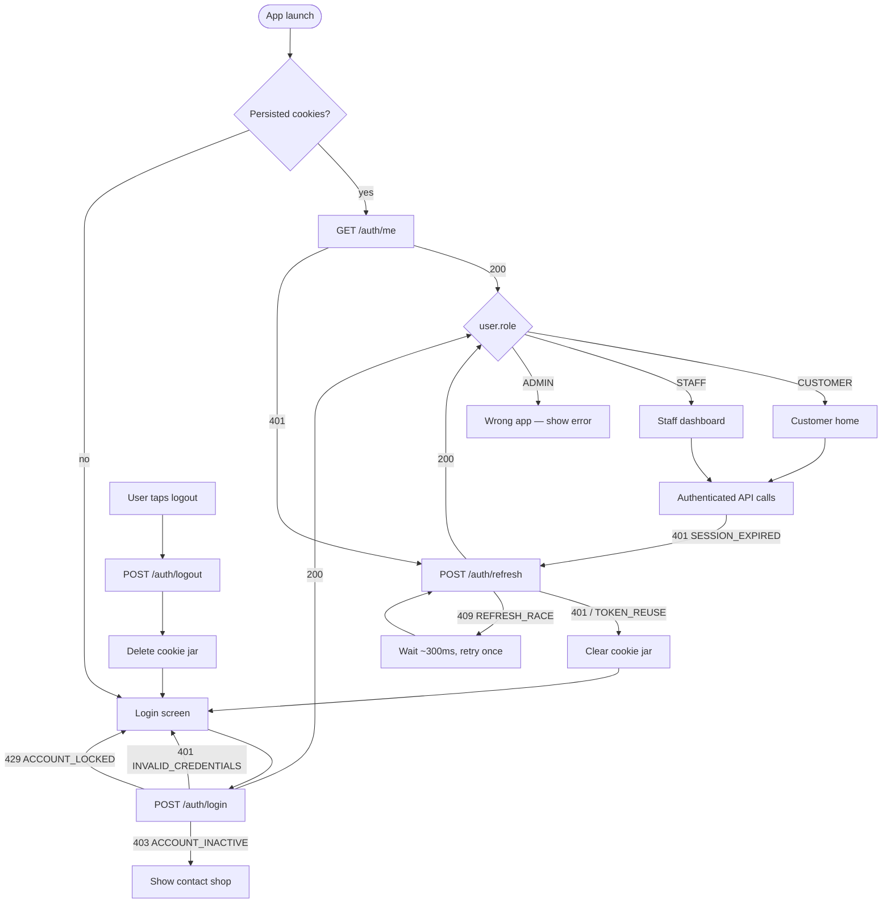

**Rules for Flutter:**

- One shared `Dio` instance per app.
- Single-flight refresh (never two parallel `/auth/refresh` calls).
- On `TOKEN_REUSE_DETECTED`, wipe cookies and force login.
- Route by `role` immediately after login — do not show customer UI to staff or vice versa.

---

## 3. Customer app — screen map

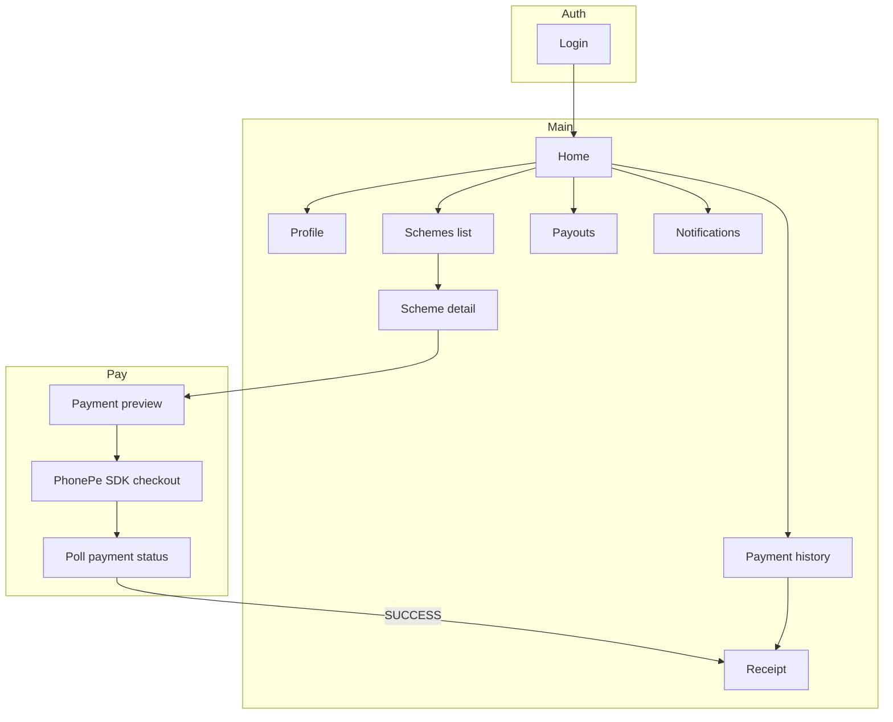

**Screens the customer app needs:**

| Screen | Primary API |
|---|---|
| Login | `POST /auth/login` |
| Home | `GET /customer/home` |
| Profile | `GET /customer/profile` |
| Schemes | `GET /customer/schemes` |
| Scheme detail | `GET /customer/schemes/:id` |
| Pay (amount entry) | `GET /customer/schemes/:id/payment-preview` |
| PhonePe checkout | `POST /customer/payments/phonepe/create-order` + SDK |
| Payment status | `GET /customer/payment-intents/:merchantOrderId` |
| Receipt | `GET /customer/payments/:id/receipt` |
| Payment history | `GET /customer/payments` |
| Payouts | `GET /customer/payouts` |
| Notifications | `GET /customer/notifications` |

**Do not build:** signup, gold rates, web PhonePe checkout (native uses SDK only).

---

## 4. Customer app — end-to-end journey

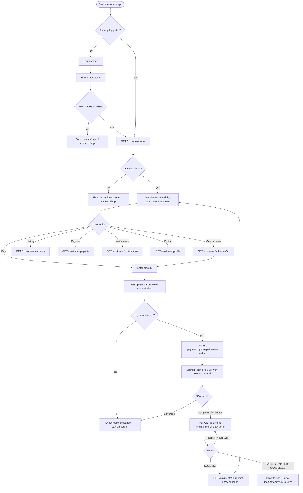

**Customer cannot:**

- Create their own account
- Enroll themselves
- Pay with cash in the app (counter only)
- Close a scheme or request payout (owner/admin only)

---

## 5. Customer payment flow (detailed)

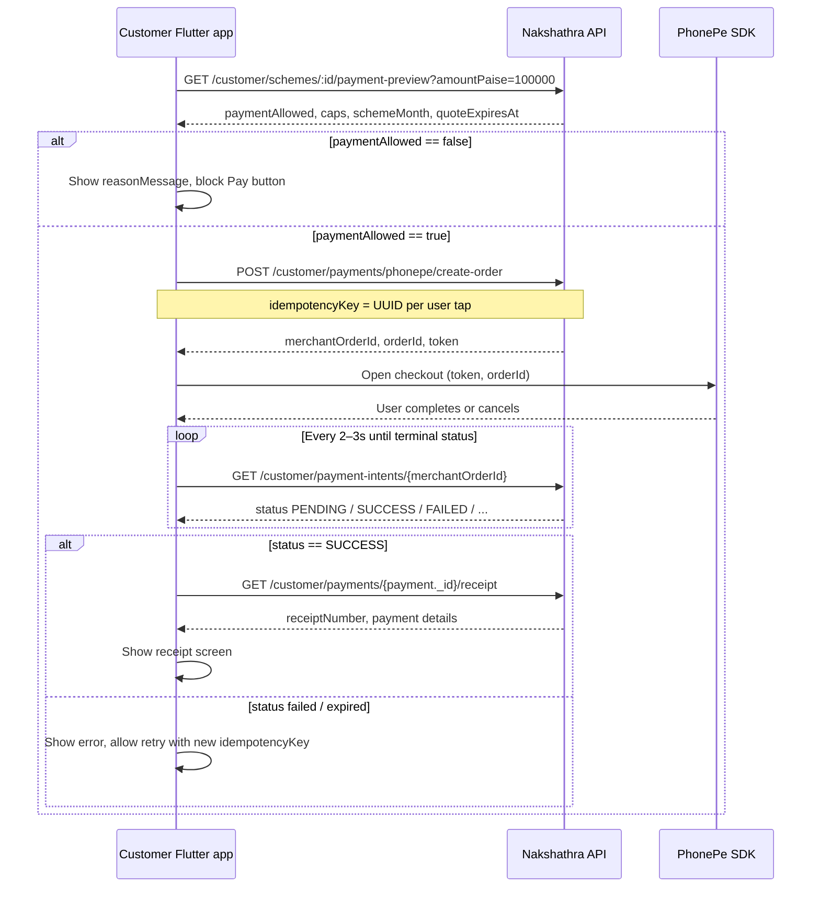

**Idempotency:** reuse the same `idempotencyKey` only when retrying the **same** payment attempt after a network error. If the user changes the amount or starts a new attempt, generate a new UUID.

**Polling stop conditions:** `SUCCESS`, `FAILED`, `EXPIRED`, `CANCELLED`, `REFUNDED`, `REVERSED`, `REVIEW_REQUIRED`.

---

## 6. Customer lifecycle (what the customer sees)

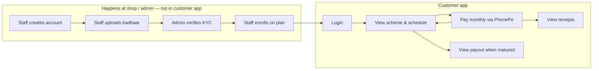

**Scheme months (CASH):**

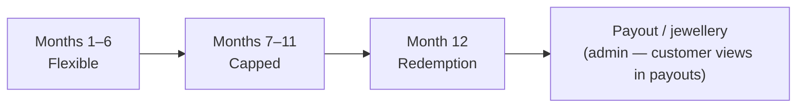

During months 1–11 the customer app shows **Pay** when `paymentWindowOpen` and preview `paymentAllowed` are true. Month 12 is redemption — no contribution; customer may see payout in `GET /customer/payouts` after admin processes it.

---

## 7. Staff app — permission gating

Staff UI must hide actions the user cannot perform. The server returns `403 PERMISSION_DENIED` if they try anyway.

```mermaid
flowchart TD
  Login[POST /auth/login] --> Dash[GET /staff/dashboard]
  Dash --> Perm{Check permissions[]}

  Perm -->|canViewCustomers| V1[Search / view customers]
  Perm -->|canCreateCustomer| V2[Create customer + upload Aadhaar]
  Perm -->|canEnrollScheme| V3[Enroll customer on plan]
  Perm -->|canCollectPayment| V4[Preview + collect payment]
  Perm -->|canSubmitCorrectionRequest| V5[Request correction on own payment]

  Dash --> Always[Always available]
  Always --> A1[Profile]
  Always --> A2[Own payments & receipts]
  Always --> A3[Cash held]
  Always --> A4[Cash submission history]
  Always --> A5[Collection report]
  Always --> A6[Scheme plans list]
```

| Permission | UI to show |
|---|---|
| `canViewCustomers` | Customer search, customer detail, enrollment detail |
| `canCreateCustomer` | New customer form, Aadhaar camera/upload |
| `canEnrollScheme` | Enroll button + plan picker |
| `canCollectPayment` | Collect payment, PhonePe for customer |
| `canSubmitCorrectionRequest` | Correction form on own receipts |

---

## 8. Staff app — screen map

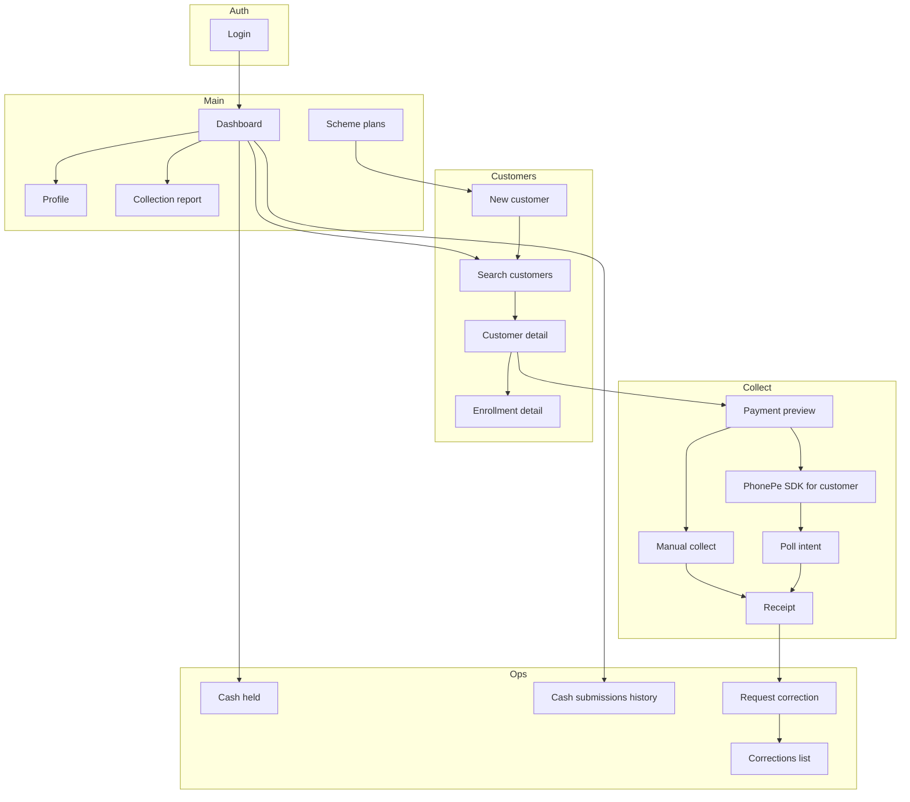

---

## 9. Staff app — onboarding a new customer

Requires: `canCreateCustomer`, optionally `canEnrollScheme`, and admin KYC before payments.


**API sequence (create + enroll at counter):**

1. `POST /uploads/presign` → PUT file to S3 URL (×2 for front/back)
2. `POST /staff/customers` (with `aadhaar` keys + optional `enrollment`)
3. Wait for admin `KYC VERIFIED` (customer/staff cannot skip if `KYC_REQUIRED=true`)
4. If not enrolled at step 2: `GET /staff/scheme-plans` → `POST /staff/enrollments`

---

## 10. Staff app — collection at counter (main daily flow)


**Cash held:** every successful **CASH** collection increases `cashHeldPaise`. Owner records handover on admin web (`POST /admin/cash-submissions`). Staff sees history via `GET /staff/cash-submissions`.

---

## 11. Staff collection flow (sequence)

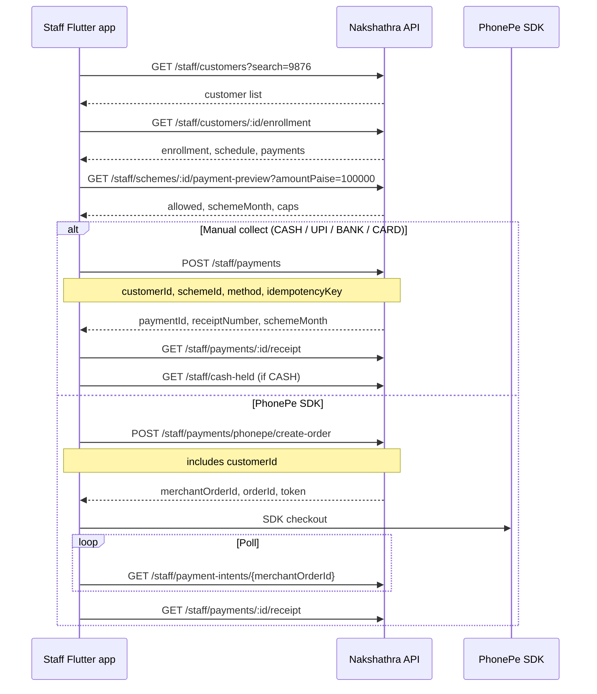

---

## 12. Staff correction flow

Staff can only correct **their own** successful collections. Admin approves or rejects on web.

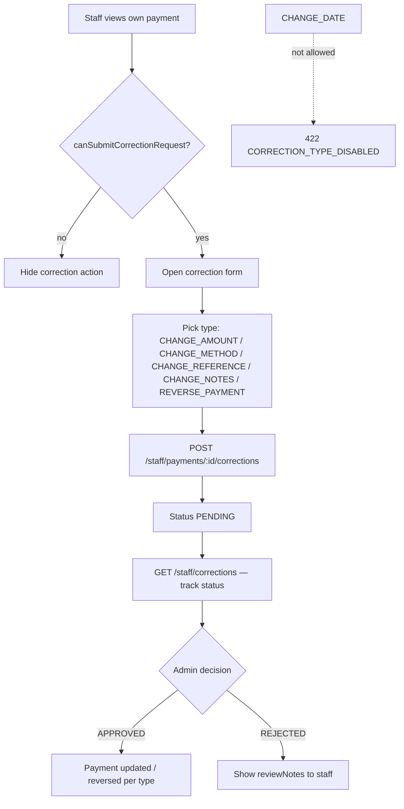

**Correction types staff may request:**

| Type | Use when |
|---|---|
| `CHANGE_AMOUNT` | Wrong amount recorded |
| `CHANGE_METHOD` | Wrong method (e.g. recorded CASH but was UPI) |
| `CHANGE_REFERENCE` | Wrong reference number |
| `CHANGE_NOTES` | Notes fix only |
| `REVERSE_PAYMENT` | Void the collection entirely |

Staff **cannot** approve their own correction. Poll `GET /staff/corrections` or refresh payment detail after admin acts.

---

## 13. Staff reporting & cash handover

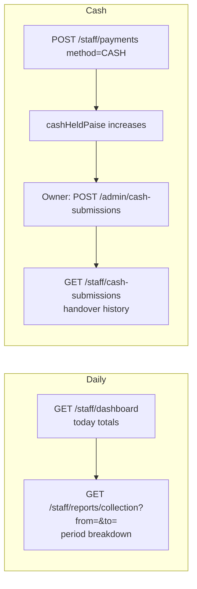

---

## 14. Error paths both apps should handle

```mermaid
flowchart TD
  API[Any API call] --> E{HTTP / error.code}

  E -->|401 SESSION_EXPIRED| R[Refresh session]
  E -->|403 PERMISSION_DENIED| P[Hide action / show message]
  E -->|409 KYC_VERIFICATION_REQUIRED| K[Staff: wait for admin KYC]
  E -->|409 SCHEME_NOT_ACTIVE| S[Cannot pay this scheme]
  E -->|409 IDEMPOTENCY_KEY_REUSED| I[New key if user changed amount]
  E -->|503 CUSTOMER_PAYMENTS_DISABLED| D[Customer PhonePe off — retry later]
  E -->|422 VALIDATION_ERROR| V[Show field errors from details[]]
  E -->|429 ACCOUNT_LOCKED| L[Login locked — wait]
```

---

## 15. Quick reference — happy paths

### Customer happy path

```
Login → Home → Scheme detail → Enter amount → Preview → Create SDK order → PhonePe → Poll → Receipt
```

### Staff happy path (new customer + first payment)

```
Login → Create customer (+ Aadhaar) → [Admin KYC] → Enroll → Search customer → Preview → Collect (cash or PhonePe) → Receipt
```

### Staff happy path (returning customer)

```
Login → Dashboard → Search → Enrollment → Preview → Collect → Receipt → (optional) Correction request
```

---

## Related docs

- [FLUTTER_API_HANDOFF.md](./FLUTTER_API_HANDOFF.md) — auth setup, all endpoints, Appendix A JSON examples
- OpenAPI (runtime): `GET /api/v1/openapi.json`
