# Nakshathra Jewellers — Flutter App Flows

Visual flow guide for the **Customer** and **Staff** Flutter apps. Pair this with [FLUTTER_API_HANDOFF.md](./FLUTTER_API_HANDOFF.md) for endpoint details and JSON examples.

**Live product:** CASH schemes only (11 contribution months, redemption in month 12).  
**Auth:** cookie-based (`access_token` + `refresh_token`). No self-signup.

---

## 1. Who does what

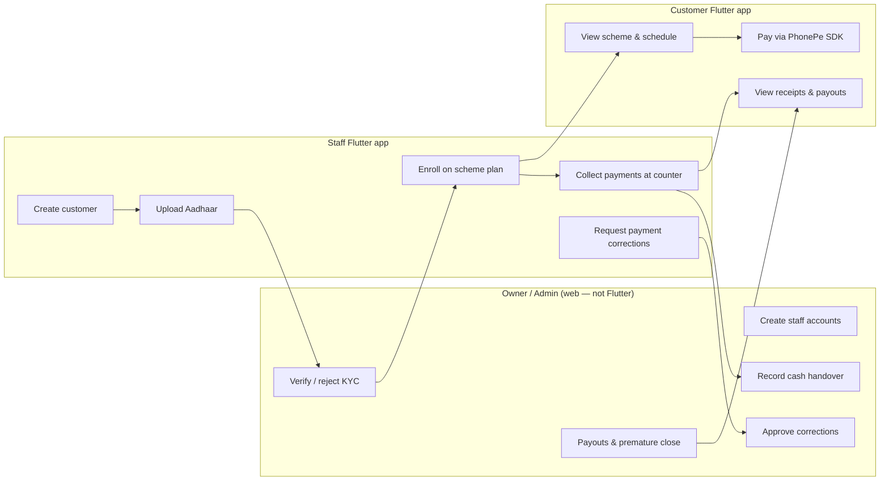

| Action | Customer app | Staff app | Admin web |
|---|---|---|---|
| Login | Yes | Yes | Yes |
| Self-register | **No** | **No** | — |
| Create customer | No | Yes (permission) | Yes |
| Upload Aadhaar | No | Yes (permission) | Yes |
| KYC verify | No | No | Yes |
| Enroll on scheme | No | Yes (permission) | Yes |
| Pay (PhonePe) | Yes (own scheme) | Yes (for customer) | — |
| Pay (cash/UPI at counter) | No | Yes (permission) | Yes |
| View own receipts | Yes | Own collections only | All |
| Request correction | No | Yes (own payments) | — |
| Approve correction | No | No | Yes |
| Maturity / payout | View only | No | Yes |

---

## 2. Shared session flow (both apps)

Use the **same Dio + cookie jar pattern** in both apps. Only the post-login route differs by `role`.


**Rules for Flutter:**

- One shared `Dio` instance per app.
- Single-flight refresh (never two parallel `/auth/refresh` calls).
- On `TOKEN_REUSE_DETECTED`, wipe cookies and force login.
- Route by `role` immediately after login — do not show customer UI to staff or vice versa.

---

## 3. Customer app — screen map

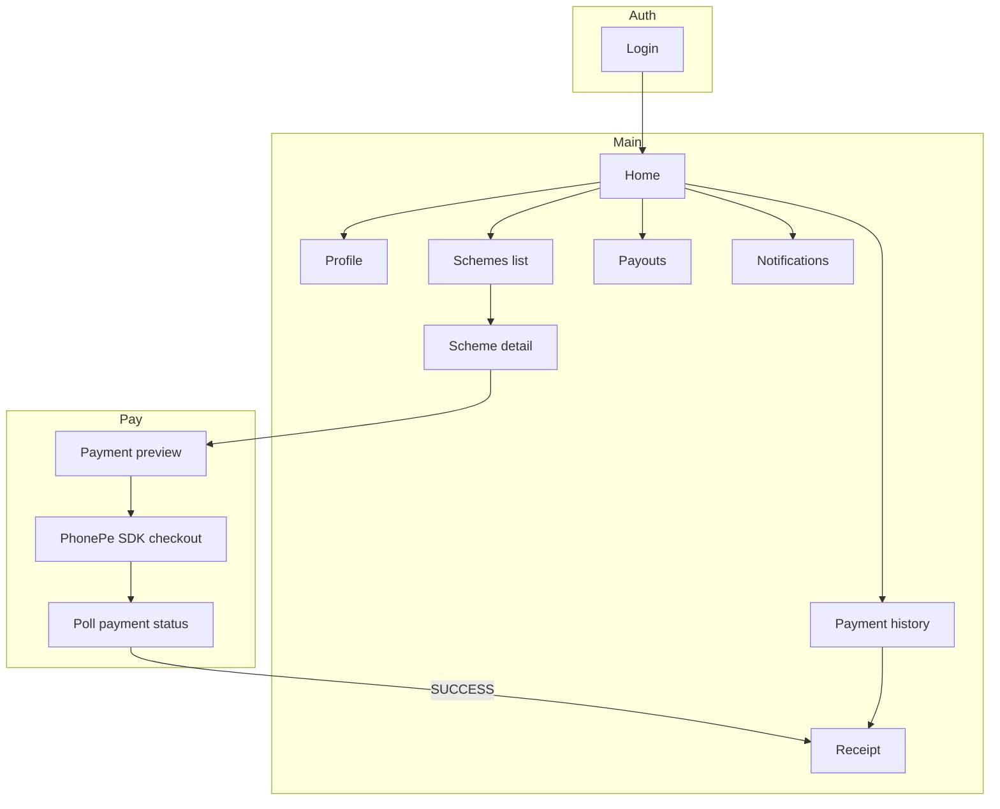

**Screens the customer app needs:**

| Screen | Primary API |
|---|---|
| Login | `POST /auth/login` |
| Home | `GET /customer/home` |
| Profile | `GET /customer/profile` |
| Schemes | `GET /customer/schemes` |
| Scheme detail | `GET /customer/schemes/:id` |
| Pay (amount entry) | `GET /customer/schemes/:id/payment-preview` |
| PhonePe checkout | `POST /customer/payments/phonepe/create-order` + SDK |
| Payment status | `GET /customer/payment-intents/:merchantOrderId` |
| Receipt | `GET /customer/payments/:id/receipt` |
| Payment history | `GET /customer/payments` |
| Payouts | `GET /customer/payouts` |
| Notifications | `GET /customer/notifications` |

**Do not build:** signup, gold rates, web PhonePe checkout (native uses SDK only).

---

## 4. Customer app — end-to-end journey


**Customer cannot:**

- Create their own account
- Enroll themselves
- Pay with cash in the app (counter only)
- Close a scheme or request payout (owner/admin only)

---

## 5. Customer payment flow (detailed)

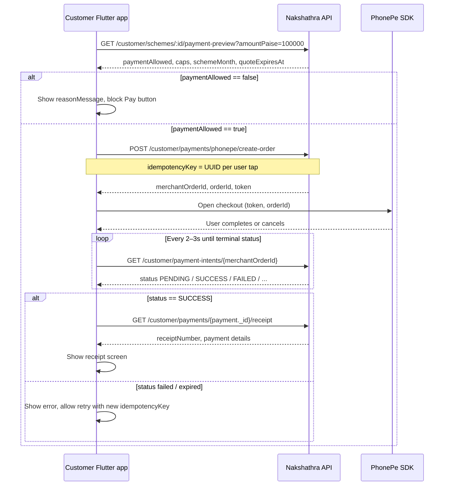

**Idempotency:** reuse the same `idempotencyKey` only when retrying the **same** payment attempt after a network error. If the user changes the amount or starts a new attempt, generate a new UUID.

**Polling stop conditions:** `SUCCESS`, `FAILED`, `EXPIRED`, `CANCELLED`, `REFUNDED`, `REVERSED`, `REVIEW_REQUIRED`.

---

## 6. Customer lifecycle (what the customer sees)

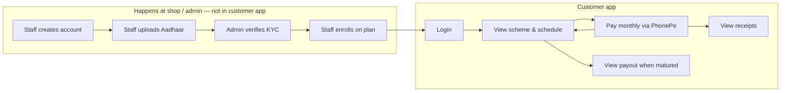

**Scheme months (CASH):**

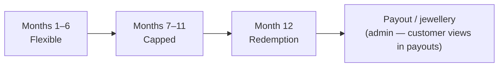

During months 1–11 the customer app shows **Pay** when `paymentWindowOpen` and preview `paymentAllowed` are true. Month 12 is redemption — no contribution; customer may see payout in `GET /customer/payouts` after admin processes it.

---

## 7. Staff app — permission gating

Staff UI must hide actions the user cannot perform. The server returns `403 PERMISSION_DENIED` if they try anyway.

```mermaid
flowchart TD
  Login[POST /auth/login] --> Dash[GET /staff/dashboard]
  Dash --> Perm{Check permissions[]}

  Perm -->|canViewCustomers| V1[Search / view customers]
  Perm -->|canCreateCustomer| V2[Create customer + upload Aadhaar]
  Perm -->|canEnrollScheme| V3[Enroll customer on plan]
  Perm -->|canCollectPayment| V4[Preview + collect payment]
  Perm -->|canSubmitCorrectionRequest| V5[Request correction on own payment]

  Dash --> Always[Always available]
  Always --> A1[Profile]
  Always --> A2[Own payments & receipts]
  Always --> A3[Cash held]
  Always --> A4[Cash submission history]
  Always --> A5[Collection report]
  Always --> A6[Scheme plans list]
```

| Permission | UI to show |
|---|---|
| `canViewCustomers` | Customer search, customer detail, enrollment detail |
| `canCreateCustomer` | New customer form, Aadhaar camera/upload |
| `canEnrollScheme` | Enroll button + plan picker |
| `canCollectPayment` | Collect payment, PhonePe for customer |
| `canSubmitCorrectionRequest` | Correction form on own receipts |

---

## 8. Staff app — screen map

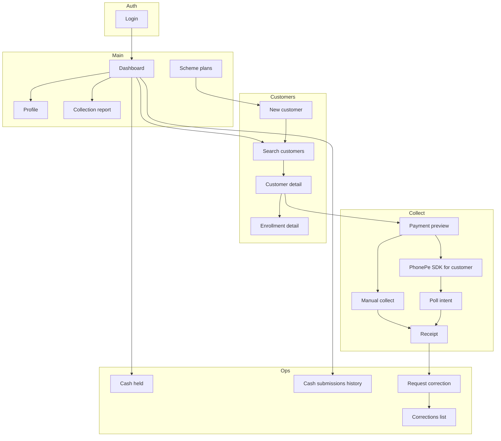

---

## 9. Staff app — onboarding a new customer

Requires: `canCreateCustomer`, optionally `canEnrollScheme`, and admin KYC before payments.

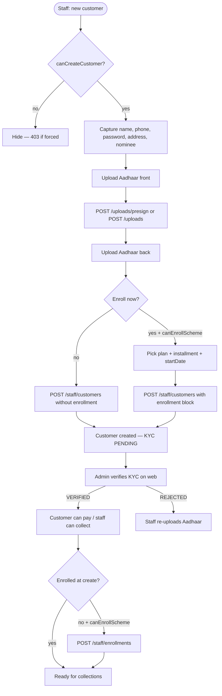

**API sequence (create + enroll at counter):**

1. `POST /uploads/presign` → PUT file to S3 URL (×2 for front/back)
2. `POST /staff/customers` (with `aadhaar` keys + optional `enrollment`)
3. Wait for admin `KYC VERIFIED` (customer/staff cannot skip if `KYC_REQUIRED=true`)
4. If not enrolled at step 2: `GET /staff/scheme-plans` → `POST /staff/enrollments`

---

## 10. Staff app — collection at counter (main daily flow)

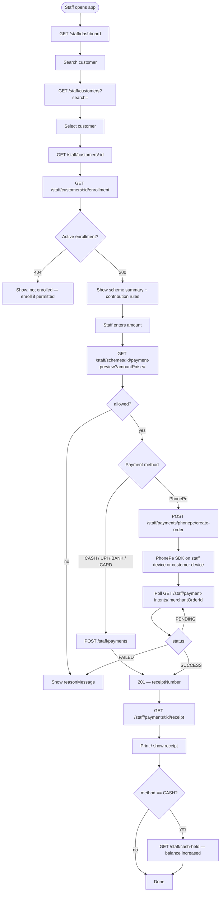

**Cash held:** every successful **CASH** collection increases `cashHeldPaise`. Owner records handover on admin web (`POST /admin/cash-submissions`). Staff sees history via `GET /staff/cash-submissions`.

---

## 11. Staff collection flow (sequence)

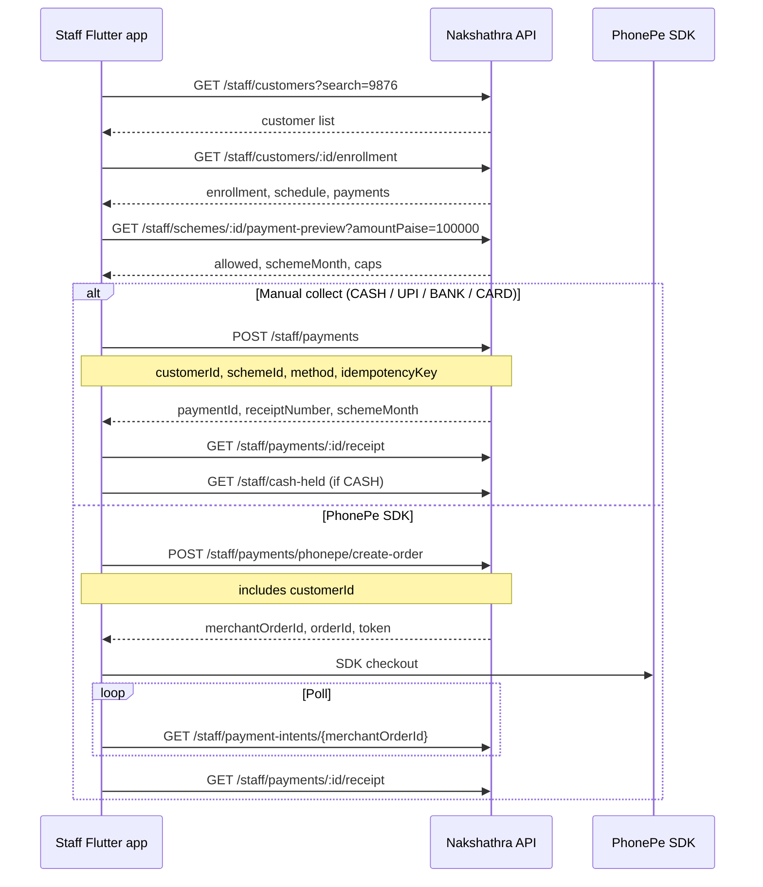

---

## 12. Staff correction flow

Staff can only correct **their own** successful collections. Admin approves or rejects on web.

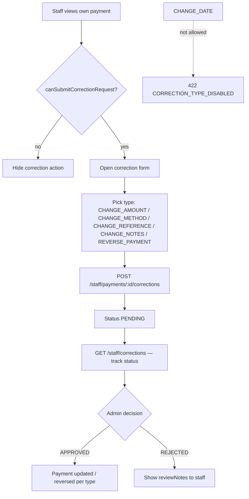

**Correction types staff may request:**

| Type | Use when |
|---|---|
| `CHANGE_AMOUNT` | Wrong amount recorded |
| `CHANGE_METHOD` | Wrong method (e.g. recorded CASH but was UPI) |
| `CHANGE_REFERENCE` | Wrong reference number |
| `CHANGE_NOTES` | Notes fix only |
| `REVERSE_PAYMENT` | Void the collection entirely |

Staff **cannot** approve their own correction. Poll `GET /staff/corrections` or refresh payment detail after admin acts.

---

## 13. Staff reporting & cash handover

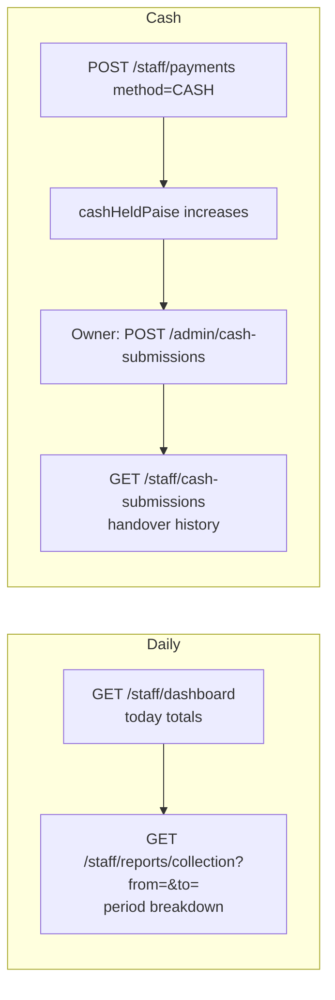

---

## 14. Error paths both apps should handle

```mermaid
flowchart TD
  API[Any API call] --> E{HTTP / error.code}

  E -->|401 SESSION_EXPIRED| R[Refresh session]
  E -->|403 PERMISSION_DENIED| P[Hide action / show message]
  E -->|409 KYC_VERIFICATION_REQUIRED| K[Staff: wait for admin KYC]
  E -->|409 SCHEME_NOT_ACTIVE| S[Cannot pay this scheme]
  E -->|409 IDEMPOTENCY_KEY_REUSED| I[New key if user changed amount]
  E -->|503 CUSTOMER_PAYMENTS_DISABLED| D[Customer PhonePe off — retry later]
  E -->|422 VALIDATION_ERROR| V[Show field errors from details[]]
  E -->|429 ACCOUNT_LOCKED| L[Login locked — wait]
```

---

## 15. Quick reference — happy paths

### Customer happy path

```
Login → Home → Scheme detail → Enter amount → Preview → Create SDK order → PhonePe → Poll → Receipt
```

### Staff happy path (new customer + first payment)

```
Login → Create customer (+ Aadhaar) → [Admin KYC] → Enroll → Search customer → Preview → Collect (cash or PhonePe) → Receipt
```

### Staff happy path (returning customer)

```
Login → Dashboard → Search → Enrollment → Preview → Collect → Receipt → (optional) Correction request
```

---

## 16. Business logic — scheme engine (CASH)

This is what the server enforces. The Flutter apps must **display** these rules and **never invent** amounts, caps, or scheme months client-side.

### 16.1 Timeline

| Calendar phase | Scheme months | Contribution rule |
|---|---|---|
| Flexible | 1–6 | Pay **at least** `monthlyInstallmentPaise` per month. No upper cap in this phase. |
| Capped | 7–11 | Pay **at least** `monthlyInstallmentPaise`, **at most** the monthly cap (see below). |
| Redemption | 12 | **No contributions.** Customer may see payout after admin settles. |

- **Duration:** 11 contribution months.
- **Redemption month:** 12 (no payment in app).
- **Timezone:** all scheme months and business dates use **Asia/Kolkata**.

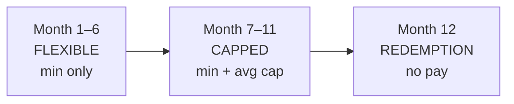

### 16.2 Monthly cap (months 7–11)

Cap strategy: **`AVERAGE_SUCCESSFUL_PAYMENT_FIRST_6`**

```
monthlyCapPaise = floor( sum(successful payments in scheme months 1–6) / count(those payments) )
```

**Example** (enrollment `monthlyInstallmentPaise = 100000` = ₹1,000):

| Month | Payment | Running total (months 1–6) |
|---|---|---|
| 1 | ₹1,000 | 1 payment |
| 2 | ₹1,000 | 2 |
| 3 | ₹1,200 | 3 |
| 4 | ₹1,000 | 4 |
| 5 | ₹1,000 | 5 |
| 6 | ₹1,100 | 6 → total ₹6,300 |

From month 7 onward: **cap = ₹1,050** (630000 / 6 = 105000 paise). Customer may pay ₹1,000–₹1,050 in capped months (minimum still ₹1,000).

If **zero** successful payments exist in months 1–6 when month 7 starts → **`FIRST_PERIOD_EMPTY`** — payments blocked until at least one month 1–6 payment exists.

### 16.3 One payment per scheme month

Only **one successful payment** is allowed per `schemeMonth` per enrollment. A second payment for the same month returns:

- Preview: `allowed: false`, `reasonCode: INSTALLMENT_ALREADY_PAID`
- Collect API: `409 INSTALLMENT_ALREADY_PAID`

**Test:** pay month 3 successfully, then preview/collect month 3 again → must fail.

### 16.4 Scheme month is server-authoritative

For Nakshathra CASH, `schemeMonth` is computed from **payment date in Asia/Kolkata**, not from the client clock alone.

- Customer preview may pass optional `schemeMonth` — if it disagrees with the server-derived month → `422 INVALID_SCHEME_MONTH`.
- Staff preview **does not** accept `schemeMonth` query param.
- Staff manual collect sends `paymentDate` — server assigns `schemeMonth`.

**Test:** do not hard-code scheme month in UI; always show `schemeMonth` from preview response.

### 16.5 Payment preview is mandatory

Before any PhonePe or manual collect:

1. Call preview with `amountPaise`.
2. Check `paymentAllowed` / `allowed`.
3. If false, show `reasonMessage` and **disable Pay**.

Preview quotes expire in **15 minutes** (`quoteExpiresAt`). After expiry, call preview again before create-order/collect.

### 16.6 Payment preview — reason codes to test

| `reasonCode` | When | UI expectation |
|---|---|---|
| *(null)* + `allowed: true` | Valid amount | Enable Pay |
| `PAYMENT_BELOW_MINIMUM` | Amount < `monthlyInstallmentPaise` | Show minimum in ₹ |
| `PAYMENT_LIMIT_EXCEEDED` | Capped month, amount > `remainingCapPaise` | Show cap and remaining |
| `INSTALLMENT_ALREADY_PAID` | Month already has SUCCESS payment | Hide Pay / show paid |
| `FIRST_PERIOD_EMPTY` | Month 7+ but no payments in months 1–6 | Explain shop contact |
| `SCHEME_NOT_ACTIVE` | Enrollment not ACTIVE | No pay |
| `SCHEME_MATURED` | Past contribution window | No pay |
| `ALL_INSTALLMENTS_PAID` | All 11 months paid | No pay |
| `INVALID_SCHEME_MONTH` | Client sent wrong `schemeMonth` | Refresh preview |
| `GOLD_WEIGHT_DISABLED` | Gold endpoints only | N/A for live CASH |

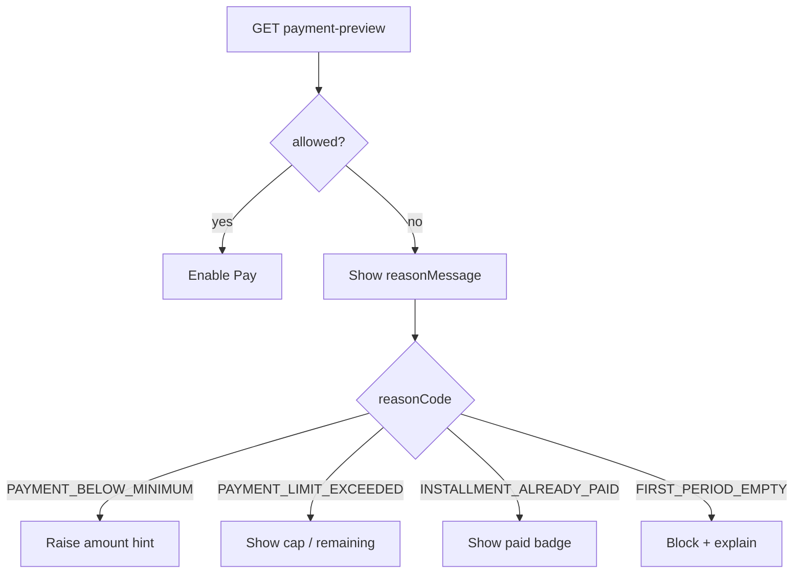

### 16.7 Installment schedule statuses

From `GET /customer/home` or `/customer/schemes/:id` → `installmentSchedule[]`:

| `status` | Meaning | UI |
|---|---|---|
| `PAID` | SUCCESS payment exists for that month | Green / receipt link |
| `DUE` | Window open, unpaid | Pay allowed (if preview ok) |
| `OVERDUE` | Window passed, unpaid | Highlight overdue |
| `UPCOMING` | Future month / window not open | Disabled |

`canRecord: true` means staff/customer **may** record a payment for that month (subject to preview).

Default payment window: **fixed day 5** of each scheme month (plan-configurable).

---

## 17. Business logic — KYC & customer lifecycle

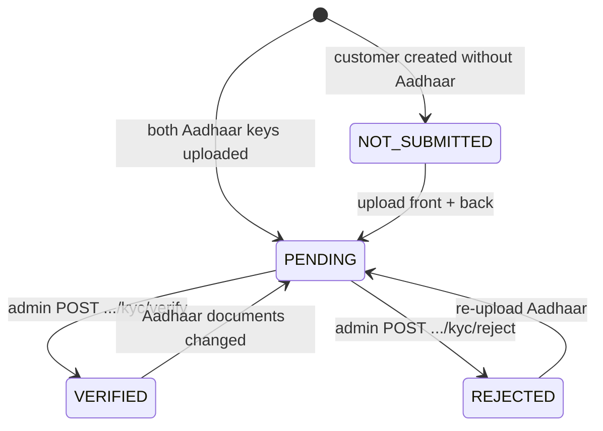

| `kycStatus` | Can enroll? | Can pay/collect? |
|---|---|---|
| `NOT_SUBMITTED` | Yes (if `KYC_REQUIRED=false`) / blocked when `KYC_REQUIRED=true` | Blocked when `KYC_REQUIRED=true` |
| `PENDING` | Blocked when `KYC_REQUIRED=true` | Blocked when `KYC_REQUIRED=true` |
| `REJECTED` | Blocked when `KYC_REQUIRED=true` | Blocked when `KYC_REQUIRED=true` |
| `VERIFIED` | Yes | Yes |

**Server flag:** `KYC_REQUIRED` (env). Your current dev backend has **`KYC_REQUIRED=false`** — enroll/pay works without admin KYC verify. **Production will likely be `true`** — test both modes.

**Error when blocked:** `409 KYC_VERIFICATION_REQUIRED`

---

## 18. Business logic — enrollment & customer rules

| Rule | Error code | Test |
|---|---|---|
| One **ACTIVE** enrollment per customer | `409 CUSTOMER_ALREADY_ENROLLED` | Enroll same customer twice |
| `monthlyInstallmentPaise` ≥ plan `minimumPaymentPaise` | `422 INSTALLMENT_BELOW_MINIMUM` | Enroll with ₹100 when plan min is ₹1000 |
| Phone unique across users | `409` duplicate phone | Create two customers with same phone |
| Customer cannot self-register | N/A | No signup API exists |
| Only **CASH** plans enrollable live | `422 SCHEME_TYPE_NOT_LIVE` | N/A in Flutter (no GOLD plans shown) |

Enrollment creates snapshot of plan terms on the enrollment record — UI should show `schemeName`, `monthlyInstallmentPaise`, `durationMonths` from enrollment/home, not hard-coded copy.

---

## 19. Business logic — payments, PhonePe & idempotency

### 19.1 Money

- All amounts in **integer paise**.
- API floor: **10000 paise (₹100)** unless plan minimum is higher.
- Demo seeded plan minimum: **100000 paise (₹1,000)**.

### 19.2 Idempotency

Every collect / PhonePe create-order needs `idempotencyKey` (8–120 chars).

| Scenario | Same key? | Expected |
|---|---|---|
| Network retry, same body | Yes | Same payment / same intent returned |
| User changes amount | **No** (new UUID) | Old key + new amount → `409 IDEMPOTENCY_KEY_REUSED` |
| Switch WEB ↔ SDK checkout | **No** | `409 PAYMENT_INTENT_INCOMPLETE` |

### 19.3 PhonePe intent statuses (poll until terminal)

| Status | Keep polling? | UI |
|---|---|---|
| `INITIATED`, `PROVIDER_CREATING`, `PROVIDER_CREATE_UNCERTAIN`, `PENDING` | Yes (2–3s) | Spinner |
| `SUCCESS` | No | Receipt |
| `FAILED`, `EXPIRED`, `CANCELLED` | No | Retry with new key |
| `REVIEW_REQUIRED` | No | Contact shop (ops issue) |

Quote TTL: **15 minutes** from preview/create-order.

**Dev only:** `PHONEPE_DEV_AUTO_SUCCESS=true` auto-completes pending intents (never in production).

**Admin toggle:** `customerPhonePeEnabled=false` in settings → customer PhonePe returns `503 CUSTOMER_PAYMENTS_DISABLED`.

### 19.4 Payment methods (staff manual collect)

| Method | Effect |
|---|---|
| `CASH` | Increases staff `cashHeldPaise` |
| `UPI`, `BANK`, `CARD` | Recorded; does not increase cash held |
| PhonePe (SDK) | Gateway payment; staff or customer initiated |

---

## 20. Business logic — staff cash & corrections

### 20.1 Cash held

```
cashWithStaffPaise = cashCollectedPaise - cashSubmittedPaise
```

- Each staff **CASH** SUCCESS payment adds to their cash collected.
- Owner records handover via **admin** `POST /admin/cash-submissions`.
- Staff sees `GET /staff/cash-held` and `GET /staff/cash-submissions` (read-only history).

**Test:** collect ₹1,000 CASH → `cashHeldPaise` increases by 100000. UPI collect → cash held unchanged.

### 20.2 Corrections

| Rule | Detail |
|---|---|
| Who can request | Staff who **collected** that payment |
| Who approves | **Admin only** (not staff app) |
| `CHANGE_DATE` | **Forbidden** → `422 CORRECTION_TYPE_DISABLED` |
| One pending per payment | `409 CORRECTION_ALREADY_PENDING` |
| Allowed types | `CHANGE_AMOUNT`, `CHANGE_METHOD`, `CHANGE_REFERENCE`, `CHANGE_NOTES`, `REVERSE_PAYMENT` |

---

## 21. Business logic — auth & permissions

| Rule | Detail |
|---|---|
| Login lockout | 5 failed attempts → `429 ACCOUNT_LOCKED` for 15 minutes |
| Role routing | `CUSTOMER` → customer app only; `STAFF` → staff app only |
| Staff permissions | Server enforces; UI should hide missing permissions |
| Session refresh | Rotating refresh cookie; parallel refresh → `409 REFRESH_RACE` (retry once) |
| Token reuse | `401 TOKEN_REUSE_DETECTED` → wipe cookies, force login |

**Restricted staff test account:** create staff with only `canViewCustomers` — search works; collect/enroll/create return `403 PERMISSION_DENIED`.

---

## 22. Test environment setup

### 22.1 Local API

Default dev URL: `http://localhost:2020/api/v1` (see `PORT` in `.env`).

Check health: `GET /health` → `{ "status": "ok" }`.

### 22.2 Demo data (development only)

**Option A — seed script (wipes entire DB):**

```bash
npm run seed
```

**Option B — auto on server start:** set `BOOTSTRAP_DEMO=true` in `.env` (forbidden in production).

| Account | Phone (login) | Password | Role |
|---|---|---|---|
| Demo admin | `9999999901` or `+919999999901` | `Nakshathra@123` | ADMIN (web, not Flutter) |
| Demo customer | `9999999903` or `+919999999903` | `Nakshathra@123` | CUSTOMER |

Seeded customer has **KYC VERIFIED**, **ACTIVE** CASH enrollment, `monthlyInstallmentPaise = 100000` (₹1,000).

Create staff via admin API or ask backend team for a staff test account with full permissions.

### 22.3 Environment flags that change test behavior

| Flag | Dev value (typical) | Effect on testing |
|---|---|---|
| `KYC_REQUIRED` | `false` locally | Pay/enroll without admin KYC step |
| `COOKIE_SECURE` | `false` locally | HTTP ok for cookies |
| `PHONEPE_ENABLED` | `true` | PhonePe routes active |
| `PHONEPE_DEV_AUTO_SUCCESS` | `false` | Must complete sandbox or poll real status |
| `customerPhonePeEnabled` | admin settings | Can disable customer PhonePe |

---

## 23. Customer app — test scenario matrix

Use this as a QA checklist. **Expected** = what the API/UI should do.

| # | Scenario | Steps | Expected |
|---|---|---|---|
| C1 | Happy login | `POST /auth/login` demo customer | `role: CUSTOMER`, cookies set, home loads |
| C2 | Wrong role | Login as staff in customer app | Show error / redirect message |
| C3 | Session persist | Kill app, reopen | Cookies → `/auth/me` → home without login |
| C4 | Home data | `GET /customer/home` | `activeScheme`, `installmentSchedule`, `schemeStatus.paymentWindowOpen` |
| C5 | Preview too low | Preview with `amountPaise=5000` | `allowed: false`, `PAYMENT_BELOW_MINIMUM` |
| C6 | Preview ok | Preview with `amountPaise=100000` | `allowed: true`, show `schemeMonth`, `phase` |
| C7 | Pay blocked UI | When `allowed: false` | Pay button disabled, `reasonMessage` visible |
| C8 | PhonePe happy path | Preview → create-order → SDK → poll | `SUCCESS`, receipt with `receiptNumber` |
| C9 | Poll pending | After SDK, before webhook | Status `PENDING`, spinner, then success |
| C10 | Duplicate month | Pay same month twice | Second preview: `INSTALLMENT_ALREADY_PAID` |
| C11 | Payment history | `GET /customer/payments` | Lists SUCCESS payments with pagination `meta` |
| C12 | Receipt | `GET /customer/payments/:id/receipt` | Matches payment from poll `payment._id` |
| C13 | Profile | `GET /customer/profile` | `customerCode`, `kycStatus`, no `aadhaar` keys |
| C14 | Schemes list | `GET /customer/schemes` | At least one enrollment with schedule |
| C15 | Scheme detail | `GET /customer/schemes/:id` | `payments`, `schemeStatus`, schedule |
| C16 | Logout | `POST /auth/logout` + clear jar | Next API call → login screen |
| C17 | Refresh race | Two parallel 401 handlers | One succeeds; other gets `REFRESH_RACE` then retries |
| C18 | Idempotency retry | Same create-order body + key after network drop | Same `merchantOrderId` returned |
| C19 | KYC blocked (prod) | With `KYC_REQUIRED=true`, PENDING customer | Pay → `409 KYC_VERIFICATION_REQUIRED` |
| C20 | PhonePe disabled | Admin disables customer PhonePe | `503 CUSTOMER_PAYMENTS_DISABLED` |

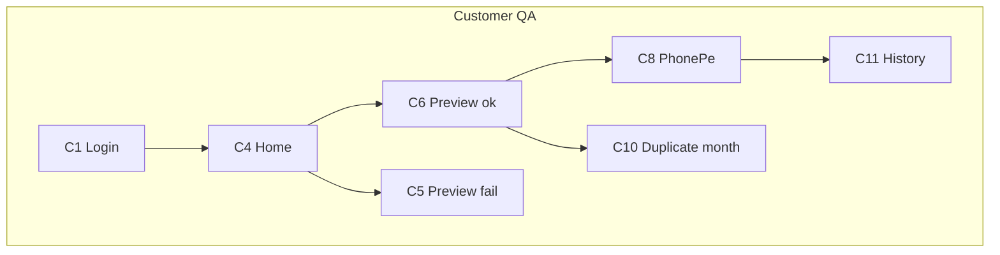

---

## 24. Staff app — test scenario matrix

| # | Scenario | Steps | Expected |
|---|---|---|---|
| S1 | Happy login | Staff credentials | `role: STAFF`, `permissions[]` present |
| S2 | Dashboard | `GET /staff/dashboard` | Today totals, `cashWithStaffPaise` |
| S3 | Search customer | `GET /staff/customers?search=9903` | Demo customer in list |
| S4 | Customer detail | `GET /staff/customers/:id` | `activeEnrollment`, `contribution` rules |
| S5 | Active enrollment | `GET /staff/customers/:id/enrollment` | Full enrollment + schedule |
| S6 | Scheme plans | `GET /staff/scheme-plans` | Active CASH plan with `minimumPaymentPaise` |
| S7 | Create customer | POST with phone, password, optional Aadhaar | `201`, `customerCode`, KYC `PENDING` if Aadhaar |
| S8 | Duplicate phone | Same phone as existing | `409` duplicate |
| S9 | Enroll | `POST /staff/enrollments` | `201`, `enrollmentNumber` NKS-ENR-... |
| S10 | Double enroll | Second ACTIVE enrollment same customer | `409 CUSTOMER_ALREADY_ENROLLED` |
| S11 | Preview | `GET /staff/schemes/:id/payment-preview?amountPaise=100000` | `allowed: true`, server `schemeMonth` |
| S12 | Cash collect | `POST /staff/payments` method=CASH | `201`, receipt, cash held +amount |
| S13 | UPI collect | method=UPI | `201`, cash held **unchanged** |
| S14 | Staff PhonePe | create-order → SDK → poll | SUCCESS, attributed to staff collection |
| S15 | Own payments list | `GET /staff/payments` | Only this staff's collections |
| S16 | Receipt | `GET /staff/payments/:id/receipt` | Customer + scheme populated |
| S17 | Cash held | After CASH collect | `GET /staff/cash-held` increased |
| S18 | Correction | `POST .../corrections` CHANGE_AMOUNT | `201` status `PENDING` |
| S19 | CHANGE_DATE blocked | correctionType CHANGE_DATE | `422 CORRECTION_TYPE_DISABLED` |
| S20 | List corrections | `GET /staff/corrections` | Shows pending request |
| S21 | Collection report | `GET /staff/reports/collection?from=&to=` | `byMethod`, `daily[]`, meta dates |
| S22 | Permission denied | Restricted staff tries collect | `403 PERMISSION_DENIED` |
| S23 | KYC block collect | `KYC_REQUIRED=true`, unverified customer | `409 KYC_VERIFICATION_REQUIRED` |
| S24 | Idempotency | Same staff payment key replay | Same receipt returned |

### 24.1 End-to-end staff scripts (manual QA)

**Script A — New customer at counter**

```
Login → presign/upload Aadhaar → POST /staff/customers (+ enrollment)
→ [if KYC_REQUIRED: admin verify on web]
→ GET enrollment → preview ₹1000 → POST /staff/payments CASH
→ receipt → cash-held increased
```

**Script B — Returning customer PhonePe**

```
Login → search → enrollment → preview → POST /staff/payments/phonepe/create-order
→ SDK → poll → receipt
```

**Script C — Correction**

```
Login → GET /staff/payments → pick own CASH payment
→ POST correction CHANGE_AMOUNT → GET /staff/corrections (PENDING)
→ [admin approve on web] → payment amount updated
```

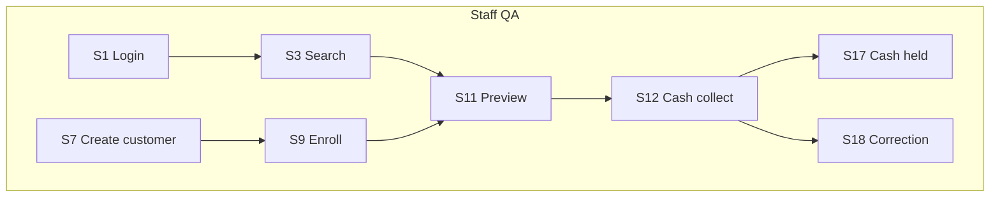

---

## 25. Assertions — what to verify in UI after each action

| After action | Check in UI / next API call |
|---|---|
| Successful payment | `totalPaidPaise` increased; schedule month → `PAID`; new receipt number |
| Capped month payment | Amount ≤ cap; preview showed `phase: CAPPED` |
| Month 7+ with no early payments | Preview blocked with `FIRST_PERIOD_EMPTY` |
| CASH staff collect | Dashboard + cash-held increased by exact paise |
| PhonePe SUCCESS | Poll returns `payment.receiptNumber`; appears in payment list |
| Enroll | Home shows `activeScheme`; only one ACTIVE per customer |
| KYC verify (admin) | `kycStatus: VERIFIED`; pay no longer blocked |
| Logout | No authenticated calls succeed until login |

---

## Related docs

- [FLUTTER_API_HANDOFF.md](./FLUTTER_API_HANDOFF.md) — auth setup, all endpoints, Appendix A JSON examples
- OpenAPI (runtime): `GET /api/v1/openapi.json`
