# Nakshathra — Flutter Payment API Flow

Payment integration guide for the **Customer** and **Staff** Flutter apps using **PhonePe SDK** (native). For auth setup, cookie handling, and non-payment endpoints see [FLUTTER_API_HANDOFF.md](./FLUTTER_API_HANDOFF.md).

**Base URL:** `https://{host}/api/v1`  
**Live example:** `https://nakshatra-bnglr-hassan.retailkerala.com/api/v1`  
**Money:** integer **paise** only (₹1 = `100` paise, ₹1,000 = `100000` paise)  
**Auth:** cookie-based (`access_token` + `refresh_token`). Use one Dio instance with `PersistCookieJar`.

---

## 1. Overview

Flutter apps use the **PhonePe SDK** flow — not web checkout.

| App | Who pays | Create-order endpoint | Poll endpoint |
| --- | --- | --- | --- |
| Customer | Logged-in customer (own scheme) | `POST /customer/payments/phonepe/create-order` | `GET /customer/payment-intents/:orderId` |
| Staff | Staff collects for a customer at counter | `POST /staff/payments/phonepe/create-order` | `GET /staff/payment-intents/:orderId` |

**Do not use on native Flutter:**

- `POST /customer/payments/phonepe` (returns web `checkoutUrl`)
- `POST /staff/payments/phonepe` (returns web `checkoutUrl`)

---

## 2. End-to-end flow

```mermaid
sequenceDiagram
  participant App as Flutter app
  participant API as Nakshathra API
  participant PP as PhonePe SDK

  App->>API: POST /auth/login
  API-->>App: Set access_token cookie

  App->>API: GET /payments/phonepe/config
  API-->>App: enabled, merchantId, environment

  App->>PP: PhonePePaymentSdk.init(environment, merchantId, flowId, false)

  App->>API: GET .../payment-preview?amountPaise=
  API-->>App: paymentAllowed, schemeMonth, caps

  alt paymentAllowed == false
    App->>App: Show reasonMessage, disable Pay
  else paymentAllowed == true
    App->>API: POST .../phonepe/create-order
    Note over App,API: idempotencyKey = UUID per user tap
    API-->>App: merchantOrderId, orderId, token

    App->>PP: startTransaction(orderId, token)
    PP-->>App: User completes or cancels

    loop Every 2–3 seconds until terminal status
      App->>API: GET .../payment-intents/{merchantOrderId}
      API-->>App: status PENDING / SUCCESS / FAILED / ...
    end

    alt status == SUCCESS
      App->>API: GET .../payments/{payment._id}/receipt
      App->>App: Show receipt
    else failed / expired / cancelled
      App->>App: Show error, new idempotencyKey to retry
    end
  end
```



---

## 3. Prerequisites

### 3.1 Login

**`POST /auth/login`**

```json
{
  "phone": "9999999903",
  "password": "Nakshathra@123"
}
```

**Response `200`:**

```json
{
  "success": true,
  "data": {
    "user": {
      "id": "6a803a974a7169fddfab2c96",
      "name": "Demo Customer",
      "phone": "+919999999903",
      "role": "CUSTOMER",
      "permissions": []
    },
    "redirectTo": "/customer"
  }
}
```

Phone format: `9876543210` or `+919876543210`.

### 3.2 PhonePe SDK config

Call once after login (and on app resume if needed). Required before `PhonePePaymentSdk.init`.

**`GET /payments/phonepe/config`**

| | |
| --- | --- |
| Auth | Required — `CUSTOMER`, `STAFF`, or `ADMIN` |
| Body | None |

**Response `200`:**

```json
{
  "success": true,
  "data": {
    "enabled": true,
    "environment": "SANDBOX",
    "clientId": "M22YS04Y1SCLH_2605121543",
    "clientSecret": "ZTJlN2I5MWYtZDZlNS00OGU3LWI5OTktOGY5MDA4ZDU5OGM2",
    "clientVersion": 1,
    "merchantId": "M22YS04Y1SCLH_2605121543",
    "redirectUrl": "https://nakshatra-jewellers-hassan.netlify.app/customer/payments/return"
  }
}
```

| Field | Use in Flutter |
| --- | --- |
| `enabled` | If `false`, hide Pay button |
| `environment` | Pass to `PhonePePaymentSdk.init` — `"SANDBOX"` or `"PRODUCTION"` |
| `merchantId` | Pass to `PhonePePaymentSdk.init` (same as `clientId`) |
| `clientId` / `clientSecret` | Available if needed; prefer backend create-order flow |
| `clientVersion` | PhonePe client version (default `1`) |
| `redirectUrl` | Web return URL (not used by native SDK checkout) |

**Flutter init example:**

```dart
final config = await api.getPhonePeConfig();
if (!config.enabled) {
  // Hide payment option
  return;
}

await PhonePePaymentSdk.init(
  config.environment,       // "SANDBOX" or "PRODUCTION"
  config.merchantId,
  userId,                   // flowId — use logged-in user id
  false,                    // enableLogging — false in production
);
```

**Errors:**

| Status | Code | When |
| --- | --- | --- |
| `401` | `AUTHENTICATION_REQUIRED` | Not logged in |
| `403` | `PERMISSION_DENIED` | Invalid role |

When `enabled` is `false`, `clientId`, `clientSecret`, and `merchantId` are empty strings.

---

## 4. Customer app payment flow

All routes require role **`CUSTOMER`**. Prefix: `/api/v1/customer`.

### Step 1 — Payment preview (required)

Always call preview before create-order. Never trust client-side amount validation alone.

**`GET /customer/schemes/:id/payment-preview?amountPaise=100000&schemeMonth=3`**

| Query param | Required | Notes |
| --- | --- | --- |
| `amountPaise` | Yes | Integer ≥ plan minimum (floor ₹100 = `10000` paise) |
| `schemeMonth` | No | 1–11. Omit unless targeting a specific unpaid month |

**Response `200` when allowed:**

```json
{
  "success": true,
  "data": {
    "enrollmentId": "67a1b2c3d4e5f6789012345e",
    "schemeId": "67a1b2c3d4e5f6789012345e",
    "schemeName": "Nakshathra Cash 11",
    "schemeMonth": 3,
    "phase": "FLEXIBLE",
    "phaseLabel": "Flexible contribution month",
    "amountPaise": 100000,
    "minimumPaymentPaise": 100000,
    "monthlyCapPaise": 100000,
    "remainingCapPaise": 100000,
    "paidInCurrentMonthPaise": 0,
    "paymentAllowed": true,
    "allowed": true,
    "reasonCode": null,
    "reasonMessage": null,
    "quoteExpiresAt": "2026-08-17T07:35:00.000Z"
  }
}
```

**Response `200` when blocked** (still HTTP 200 — check flags):

```json
{
  "success": true,
  "data": {
    "paymentAllowed": false,
    "allowed": false,
    "reasonCode": "PAYMENT_BELOW_MINIMUM",
    "reasonMessage": "Amount is below the minimum payment for this scheme",
    "minimumPaymentPaise": 100000
  }
}
```

Do **not** proceed unless `paymentAllowed` / `allowed` is `true`. Show `reasonMessage` to the user.

### Step 2 — Create SDK order

**`POST /customer/payments/phonepe/create-order`**

**Request:**

```json
{
  "schemeId": "67a1b2c3d4e5f6789012345e",
  "amountPaise": 100000,
  "schemeMonth": 3,
  "idempotencyKey": "cust-pay-20260817-001"
}
```

| Field | Required | Notes |
| --- | --- | --- |
| `schemeId` | Yes | Enrollment id |
| `amountPaise` | Yes | Same as preview |
| `schemeMonth` | No | 1–11. Should match preview |
| `idempotencyKey` | Yes | 8–120 chars. New UUID per user tap |

**Response `201`:**

```json
{
  "success": true,
  "data": {
    "merchantOrderId": "NKS-1723886400000-a1b2c3d4",
    "orderId": "OMO12345678901234567890123456789012",
    "token": "eyJhbGciOiJIUzI1NiIsInR5cCI6IkpXVCJ9..."
  }
}
```

Pass `orderId` and `token` to PhonePe SDK. Save `merchantOrderId` for polling.

**Idempotency:** Same `idempotencyKey` + same body → same order returned (safe for network retries).

### Step 3 — PhonePe SDK checkout

```dart
// Build request payload per PhonePe SDK docs
final result = await PhonePePaymentSdk.startTransaction(requestPayload, appSchema);
// Handle SDK result — always poll backend for authoritative status
```

### Step 4 — Poll payment status

**`GET /customer/payment-intents/:orderId`**

`:orderId` = **`merchantOrderId`** from create-order (not PhonePe `orderId`).

**Response `200` while pending:**

```json
{
  "success": true,
  "data": {
    "merchantTransactionId": "NKS-1723886400000-a1b2c3d4",
    "status": "PENDING",
    "expiresAt": "2026-08-17T08:00:00.000Z",
    "amountPaise": 100000,
    "checkoutChannel": "SDK",
    "payment": null
  }
}
```

**Response `200` on success:**

```json
{
  "success": true,
  "data": {
    "merchantTransactionId": "NKS-1723886400000-a1b2c3d4",
    "status": "SUCCESS",
    "amountPaise": 100000,
    "checkoutChannel": "SDK",
    "payment": {
      "_id": "67a1b2c3d4e5f6789012345f",
      "receiptNumber": "NKS-2026-0000003",
      "amountPaise": 100000,
      "paymentDate": "2026-08-17T07:31:15.000Z",
      "status": "SUCCESS"
    }
  }
}
```

**Polling rules:**

| Status | Action |
| --- | --- |
| `INITIATED`, `PROVIDER_CREATING`, `PROVIDER_CREATE_UNCERTAIN`, `PENDING` | Keep polling every 2–3s |
| `SUCCESS` | Stop — show receipt |
| `FAILED`, `EXPIRED`, `CANCELLED` | Stop — show error, allow retry with new `idempotencyKey` |
| `REVIEW_REQUIRED` | Stop — ask customer to contact shop |

### Step 5 — Receipt

**`GET /customer/payments/:id/receipt`**

Use `payment._id` from the poll response when `status === SUCCESS`.

**Response `200`:**

```json
{
  "success": true,
  "data": {
    "receiptNumber": "NKS-2026-0000003",
    "payment": {
      "_id": "67a1b2c3d4e5f6789012345f",
      "amountPaise": 100000,
      "method": "PHONEPE",
      "status": "SUCCESS",
      "paymentDate": "2026-08-17T07:31:15.000Z",
      "schemeMonth": 3,
      "receiptNumber": "NKS-2026-0000003"
    }
  }
}
```

---

## 5. Staff app payment flow (PhonePe at counter)

All routes require role **`STAFF`** and permission **`canCollectPayment`**. Prefix: `/api/v1/staff`.

### Flow

```
Search customer → GET enrollment → Preview → Create SDK order → PhonePe SDK → Poll → Receipt
```

### Step 1 — Find customer and enrollment

**`GET /staff/customers?search=9903`**  
**`GET /staff/customers/:id/enrollment`**

Confirm active enrollment exists before collecting.

### Step 2 — Payment preview

**`GET /staff/schemes/:id/payment-preview?amountPaise=100000`**

Staff preview accepts **`amountPaise` only** — no `schemeMonth` query param. Server derives the scheme month in Asia/Kolkata.

Check `allowed` / `paymentAllowed` before proceeding.

### Step 3 — Create SDK order

**`POST /staff/payments/phonepe/create-order`**

**Request:**

```json
{
  "customerId": "67a1b2c3d4e5f6789012345c",
  "schemeId": "67a1b2c3d4e5f6789012345e",
  "amountPaise": 100000,
  "idempotencyKey": "staff-phonepe-20260817-001"
}
```

**Response `201`:** Same shape as customer — `merchantOrderId`, `orderId`, `token`.

### Step 4 — SDK + poll + receipt

Same as customer flow, but use staff endpoints:

- Poll: **`GET /staff/payment-intents/:merchantOrderId`**
- Receipt: **`GET /staff/payments/:id/receipt`**

---

## 6. Customer vs staff — quick reference

| Step | Customer | Staff |
| --- | --- | --- |
| Config | `GET /payments/phonepe/config` | Same |
| Preview | `GET /customer/schemes/:id/payment-preview` | `GET /staff/schemes/:id/payment-preview` |
| Create order | `POST /customer/payments/phonepe/create-order` | `POST /staff/payments/phonepe/create-order` |
| Poll | `GET /customer/payment-intents/:orderId` | `GET /staff/payment-intents/:orderId` |
| Receipt | `GET /customer/payments/:id/receipt` | `GET /staff/payments/:id/receipt` |
| Extra body fields | — | `customerId` required on create-order |

---

## 7. Idempotency rules

Every create-order call needs an `idempotencyKey` (8–120 characters).

| Scenario | Same key? | Result |
| --- | --- | --- |
| Network retry, same body | Yes | Same order returned |
| User changes amount | No (new UUID) | Old key + new amount → `409 IDEMPOTENCY_KEY_REUSED` |
| User starts fresh payment | No (new UUID) | New order |
| SDK cancel then retry same payment | Yes (if same amount) | Same order returned |

Generate a new UUID when the user taps Pay. Reuse the same key only when retrying the exact same attempt after a network error.

---

## 8. Error codes (payment-specific)

All errors follow:

```json
{
  "success": false,
  "error": {
    "code": "PAYMENT_GATEWAY_DISABLED",
    "message": "...",
    "retryable": false,
    "details": []
  },
  "requestId": "..."
}
```

| Code | HTTP | When | Flutter action |
| --- | --- | --- | --- |
| `AUTHENTICATION_REQUIRED` | 401 | Not logged in | Refresh session or login |
| `SESSION_EXPIRED` | 401 | Token expired | `POST /auth/refresh` |
| `PERMISSION_DENIED` | 403 | Staff missing `canCollectPayment` | Hide Pay |
| `VALIDATION_ERROR` | 422 | Invalid body | Show field errors |
| `SCHEME_NOT_FOUND` | 404 | Bad scheme id | Go back |
| `SCHEME_NOT_ACTIVE` | 409 | Scheme closed | Disable Pay |
| `KYC_VERIFICATION_REQUIRED` | 409 | KYC not verified | Show contact shop |
| `IDEMPOTENCY_KEY_REUSED` | 409 | Key reused with different body | New UUID |
| `PAYMENT_INTENT_INCOMPLETE` | 409 | Stale SDK intent | New idempotency key |
| `PAYMENT_INTENT_NOT_FOUND` | 404 | Wrong order id on poll | Check merchantOrderId |
| `CUSTOMER_PAYMENTS_DISABLED` | 503 | Admin disabled PhonePe | Hide Pay, retry later |
| `PAYMENT_GATEWAY_DISABLED` | 503 | PhonePe off globally | Hide Pay |

Preview blocked reasons (HTTP 200, `allowed: false`):

| `reasonCode` | Meaning |
| --- | --- |
| `PAYMENT_BELOW_MINIMUM` | Amount too low |
| `PAYMENT_LIMIT_EXCEEDED` | Exceeds capped month limit |
| `INSTALLMENT_ALREADY_PAID` | Month already paid |
| `FIRST_PERIOD_EMPTY` | Month 7+ with no early payments |
| `SCHEME_MATURED` | Past contribution window |
| `ALL_INSTALLMENTS_PAID` | All 11 months done |

---

## 9. Flutter implementation checklist

1. **One Dio + `PersistCookieJar`** — cookies must persist across requests.
2. **Login first** — all payment endpoints require auth.
3. **Fetch PhonePe config** — `GET /payments/phonepe/config` → init SDK if `enabled`.
4. **Always preview** — never skip `payment-preview`.
5. **Use create-order** — not web checkout routes on native.
6. **Poll backend** — SDK result alone is not final; poll until terminal status.
7. **Paise only** — never send rupees as floats.
8. **New idempotency key** per user-initiated payment attempt.
9. **Quote expiry** — preview quotes expire in ~15 minutes; re-preview if stale.
10. **Handle `503 CUSTOMER_PAYMENTS_DISABLED`** — admin may turn off customer PhonePe.

---

## 10. Demo credentials (development / staging)

| Role | Phone | Password |
| --- | --- | --- |
| Customer | `9999999903` or `+919999999903` | `Nakshathra@123` |

**Live API:** `https://nakshatra-bnglr-hassan.retailkerala.com/api/v1`

Verified live response from config endpoint (SANDBOX):

```json
{
  "enabled": true,
  "environment": "SANDBOX",
  "merchantId": "M22YS04Y1SCLH_2605121543"
}
```

---

## 11. Related docs

- [FLUTTER_API_HANDOFF.md](./FLUTTER_API_HANDOFF.md) — full API reference, auth setup, Appendix A JSON
- [FLUTTER_APP_FLOWS.md](./FLUTTER_APP_FLOWS.md) — screen maps, sequence diagrams, QA test matrix
- OpenAPI (runtime): `GET /api/v1/openapi.json`
